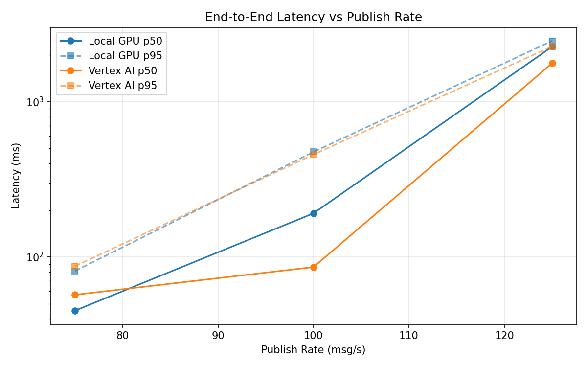
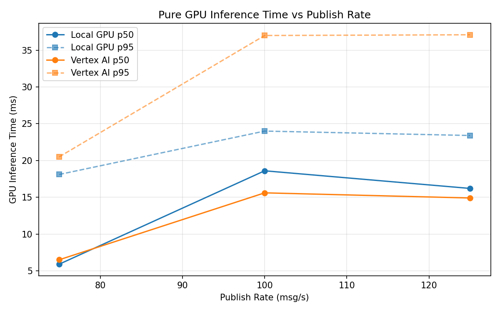
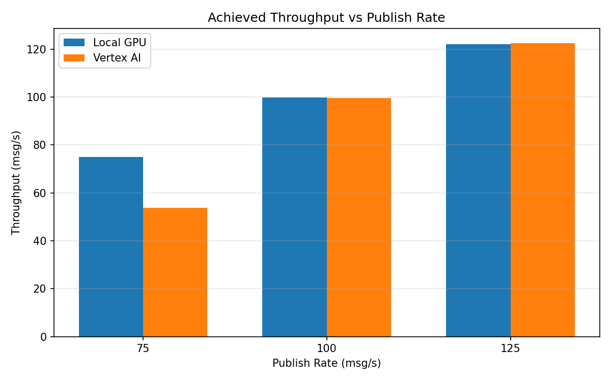

# Benchmark Report

Generated: 2026-03-08 08:06:57

## Configuration

| Parameter | Value |
|---|---|
| Messages per phase | 100s per phase |
| Rates (msg/s) | 75, 100, 125 |
| Experiments | Local GPU, Vertex AI |

## Throughput

| Rate (msg/s) | Local GPU | Vertex AI |
|---|---|---|
| 75 | 75.0 | 53.7 |
| 100 | 99.8 | 99.6 |
| 125 | 122.0 | 122.5 |

## End-to-End Latency (ms)

| Rate | Percentile | Local GPU | Vertex AI |
|---|---|---|---|
| 75 | p50 | 45.0 | 57.0 |
| 75 | p95 | 81.0 | 87.0 |
| 75 | p99 | 516.0 | 386.9 |
| 100 | p50 | 191.0 | 86.0 |
| 100 | p95 | 475.0 | 457.0 |
| 100 | p99 | 679.0 | 733.0 |
| 125 | p50 | 2266.0 | 1771.0 |
| 125 | p95 | 2467.0 | 2275.0 |
| 125 | p99 | 2522.0 | 2382.0 |

## GPU Inference Time (ms)

| Rate | Percentile | Local GPU | Vertex AI |
|---|---|---|---|
| 75 | p50 | 5.9 | 6.5 |
| 75 | p95 | 18.1 | 20.5 |
| 75 | p99 | 22.0 | 33.1 |
| 100 | p50 | 18.6 | 15.6 |
| 100 | p95 | 24.0 | 37.0 |
| 100 | p99 | 26.1 | 46.9 |
| 125 | p50 | 16.2 | 14.9 |
| 125 | p95 | 23.4 | 37.1 |
| 125 | p99 | 25.4 | 46.1 |

## Charts

### Latency vs Publish Rate

### GPU Inference Time vs Publish Rate

### Throughput vs Publish Rate

