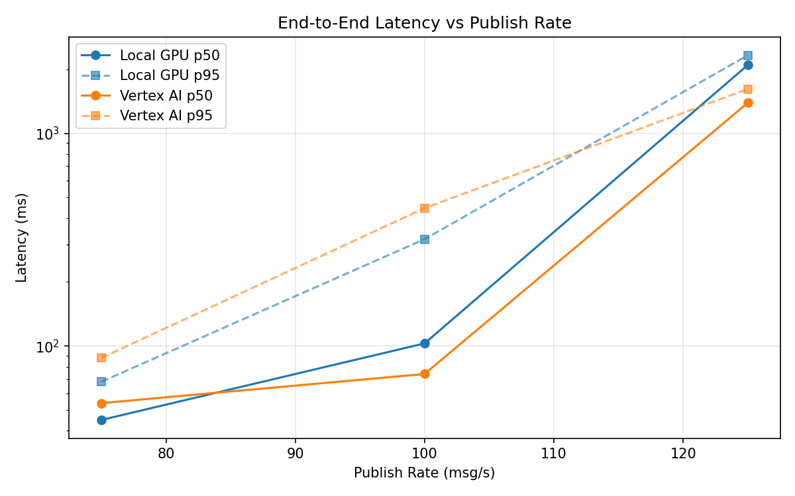
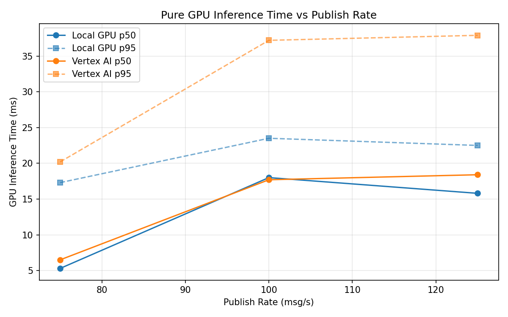
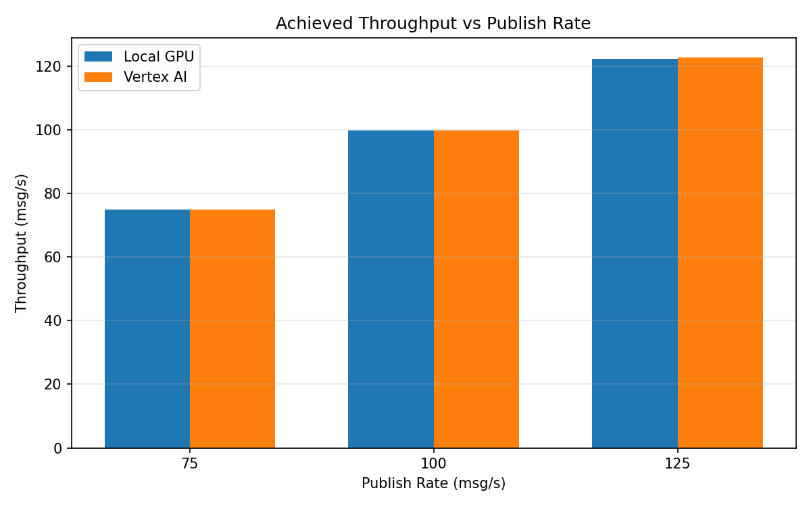

# Benchmark Report

Generated: 2026-03-08 07:28:46

## Configuration

| Parameter | Value |
|---|---|
| Messages per phase | 100s per phase |
| Rates (msg/s) | 75, 100, 125 |
| Experiments | Local GPU, Vertex AI |

## Throughput

| Rate (msg/s) | Local GPU | Vertex AI |
|---|---|---|
| 75 | 75.0 | 75.0 |
| 100 | 99.9 | 99.9 |
| 125 | 122.4 | 122.8 |

## End-to-End Latency (ms)

| Rate | Percentile | Local GPU | Vertex AI |
|---|---|---|---|
| 75 | p50 | 45.0 | 54.0 |
| 75 | p95 | 68.0 | 88.0 |
| 75 | p99 | 194.0 | 691.1 |
| 100 | p50 | 103.0 | 74.0 |
| 100 | p95 | 318.0 | 445.1 |
| 100 | p99 | 432.0 | 970.0 |
| 125 | p50 | 2092.0 | 1390.0 |
| 125 | p95 | 2325.0 | 1614.0 |
| 125 | p99 | 2383.0 | 1721.0 |

## GPU Inference Time (ms)

| Rate | Percentile | Local GPU | Vertex AI |
|---|---|---|---|
| 75 | p50 | 5.3 | 6.5 |
| 75 | p95 | 17.3 | 20.2 |
| 75 | p99 | 21.3 | 35.4 |
| 100 | p50 | 18.0 | 17.7 |
| 100 | p95 | 23.5 | 37.2 |
| 100 | p99 | 25.7 | 47.1 |
| 125 | p50 | 15.8 | 18.4 |
| 125 | p95 | 22.5 | 37.9 |
| 125 | p99 | 24.7 | 46.6 |

## Charts

### Latency vs Publish Rate

### GPU Inference Time vs Publish Rate

### Throughput vs Publish Rate

