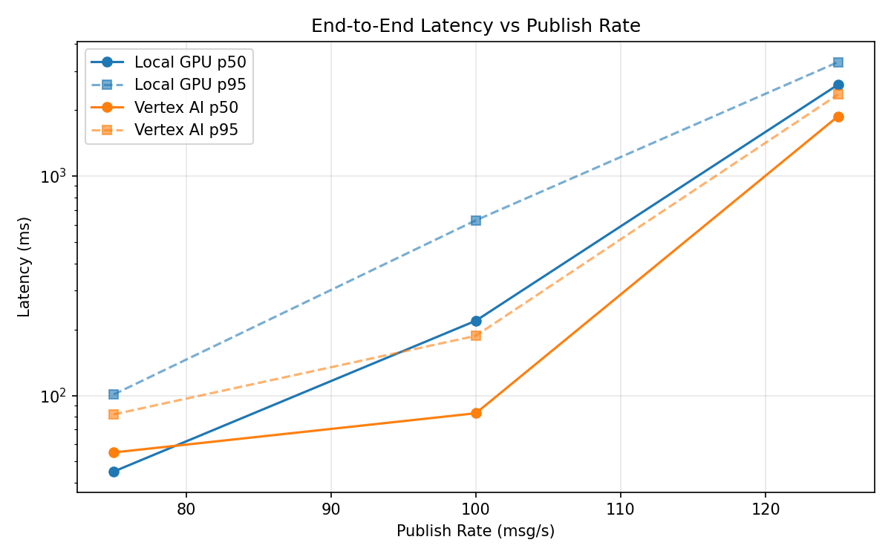
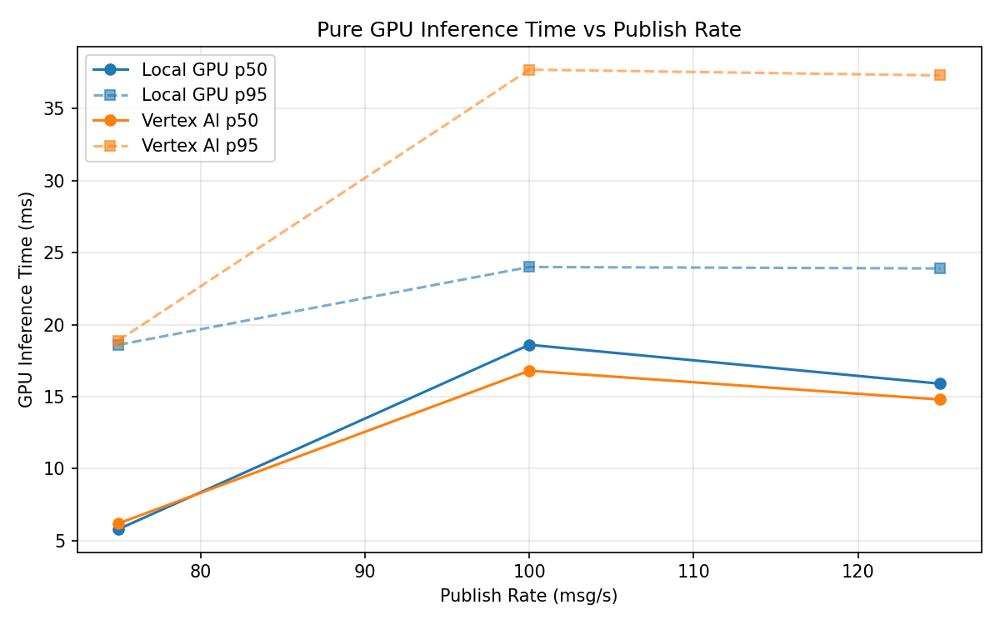
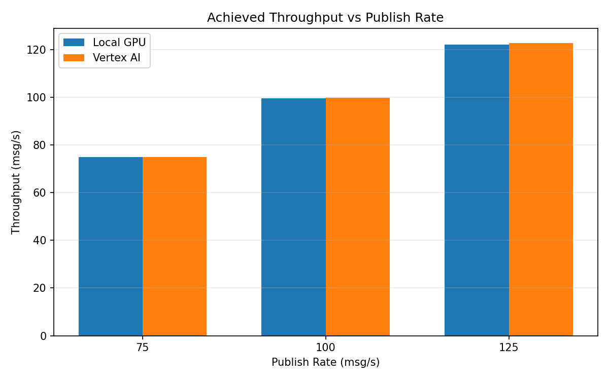

# Benchmark Report

Generated: 2026-03-08 08:19:30

## Configuration

| Parameter | Value |
|---|---|
| Messages per phase | 100s per phase |
| Rates (msg/s) | 75, 100, 125 |
| Experiments | Local GPU, Vertex AI |

## Throughput

| Rate (msg/s) | Local GPU | Vertex AI |
|---|---|---|
| 75 | 75.0 | 75.0 |
| 100 | 99.7 | 99.9 |
| 125 | 122.2 | 122.8 |

## End-to-End Latency (ms)

| Rate | Percentile | Local GPU | Vertex AI |
|---|---|---|---|
| 75 | p50 | 45.0 | 55.0 |
| 75 | p95 | 101.0 | 82.0 |
| 75 | p99 | 790.0 | 192.0 |
| 100 | p50 | 219.0 | 83.0 |
| 100 | p95 | 628.0 | 187.0 |
| 100 | p99 | 824.0 | 259.0 |
| 125 | p50 | 2607.0 | 1871.0 |
| 125 | p95 | 3303.0 | 2351.0 |
| 125 | p99 | 3381.0 | 2463.0 |

## GPU Inference Time (ms)

| Rate | Percentile | Local GPU | Vertex AI |
|---|---|---|---|
| 75 | p50 | 5.8 | 6.2 |
| 75 | p95 | 18.6 | 18.9 |
| 75 | p99 | 22.1 | 32.7 |
| 100 | p50 | 18.6 | 16.8 |
| 100 | p95 | 24.0 | 37.7 |
| 100 | p99 | 26.0 | 47.7 |
| 125 | p50 | 15.9 | 14.8 |
| 125 | p95 | 23.9 | 37.3 |
| 125 | p99 | 26.5 | 45.8 |

## Charts

### Latency vs Publish Rate

### GPU Inference Time vs Publish Rate

### Throughput vs Publish Rate

