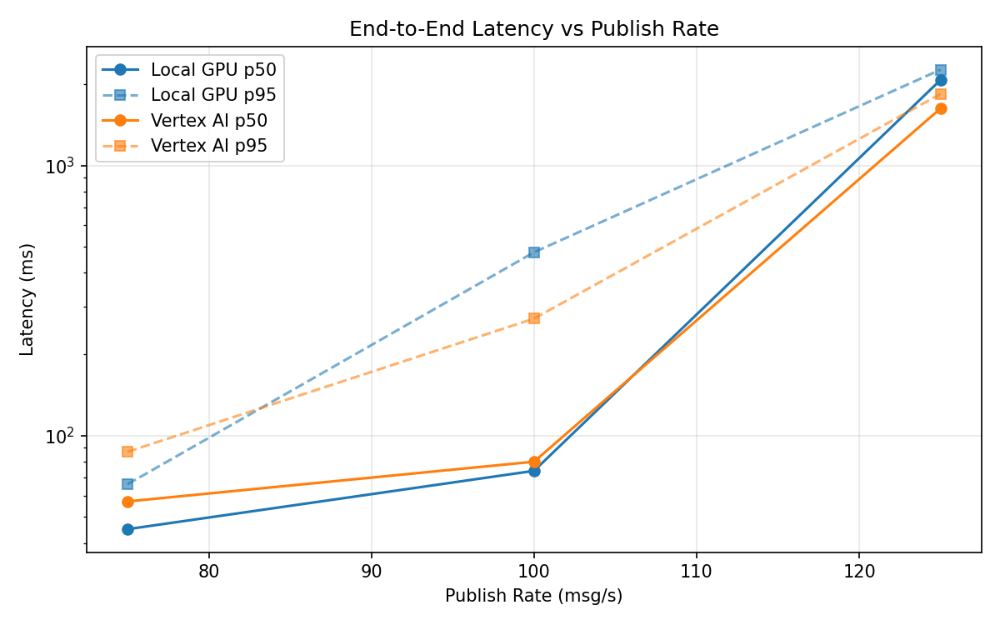
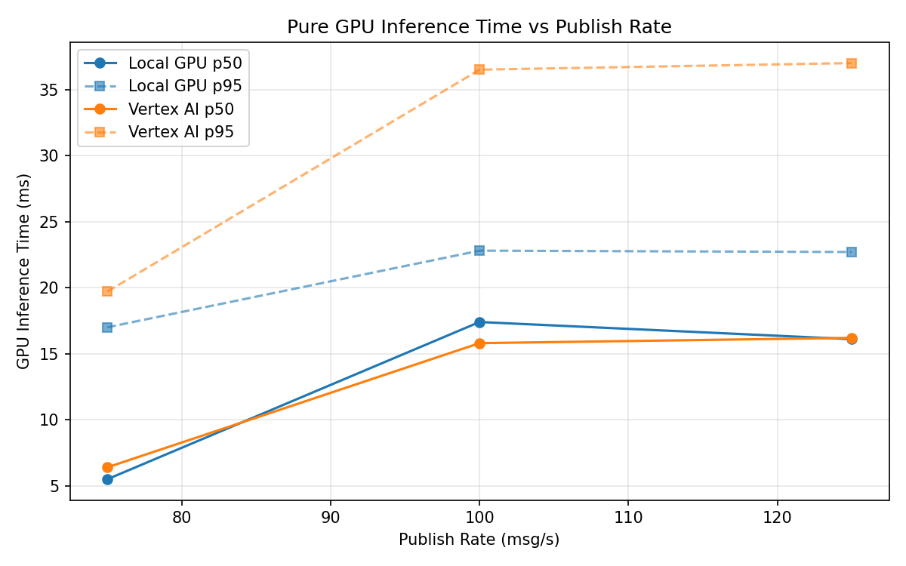
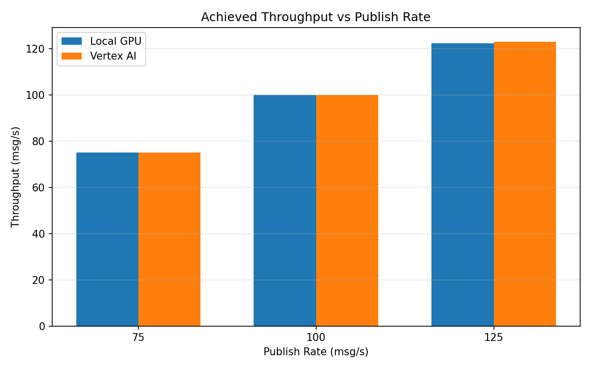

# Benchmark Report

Generated: 2026-03-08 07:41:13

## Configuration

| Parameter | Value |
|---|---|
| Messages per phase | 100s per phase |
| Rates (msg/s) | 75, 100, 125 |
| Experiments | Local GPU, Vertex AI |

## Throughput

| Rate (msg/s) | Local GPU | Vertex AI |
|---|---|---|
| 75 | 75.0 | 75.0 |
| 100 | 99.9 | 99.9 |
| 125 | 122.4 | 123.0 |

## End-to-End Latency (ms)

| Rate | Percentile | Local GPU | Vertex AI |
|---|---|---|---|
| 75 | p50 | 45.0 | 57.0 |
| 75 | p95 | 66.0 | 87.0 |
| 75 | p99 | 146.0 | 236.0 |
| 100 | p50 | 74.0 | 80.0 |
| 100 | p95 | 477.0 | 271.0 |
| 100 | p99 | 865.0 | 614.0 |
| 125 | p50 | 2074.0 | 1626.0 |
| 125 | p95 | 2263.0 | 1841.0 |
| 125 | p99 | 2326.0 | 1920.0 |

## GPU Inference Time (ms)

| Rate | Percentile | Local GPU | Vertex AI |
|---|---|---|---|
| 75 | p50 | 5.5 | 6.4 |
| 75 | p95 | 17.0 | 19.7 |
| 75 | p99 | 21.2 | 32.2 |
| 100 | p50 | 17.4 | 15.8 |
| 100 | p95 | 22.8 | 36.5 |
| 100 | p99 | 25.1 | 47.1 |
| 125 | p50 | 16.1 | 16.2 |
| 125 | p95 | 22.7 | 37.0 |
| 125 | p99 | 24.9 | 47.2 |

## Charts

### Latency vs Publish Rate

### GPU Inference Time vs Publish Rate

### Throughput vs Publish Rate

