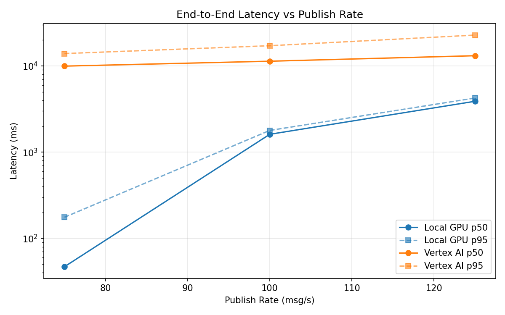
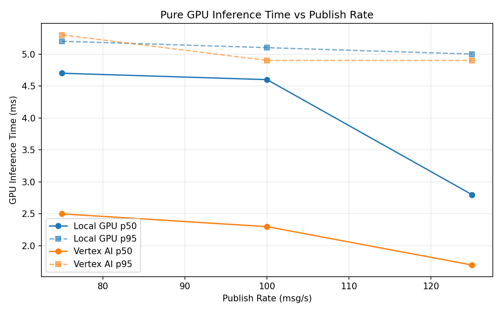
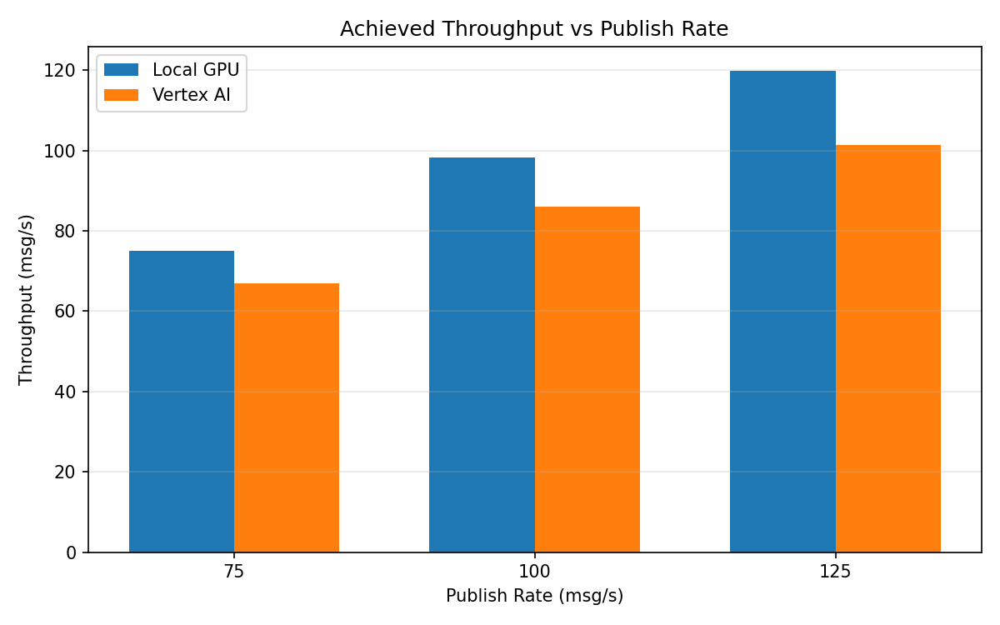

# Benchmark Report

Generated: 2026-03-08 03:13:29

## Configuration

| Parameter | Value |
|---|---|
| Messages per phase | 100s per phase |
| Rates (msg/s) | 75, 100, 125 |
| Experiments | Local GPU, Vertex AI |

## Throughput

| Rate (msg/s) | Local GPU | Vertex AI |
|---|---|---|
| 75 | 75.0 | 66.9 |
| 100 | 98.2 | 86.1 |
| 125 | 119.9 | 101.4 |

## End-to-End Latency (ms)

| Rate | Percentile | Local GPU | Vertex AI |
|---|---|---|---|
| 75 | p50 | 47.0 | 9956.0 |
| 75 | p95 | 176.0 | 13921.0 |
| 75 | p99 | 728.0 | 14363.0 |
| 100 | p50 | 1612.0 | 11348.0 |
| 100 | p95 | 1788.0 | 17162.0 |
| 100 | p99 | 1823.0 | 17253.0 |
| 125 | p50 | 3893.0 | 13144.0 |
| 125 | p95 | 4247.0 | 22787.0 |
| 125 | p99 | 4314.0 | 23220.0 |

## GPU Inference Time (ms)

| Rate | Percentile | Local GPU | Vertex AI |
|---|---|---|---|
| 75 | p50 | 4.7 | 2.5 |
| 75 | p95 | 5.2 | 5.3 |
| 75 | p99 | 5.8 | 8.0 |
| 100 | p50 | 4.6 | 2.3 |
| 100 | p95 | 5.1 | 4.9 |
| 100 | p99 | 5.5 | 6.9 |
| 125 | p50 | 2.8 | 1.7 |
| 125 | p95 | 5.0 | 4.9 |
| 125 | p99 | 5.4 | 6.2 |

## Charts

### Latency vs Publish Rate

### GPU Inference Time vs Publish Rate

### Throughput vs Publish Rate

