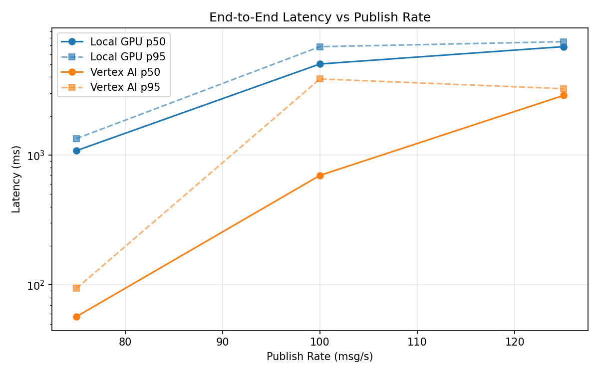
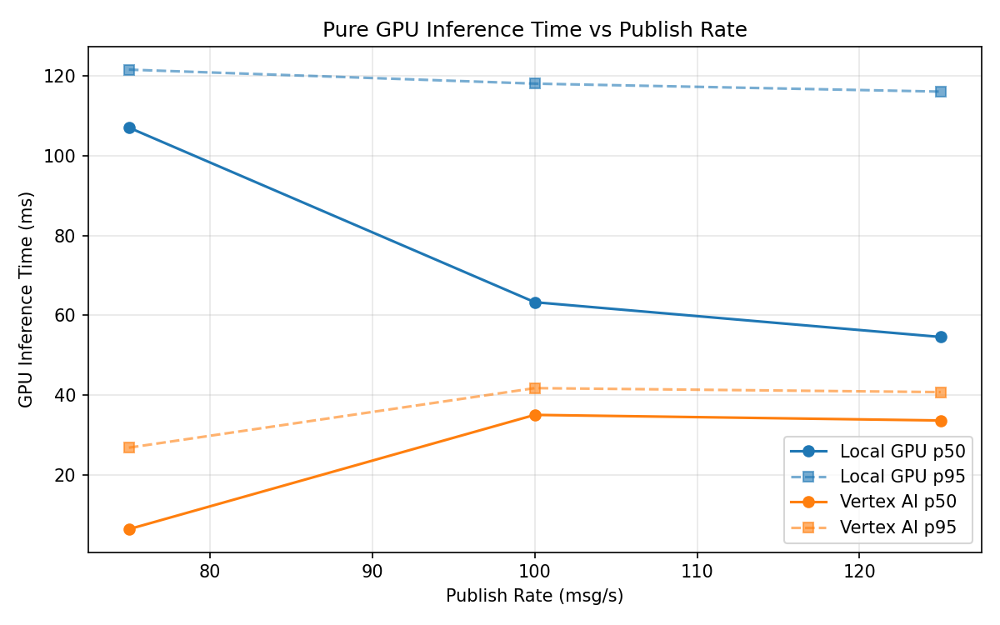
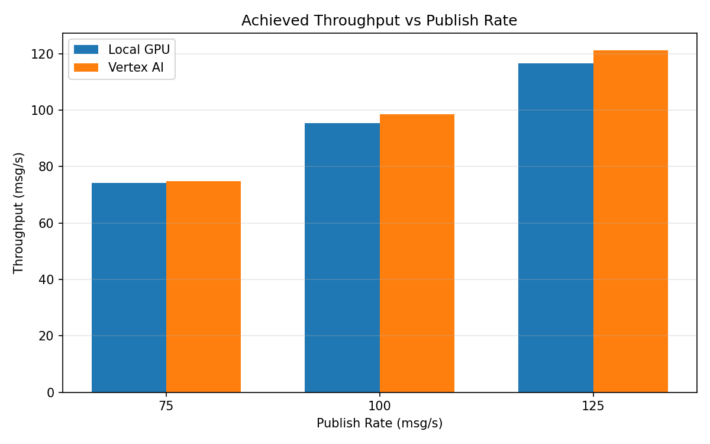

# Benchmark Report

Generated: 2026-03-08 05:10:06

## Configuration

| Parameter | Value |
|---|---|
| Messages per phase | 100s per phase |
| Rates (msg/s) | 75, 100, 125 |
| Experiments | Local GPU, Vertex AI |

## Throughput

| Rate (msg/s) | Local GPU | Vertex AI |
|---|---|---|
| 75 | 74.2 | 74.9 |
| 100 | 95.3 | 98.6 |
| 125 | 116.6 | 121.2 |

## End-to-End Latency (ms)

| Rate | Percentile | Local GPU | Vertex AI |
|---|---|---|---|
| 75 | p50 | 1083.0 | 57.0 |
| 75 | p95 | 1341.0 | 94.0 |
| 75 | p99 | 1614.1 | 588.0 |
| 100 | p50 | 5039.0 | 698.0 |
| 100 | p95 | 6846.0 | 3865.0 |
| 100 | p99 | 7586.0 | 5108.0 |
| 125 | p50 | 6853.0 | 2882.0 |
| 125 | p95 | 7484.0 | 3253.0 |
| 125 | p99 | 7594.0 | 3346.0 |

## GPU Inference Time (ms)

| Rate | Percentile | Local GPU | Vertex AI |
|---|---|---|---|
| 75 | p50 | 107.0 | 6.5 |
| 75 | p95 | 121.5 | 26.9 |
| 75 | p99 | 128.7 | 38.8 |
| 100 | p50 | 63.3 | 35.1 |
| 100 | p95 | 118.0 | 41.8 |
| 100 | p99 | 124.7 | 51.7 |
| 125 | p50 | 54.6 | 33.7 |
| 125 | p95 | 116.0 | 40.8 |
| 125 | p99 | 123.6 | 50.4 |

## Charts

### Latency vs Publish Rate

### GPU Inference Time vs Publish Rate

### Throughput vs Publish Rate

