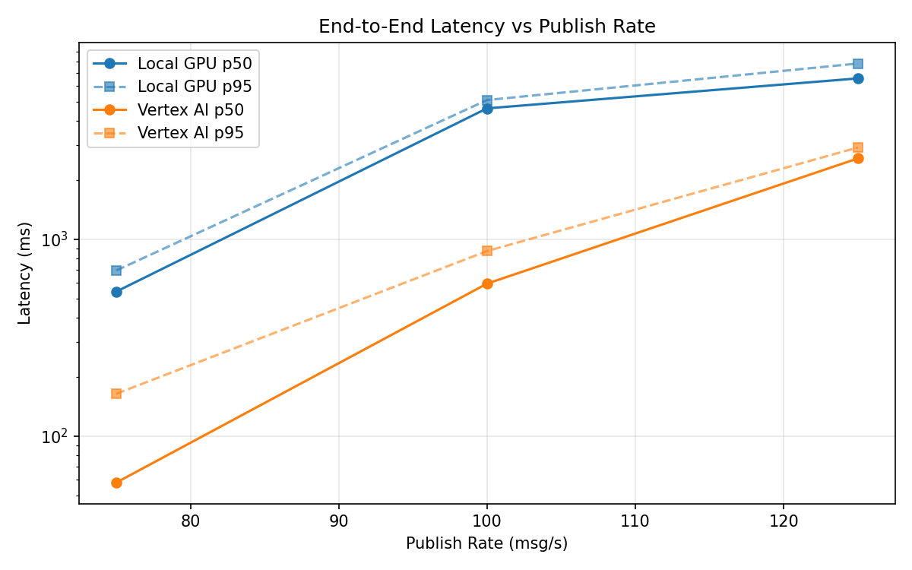
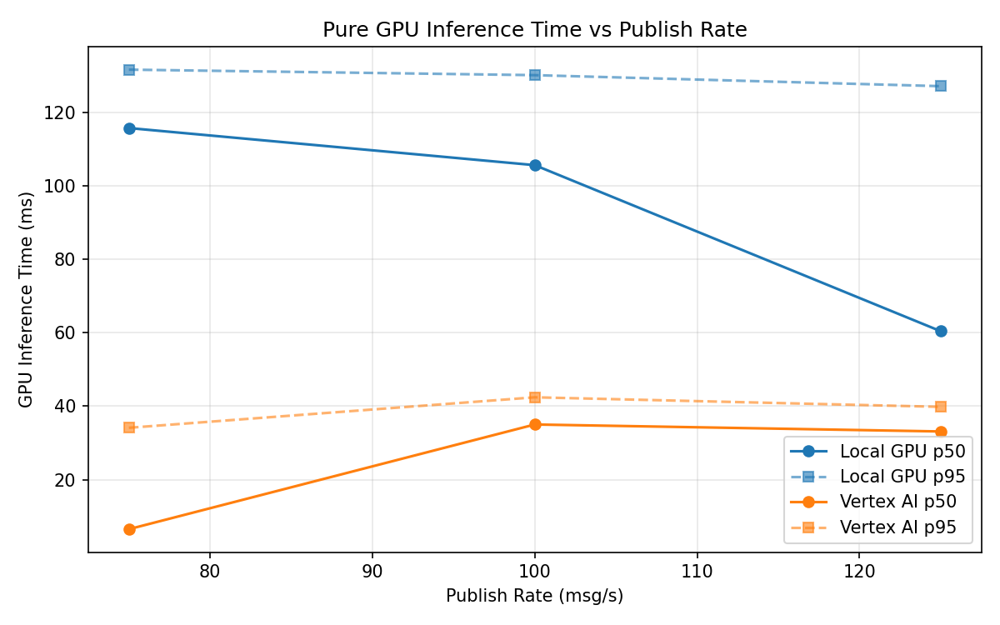
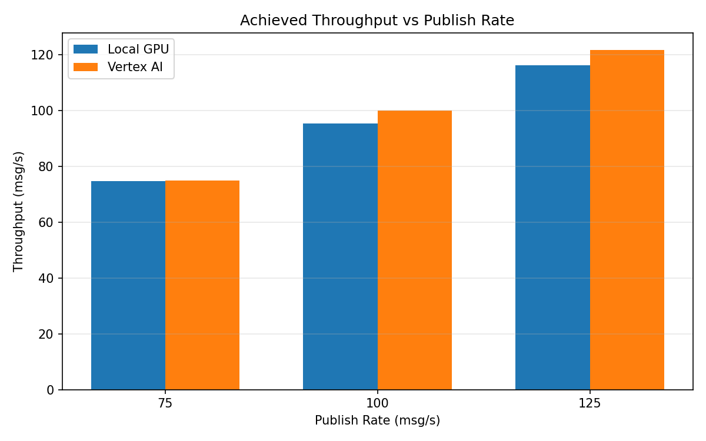

# Benchmark Report

Generated: 2026-03-08 05:22:36

## Configuration

| Parameter | Value |
|---|---|
| Messages per phase | 100s per phase |
| Rates (msg/s) | 75, 100, 125 |
| Experiments | Local GPU, Vertex AI |

## Throughput

| Rate (msg/s) | Local GPU | Vertex AI |
|---|---|---|
| 75 | 74.6 | 75.0 |
| 100 | 95.4 | 99.9 |
| 125 | 116.2 | 121.7 |

## End-to-End Latency (ms)

| Rate | Percentile | Local GPU | Vertex AI |
|---|---|---|---|
| 75 | p50 | 542.0 | 58.0 |
| 75 | p95 | 694.0 | 164.0 |
| 75 | p99 | 966.0 | 764.1 |
| 100 | p50 | 4625.5 | 595.0 |
| 100 | p95 | 5099.0 | 871.0 |
| 100 | p99 | 5221.0 | 1137.0 |
| 125 | p50 | 6567.0 | 2574.0 |
| 125 | p95 | 7817.0 | 2926.0 |
| 125 | p99 | 8267.0 | 3024.0 |

## GPU Inference Time (ms)

| Rate | Percentile | Local GPU | Vertex AI |
|---|---|---|---|
| 75 | p50 | 115.7 | 6.5 |
| 75 | p95 | 131.6 | 34.1 |
| 75 | p99 | 139.9 | 38.1 |
| 100 | p50 | 105.6 | 35.0 |
| 100 | p95 | 130.1 | 42.4 |
| 100 | p99 | 138.8 | 52.7 |
| 125 | p50 | 60.4 | 33.1 |
| 125 | p95 | 127.1 | 39.8 |
| 125 | p99 | 136.2 | 48.9 |

## Charts

### Latency vs Publish Rate

### GPU Inference Time vs Publish Rate

### Throughput vs Publish Rate

