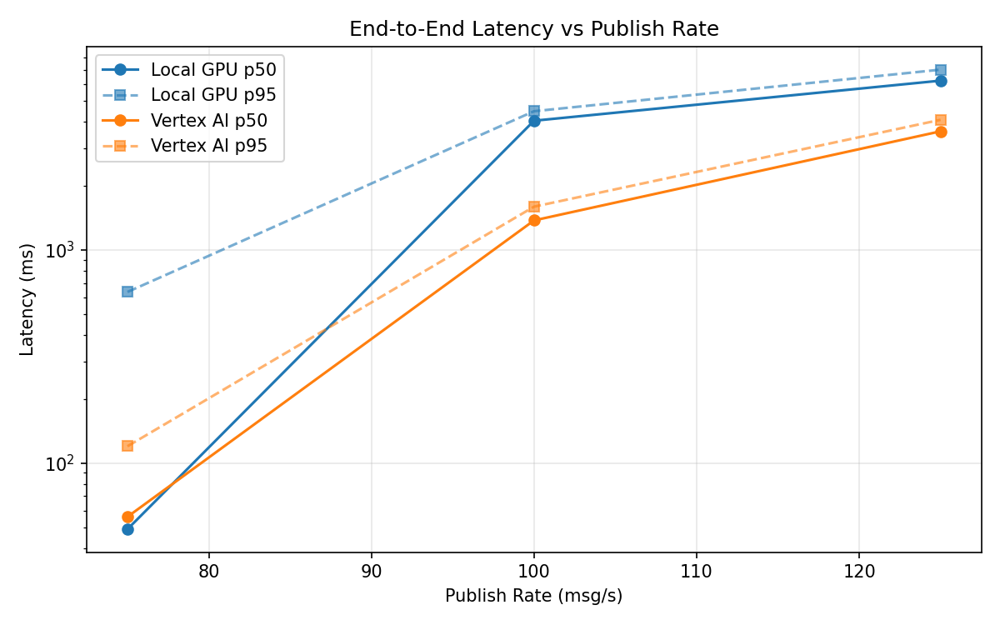
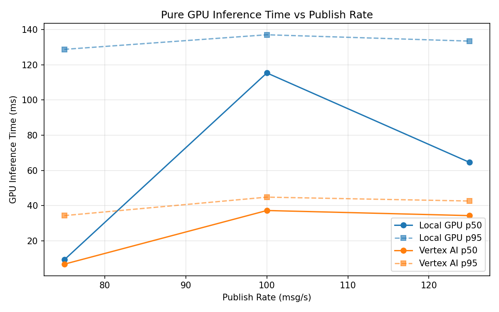
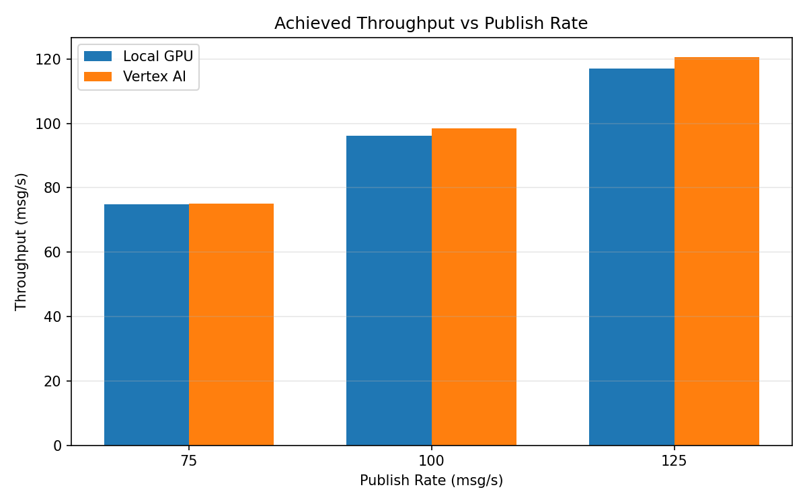

# Benchmark Report

Generated: 2026-03-08 05:35:14

## Configuration

| Parameter | Value |
|---|---|
| Messages per phase | 100s per phase |
| Rates (msg/s) | 75, 100, 125 |
| Experiments | Local GPU, Vertex AI |

## Throughput

| Rate (msg/s) | Local GPU | Vertex AI |
|---|---|---|
| 75 | 74.9 | 75.0 |
| 100 | 96.1 | 98.4 |
| 125 | 117.1 | 120.6 |

## End-to-End Latency (ms)

| Rate | Percentile | Local GPU | Vertex AI |
|---|---|---|---|
| 75 | p50 | 49.0 | 56.0 |
| 75 | p95 | 635.0 | 120.0 |
| 75 | p99 | 822.0 | 454.0 |
| 100 | p50 | 4035.0 | 1375.0 |
| 100 | p95 | 4471.0 | 1595.0 |
| 100 | p99 | 4598.0 | 1741.0 |
| 125 | p50 | 6220.5 | 3599.0 |
| 125 | p95 | 7005.0 | 4076.0 |
| 125 | p99 | 7155.0 | 4232.0 |

## GPU Inference Time (ms)

| Rate | Percentile | Local GPU | Vertex AI |
|---|---|---|---|
| 75 | p50 | 9.2 | 6.7 |
| 75 | p95 | 128.8 | 34.3 |
| 75 | p99 | 138.6 | 41.1 |
| 100 | p50 | 115.4 | 37.2 |
| 100 | p95 | 137.1 | 44.8 |
| 100 | p99 | 145.8 | 55.1 |
| 125 | p50 | 64.6 | 34.3 |
| 125 | p95 | 133.5 | 42.6 |
| 125 | p99 | 142.6 | 52.0 |

## Charts

### Latency vs Publish Rate

### GPU Inference Time vs Publish Rate

### Throughput vs Publish Rate

