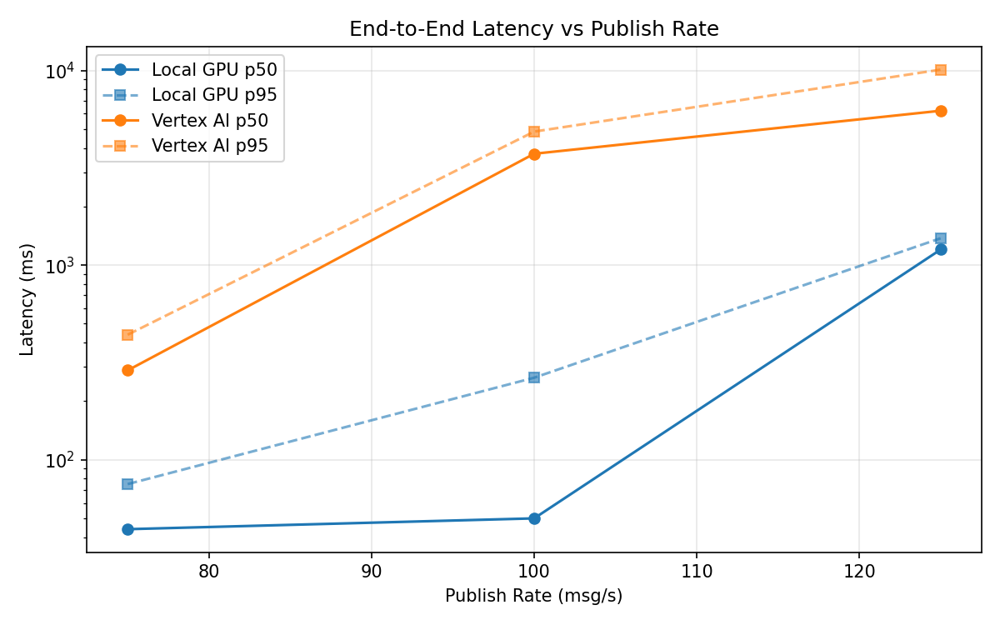
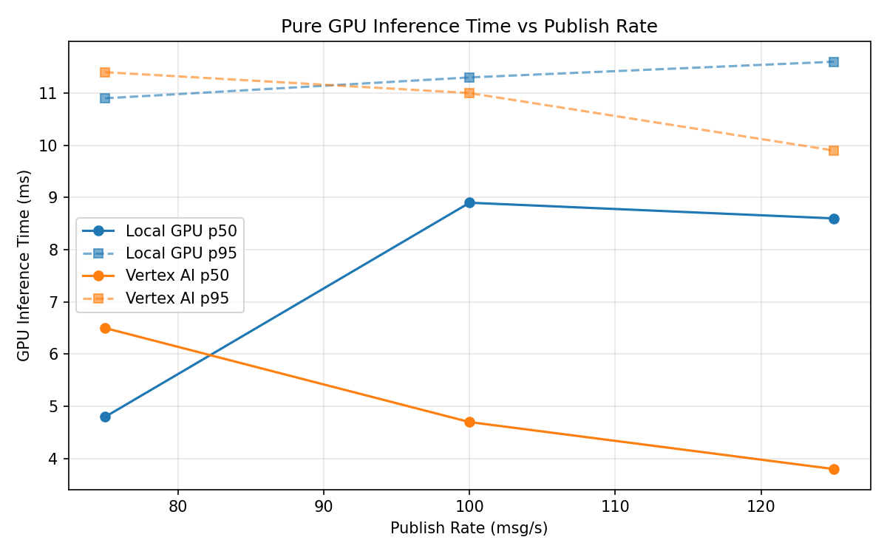
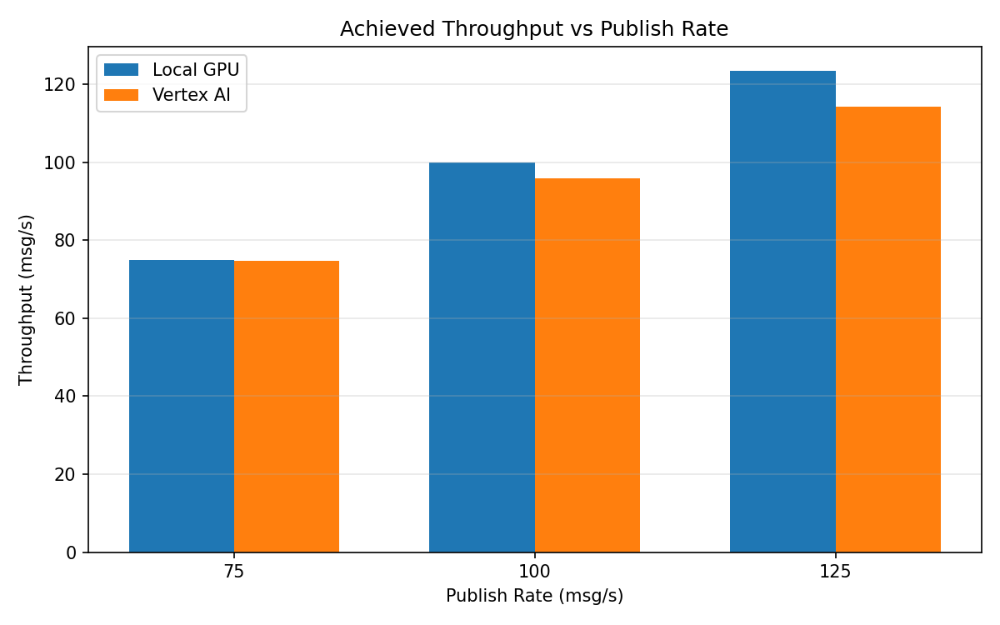

# Benchmark Report

Generated: 2026-03-08 03:26:03

## Configuration

| Parameter | Value |
|---|---|
| Messages per phase | 100s per phase |
| Rates (msg/s) | 75, 100, 125 |
| Experiments | Local GPU, Vertex AI |

## Throughput

| Rate (msg/s) | Local GPU | Vertex AI |
|---|---|---|
| 75 | 75.0 | 74.8 |
| 100 | 100.0 | 95.8 |
| 125 | 123.5 | 114.3 |

## End-to-End Latency (ms)

| Rate | Percentile | Local GPU | Vertex AI |
|---|---|---|---|
| 75 | p50 | 44.0 | 288.0 |
| 75 | p95 | 75.0 | 439.0 |
| 75 | p99 | 836.0 | 508.0 |
| 100 | p50 | 50.0 | 3734.0 |
| 100 | p95 | 264.0 | 4853.0 |
| 100 | p99 | 814.1 | 5044.0 |
| 125 | p50 | 1202.0 | 6211.0 |
| 125 | p95 | 1374.0 | 10100.0 |
| 125 | p99 | 1429.0 | 10321.0 |

## GPU Inference Time (ms)

| Rate | Percentile | Local GPU | Vertex AI |
|---|---|---|---|
| 75 | p50 | 4.8 | 6.5 |
| 75 | p95 | 10.9 | 11.4 |
| 75 | p99 | 11.9 | 14.3 |
| 100 | p50 | 8.9 | 4.7 |
| 100 | p95 | 11.3 | 11.0 |
| 100 | p99 | 12.5 | 13.8 |
| 125 | p50 | 8.6 | 3.8 |
| 125 | p95 | 11.6 | 9.9 |
| 125 | p99 | 12.8 | 12.2 |

## Charts

### Latency vs Publish Rate

### GPU Inference Time vs Publish Rate

### Throughput vs Publish Rate

