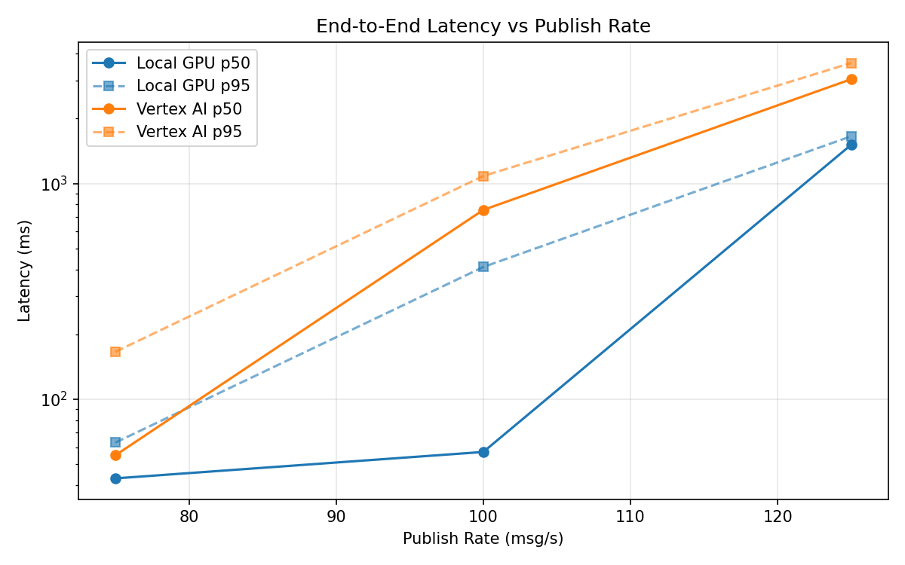
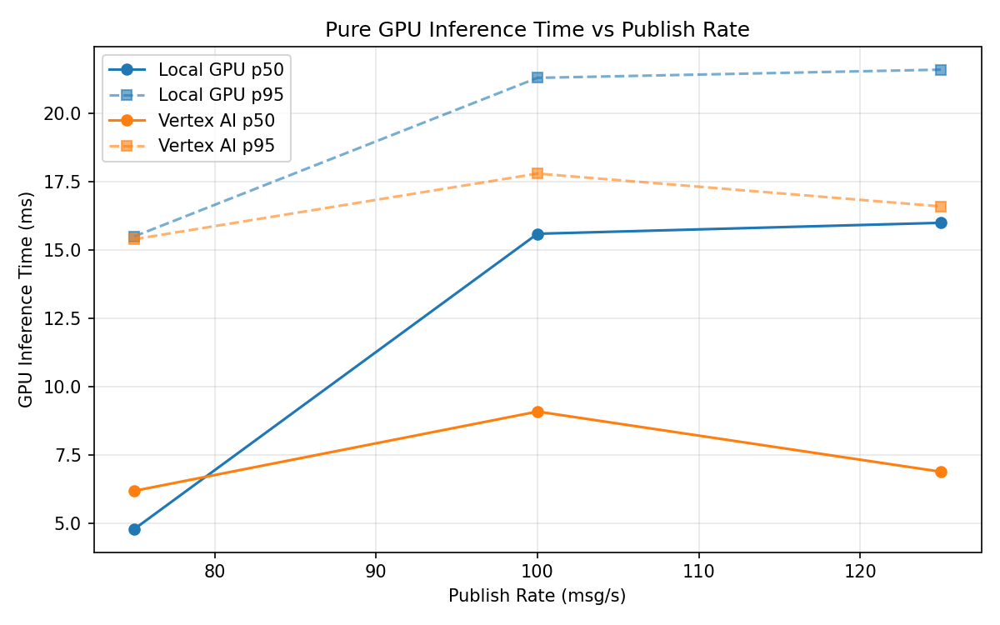
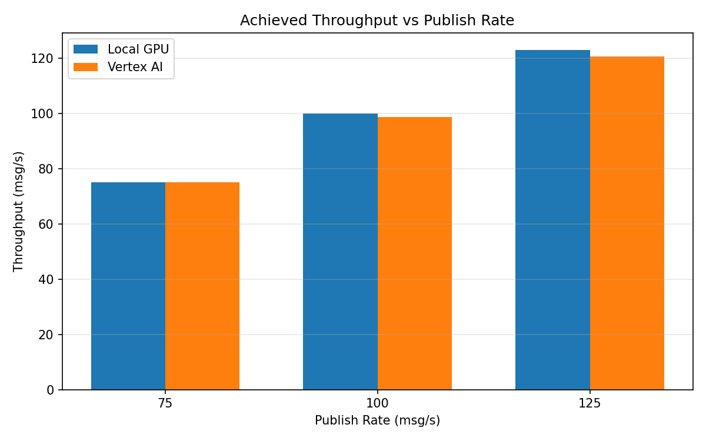

# Benchmark Report

Generated: 2026-03-08 03:38:31

## Configuration

| Parameter | Value |
|---|---|
| Messages per phase | 100s per phase |
| Rates (msg/s) | 75, 100, 125 |
| Experiments | Local GPU, Vertex AI |

## Throughput

| Rate (msg/s) | Local GPU | Vertex AI |
|---|---|---|
| 75 | 75.0 | 75.0 |
| 100 | 100.0 | 98.8 |
| 125 | 123.0 | 120.6 |

## End-to-End Latency (ms)

| Rate | Percentile | Local GPU | Vertex AI |
|---|---|---|---|
| 75 | p50 | 43.0 | 55.0 |
| 75 | p95 | 63.0 | 166.0 |
| 75 | p99 | 202.0 | 486.0 |
| 100 | p50 | 57.0 | 754.0 |
| 100 | p95 | 410.1 | 1083.0 |
| 100 | p99 | 864.0 | 1164.0 |
| 125 | p50 | 1512.0 | 3041.5 |
| 125 | p95 | 1655.0 | 3617.0 |
| 125 | p99 | 1691.0 | 3749.0 |

## GPU Inference Time (ms)

| Rate | Percentile | Local GPU | Vertex AI |
|---|---|---|---|
| 75 | p50 | 4.8 | 6.2 |
| 75 | p95 | 15.5 | 15.4 |
| 75 | p99 | 19.8 | 20.0 |
| 100 | p50 | 15.6 | 9.1 |
| 100 | p95 | 21.3 | 17.8 |
| 100 | p99 | 23.7 | 22.6 |
| 125 | p50 | 16.0 | 6.9 |
| 125 | p95 | 21.6 | 16.6 |
| 125 | p99 | 23.8 | 21.3 |

## Charts

### Latency vs Publish Rate

### GPU Inference Time vs Publish Rate

### Throughput vs Publish Rate

