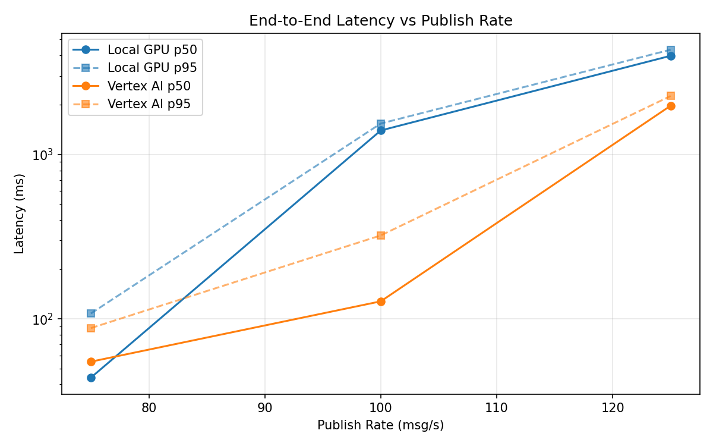
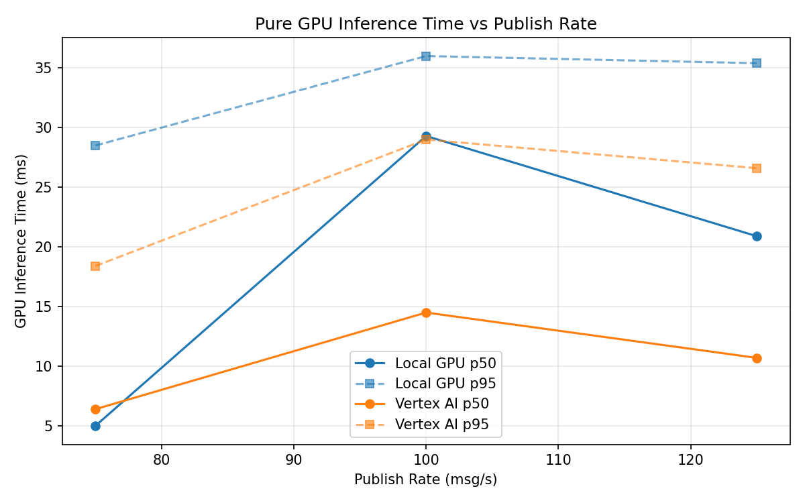
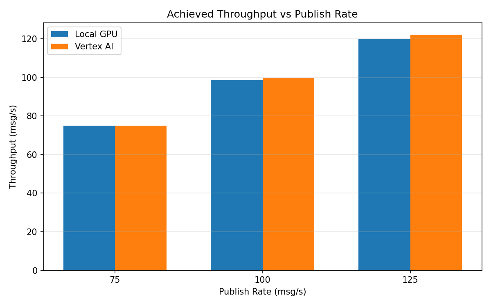

# Benchmark Report

Generated: 2026-03-08 03:51:24

## Configuration

| Parameter | Value |
|---|---|
| Messages per phase | 100s per phase |
| Rates (msg/s) | 75, 100, 125 |
| Experiments | Local GPU, Vertex AI |

## Throughput

| Rate (msg/s) | Local GPU | Vertex AI |
|---|---|---|
| 75 | 75.0 | 75.0 |
| 100 | 98.6 | 99.8 |
| 125 | 120.1 | 122.2 |

## End-to-End Latency (ms)

| Rate | Percentile | Local GPU | Vertex AI |
|---|---|---|---|
| 75 | p50 | 44.0 | 55.0 |
| 75 | p95 | 108.0 | 88.0 |
| 75 | p99 | 315.0 | 468.0 |
| 100 | p50 | 1399.0 | 128.0 |
| 100 | p95 | 1542.0 | 322.0 |
| 100 | p99 | 1576.0 | 401.0 |
| 125 | p50 | 3980.0 | 1979.0 |
| 125 | p95 | 4334.0 | 2267.0 |
| 125 | p99 | 4388.0 | 2330.0 |

## GPU Inference Time (ms)

| Rate | Percentile | Local GPU | Vertex AI |
|---|---|---|---|
| 75 | p50 | 5.0 | 6.4 |
| 75 | p95 | 28.5 | 18.4 |
| 75 | p99 | 33.6 | 28.4 |
| 100 | p50 | 29.3 | 14.5 |
| 100 | p95 | 36.0 | 29.0 |
| 100 | p99 | 38.7 | 34.3 |
| 125 | p50 | 20.9 | 10.7 |
| 125 | p95 | 35.4 | 26.6 |
| 125 | p99 | 38.5 | 32.4 |

## Charts

### Latency vs Publish Rate

### GPU Inference Time vs Publish Rate

### Throughput vs Publish Rate

