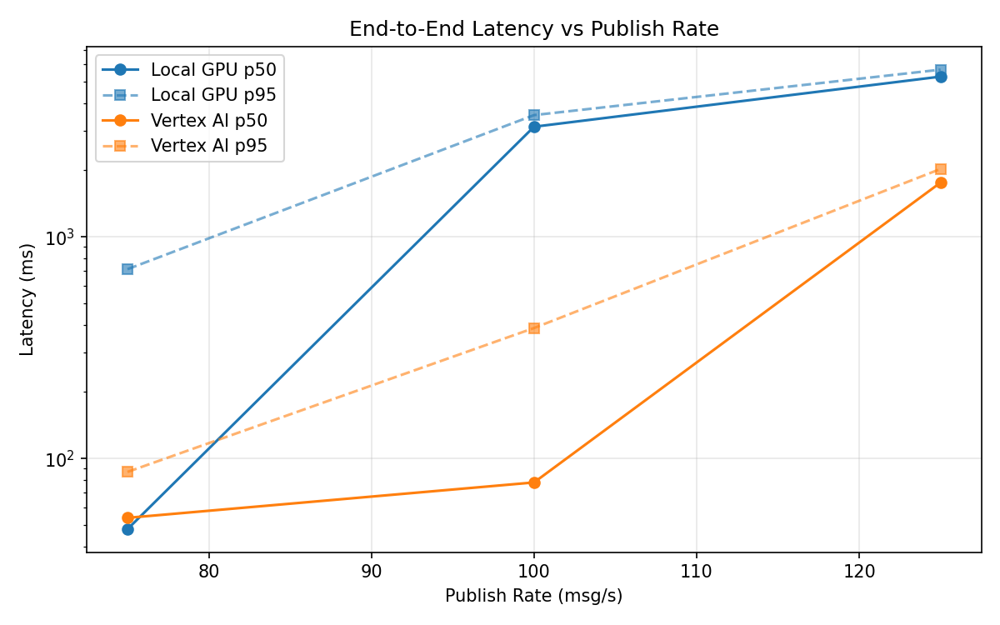
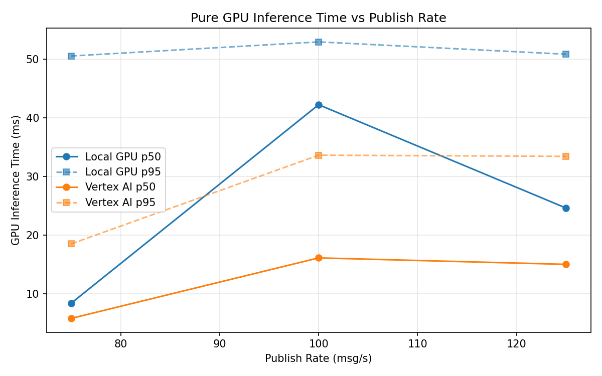
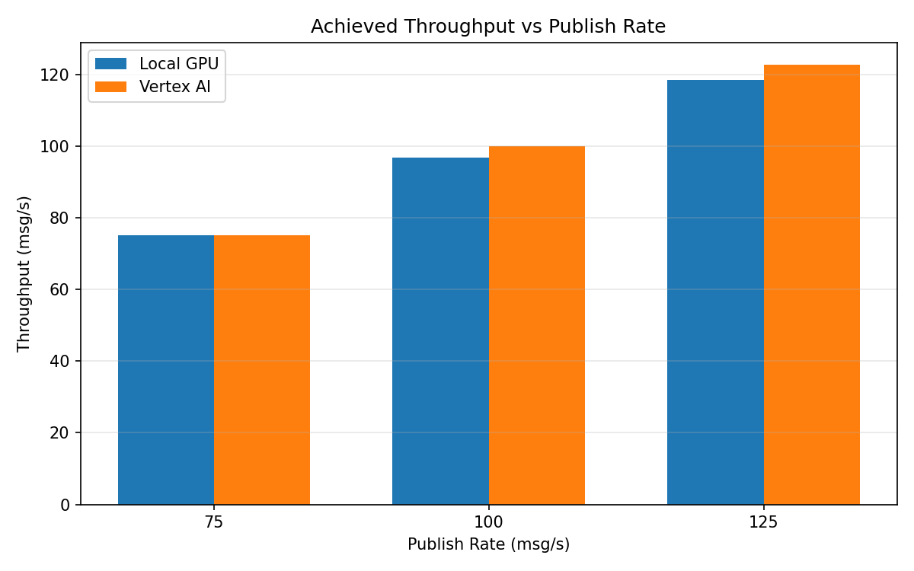

# Benchmark Report

Generated: 2026-03-08 04:04:10

## Configuration

| Parameter | Value |
|---|---|
| Messages per phase | 100s per phase |
| Rates (msg/s) | 75, 100, 125 |
| Experiments | Local GPU, Vertex AI |

## Throughput

| Rate (msg/s) | Local GPU | Vertex AI |
|---|---|---|
| 75 | 75.0 | 75.0 |
| 100 | 96.7 | 99.9 |
| 125 | 118.5 | 122.7 |

## End-to-End Latency (ms)

| Rate | Percentile | Local GPU | Vertex AI |
|---|---|---|---|
| 75 | p50 | 48.0 | 54.0 |
| 75 | p95 | 715.0 | 87.0 |
| 75 | p99 | 1067.0 | 638.1 |
| 100 | p50 | 3141.0 | 78.0 |
| 100 | p95 | 3544.0 | 388.0 |
| 100 | p99 | 3639.0 | 1047.1 |
| 125 | p50 | 5288.0 | 1759.0 |
| 125 | p95 | 5684.0 | 2026.0 |
| 125 | p99 | 5766.0 | 2102.0 |

## GPU Inference Time (ms)

| Rate | Percentile | Local GPU | Vertex AI |
|---|---|---|---|
| 75 | p50 | 8.4 | 5.8 |
| 75 | p95 | 50.5 | 18.5 |
| 75 | p99 | 55.5 | 30.7 |
| 100 | p50 | 42.2 | 16.1 |
| 100 | p95 | 52.9 | 33.6 |
| 100 | p99 | 56.9 | 41.5 |
| 125 | p50 | 24.6 | 15.0 |
| 125 | p95 | 50.8 | 33.4 |
| 125 | p99 | 55.0 | 41.0 |

## Charts

### Latency vs Publish Rate

### GPU Inference Time vs Publish Rate

### Throughput vs Publish Rate

