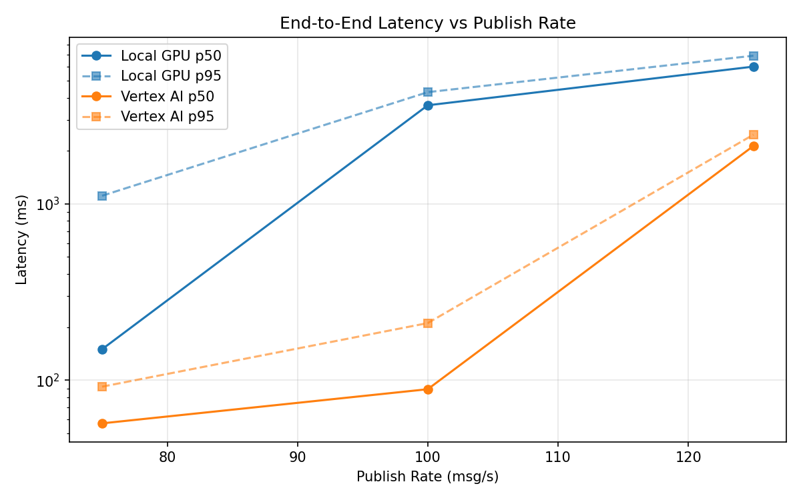
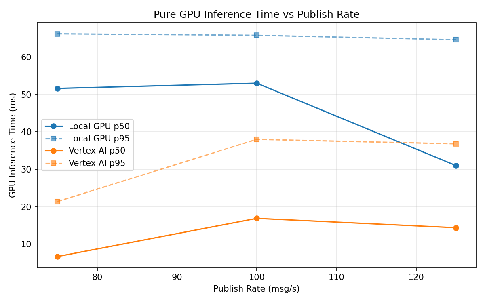
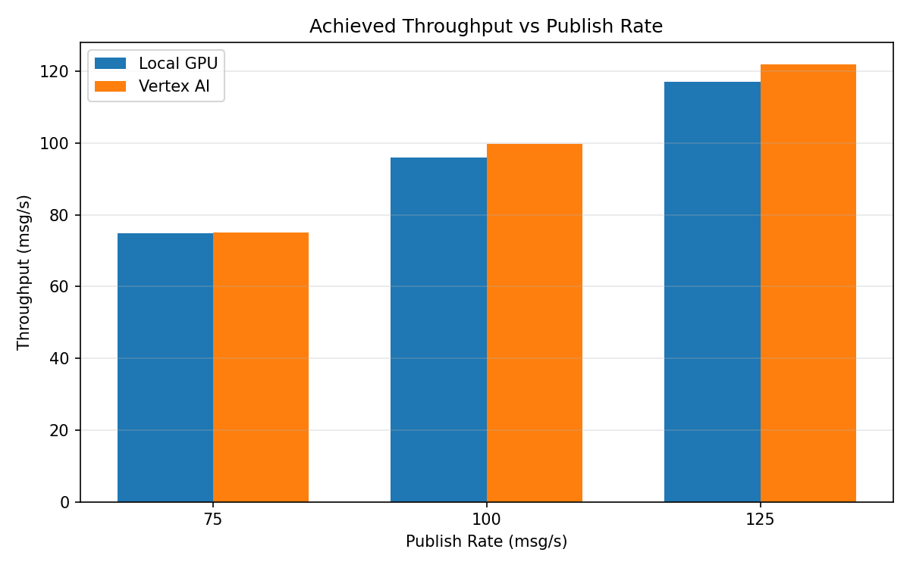

# Benchmark Report

Generated: 2026-03-08 04:17:06

## Configuration

| Parameter | Value |
|---|---|
| Messages per phase | 100s per phase |
| Rates (msg/s) | 75, 100, 125 |
| Experiments | Local GPU, Vertex AI |

## Throughput

| Rate (msg/s) | Local GPU | Vertex AI |
|---|---|---|
| 75 | 74.9 | 75.0 |
| 100 | 96.1 | 99.9 |
| 125 | 117.2 | 122.0 |

## End-to-End Latency (ms)

| Rate | Percentile | Local GPU | Vertex AI |
|---|---|---|---|
| 75 | p50 | 150.0 | 57.0 |
| 75 | p95 | 1112.0 | 92.0 |
| 75 | p99 | 1276.0 | 513.0 |
| 100 | p50 | 3623.0 | 89.0 |
| 100 | p95 | 4300.0 | 211.0 |
| 100 | p99 | 4368.0 | 337.0 |
| 125 | p50 | 6002.0 | 2129.5 |
| 125 | p95 | 6919.0 | 2468.0 |
| 125 | p99 | 7087.0 | 2549.0 |

## GPU Inference Time (ms)

| Rate | Percentile | Local GPU | Vertex AI |
|---|---|---|---|
| 75 | p50 | 51.6 | 6.7 |
| 75 | p95 | 66.2 | 21.4 |
| 75 | p99 | 71.8 | 35.9 |
| 100 | p50 | 53.0 | 16.9 |
| 100 | p95 | 65.8 | 38.0 |
| 100 | p99 | 70.2 | 48.4 |
| 125 | p50 | 31.0 | 14.4 |
| 125 | p95 | 64.6 | 36.8 |
| 125 | p99 | 69.8 | 46.2 |

## Charts

### Latency vs Publish Rate

### GPU Inference Time vs Publish Rate

### Throughput vs Publish Rate

