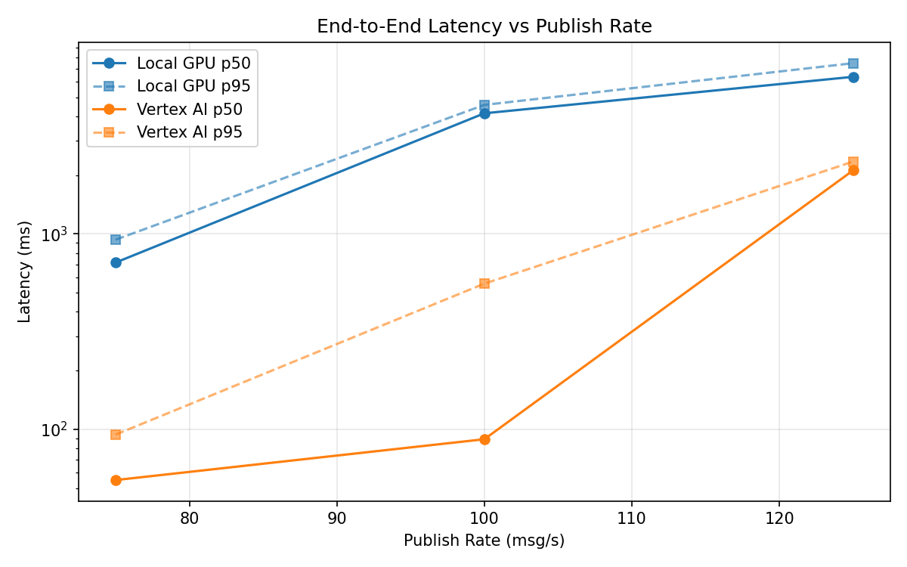
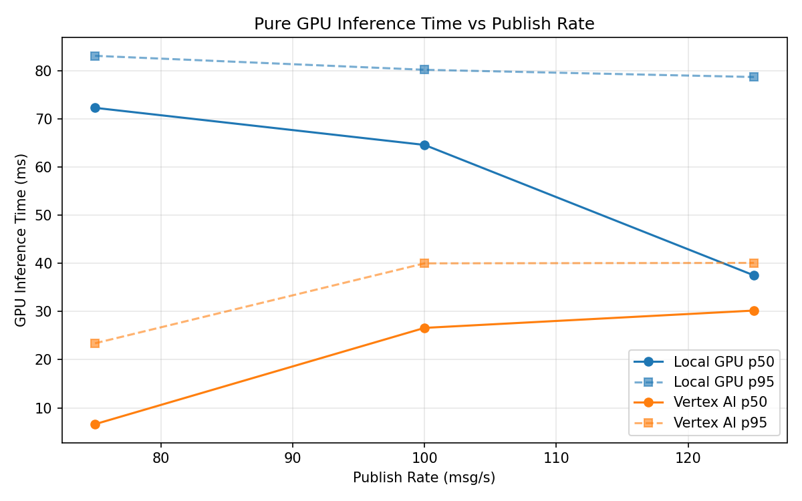
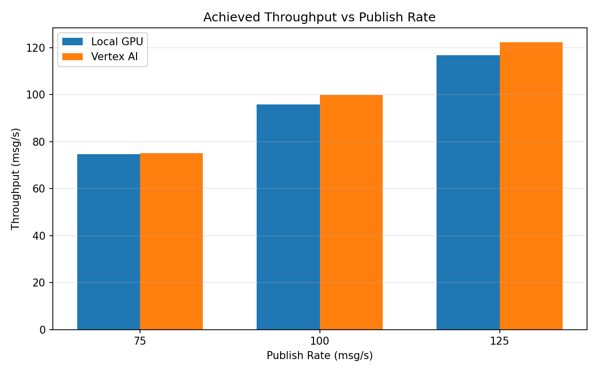

# Benchmark Report

Generated: 2026-03-08 04:31:19

## Configuration

| Parameter | Value |
|---|---|
| Messages per phase | 100s per phase |
| Rates (msg/s) | 75, 100, 125 |
| Experiments | Local GPU, Vertex AI |

## Throughput

| Rate (msg/s) | Local GPU | Vertex AI |
|---|---|---|
| 75 | 74.6 | 75.0 |
| 100 | 95.8 | 99.9 |
| 125 | 116.8 | 122.3 |

## End-to-End Latency (ms)

| Rate | Percentile | Local GPU | Vertex AI |
|---|---|---|---|
| 75 | p50 | 714.0 | 55.0 |
| 75 | p95 | 935.0 | 94.0 |
| 75 | p99 | 1041.0 | 808.0 |
| 100 | p50 | 4147.0 | 89.0 |
| 100 | p95 | 4579.0 | 557.0 |
| 100 | p99 | 4642.0 | 698.0 |
| 125 | p50 | 6374.5 | 2116.0 |
| 125 | p95 | 7486.0 | 2347.0 |
| 125 | p99 | 7603.0 | 2413.0 |

## GPU Inference Time (ms)

| Rate | Percentile | Local GPU | Vertex AI |
|---|---|---|---|
| 75 | p50 | 72.3 | 6.6 |
| 75 | p95 | 83.1 | 23.4 |
| 75 | p99 | 89.7 | 37.7 |
| 100 | p50 | 64.6 | 26.6 |
| 100 | p95 | 80.2 | 40.0 |
| 100 | p99 | 85.6 | 50.5 |
| 125 | p50 | 37.5 | 30.2 |
| 125 | p95 | 78.7 | 40.1 |
| 125 | p99 | 84.6 | 50.3 |

## Charts

### Latency vs Publish Rate

### GPU Inference Time vs Publish Rate

### Throughput vs Publish Rate

