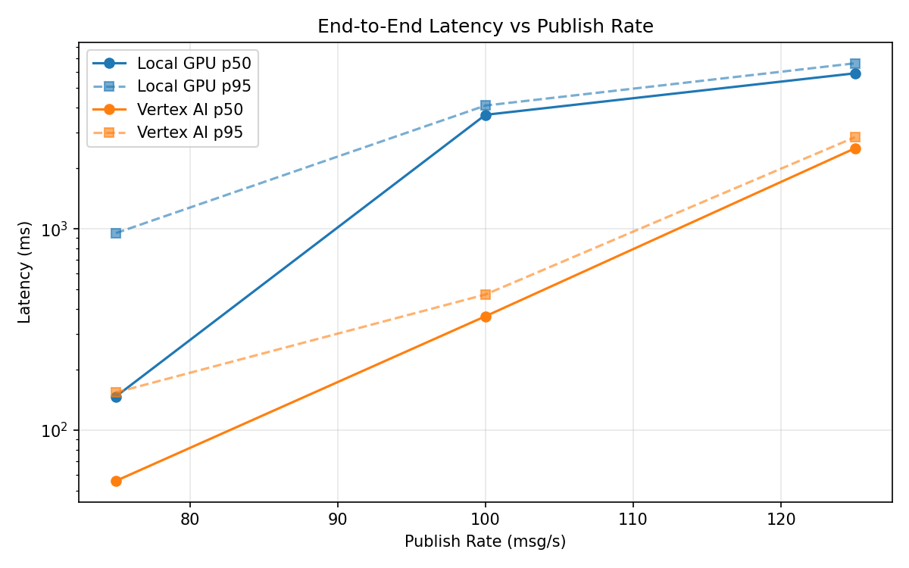
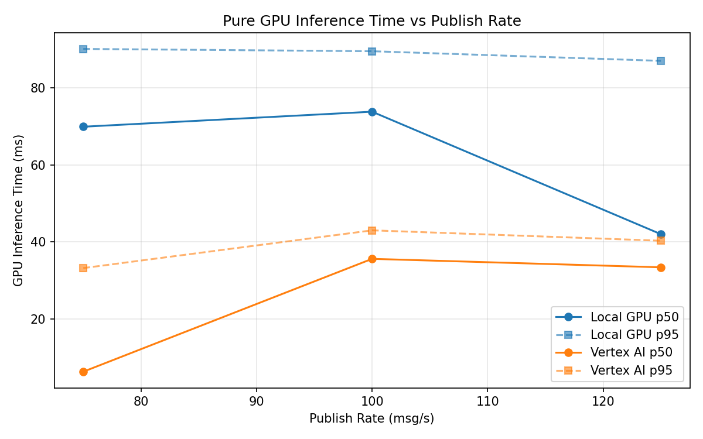
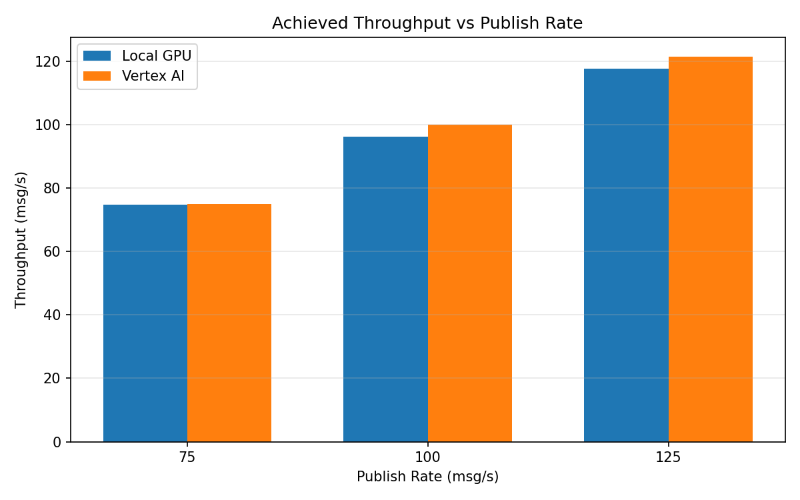

# Benchmark Report

Generated: 2026-03-08 04:44:39

## Configuration

| Parameter | Value |
|---|---|
| Messages per phase | 100s per phase |
| Rates (msg/s) | 75, 100, 125 |
| Experiments | Local GPU, Vertex AI |

## Throughput

| Rate (msg/s) | Local GPU | Vertex AI |
|---|---|---|
| 75 | 74.8 | 75.0 |
| 100 | 96.2 | 99.9 |
| 125 | 117.6 | 121.4 |

## End-to-End Latency (ms)

| Rate | Percentile | Local GPU | Vertex AI |
|---|---|---|---|
| 75 | p50 | 147.0 | 56.0 |
| 75 | p95 | 952.0 | 154.0 |
| 75 | p99 | 1123.0 | 914.0 |
| 100 | p50 | 3682.0 | 368.0 |
| 100 | p95 | 4094.0 | 472.0 |
| 100 | p99 | 4189.0 | 613.0 |
| 125 | p50 | 5919.5 | 2511.0 |
| 125 | p95 | 6637.0 | 2851.0 |
| 125 | p99 | 6754.0 | 2948.0 |

## GPU Inference Time (ms)

| Rate | Percentile | Local GPU | Vertex AI |
|---|---|---|---|
| 75 | p50 | 69.9 | 6.3 |
| 75 | p95 | 90.1 | 33.2 |
| 75 | p99 | 95.5 | 39.3 |
| 100 | p50 | 73.8 | 35.6 |
| 100 | p95 | 89.5 | 43.0 |
| 100 | p99 | 96.7 | 52.7 |
| 125 | p50 | 42.0 | 33.4 |
| 125 | p95 | 87.0 | 40.3 |
| 125 | p99 | 93.3 | 49.5 |

## Charts

### Latency vs Publish Rate

### GPU Inference Time vs Publish Rate

### Throughput vs Publish Rate

