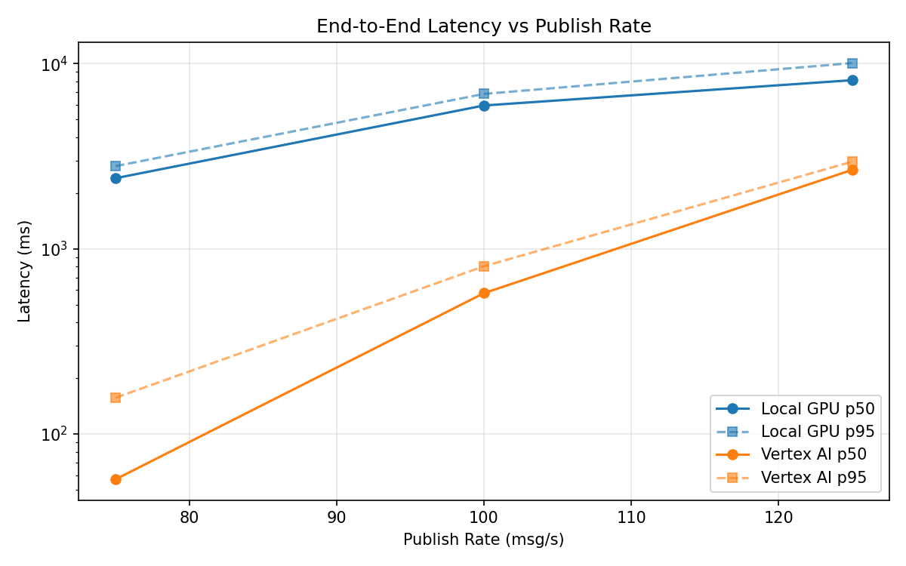
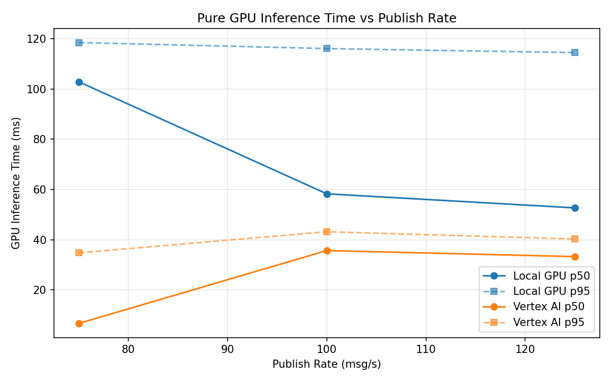
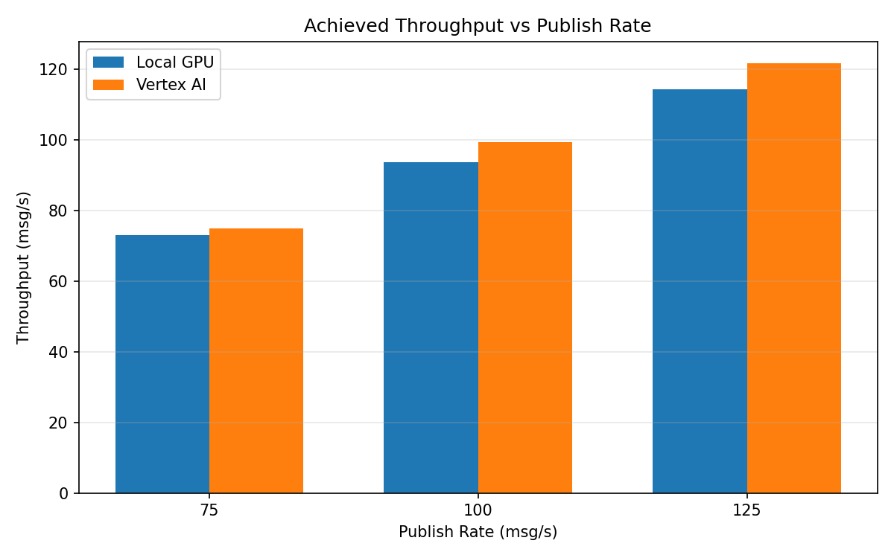

# Benchmark Report

Generated: 2026-03-08 04:57:29

## Configuration

| Parameter | Value |
|---|---|
| Messages per phase | 100s per phase |
| Rates (msg/s) | 75, 100, 125 |
| Experiments | Local GPU, Vertex AI |

## Throughput

| Rate (msg/s) | Local GPU | Vertex AI |
|---|---|---|
| 75 | 73.1 | 75.0 |
| 100 | 93.8 | 99.5 |
| 125 | 114.3 | 121.8 |

## End-to-End Latency (ms)

| Rate | Percentile | Local GPU | Vertex AI |
|---|---|---|---|
| 75 | p50 | 2406.0 | 57.0 |
| 75 | p95 | 2795.0 | 157.0 |
| 75 | p99 | 2872.0 | 409.0 |
| 100 | p50 | 5937.5 | 576.0 |
| 100 | p95 | 6854.0 | 805.0 |
| 100 | p99 | 6952.0 | 975.0 |
| 125 | p50 | 8132.5 | 2668.0 |
| 125 | p95 | 10061.0 | 2953.0 |
| 125 | p99 | 10239.0 | 3021.0 |

## GPU Inference Time (ms)

| Rate | Percentile | Local GPU | Vertex AI |
|---|---|---|---|
| 75 | p50 | 102.9 | 6.7 |
| 75 | p95 | 118.5 | 34.8 |
| 75 | p99 | 125.2 | 39.5 |
| 100 | p50 | 58.3 | 35.7 |
| 100 | p95 | 116.1 | 43.2 |
| 100 | p99 | 123.2 | 53.7 |
| 125 | p50 | 52.7 | 33.3 |
| 125 | p95 | 114.5 | 40.3 |
| 125 | p99 | 122.8 | 49.8 |

## Charts

### Latency vs Publish Rate

### GPU Inference Time vs Publish Rate

### Throughput vs Publish Rate

