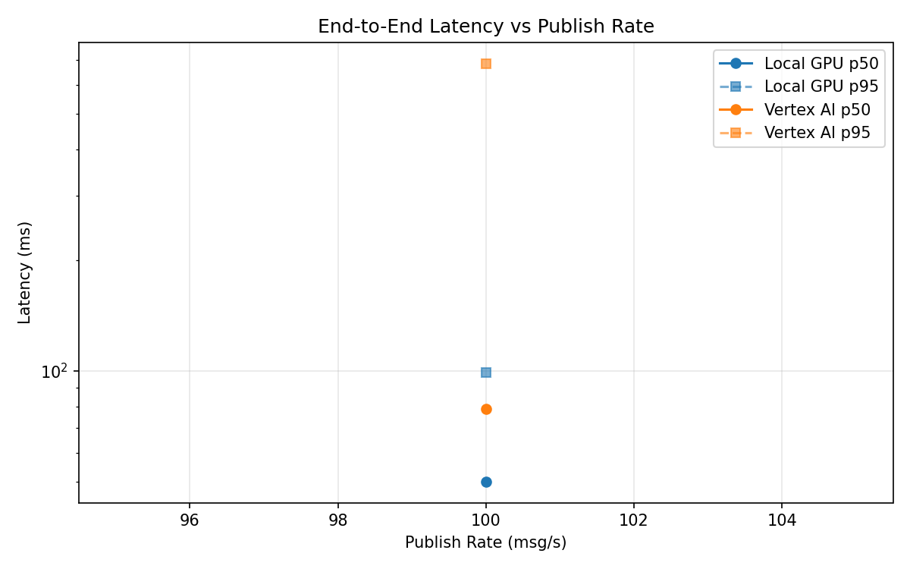
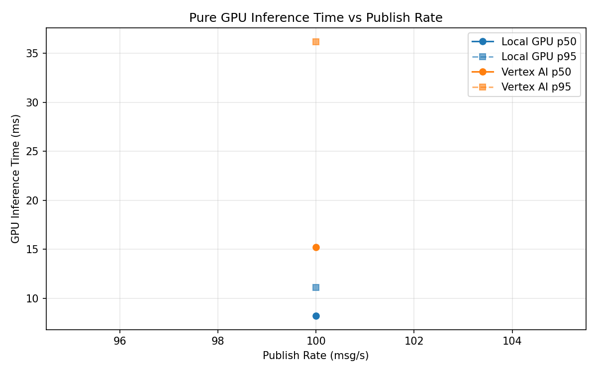

# Benchmark Report

Generated: 2026-03-08 17:07:58

## Configuration

| Parameter | Value |
|---|---|
| Messages per phase | 100s per phase |
| Rates (msg/s) | 100 |
| Experiments | Local GPU, Vertex AI |

## Throughput

| Rate (msg/s) | Local GPU | Vertex AI |
|---|---|---|
| 100 | 100.0 | 99.9 |

## End-to-End Latency (ms)

| Rate | Percentile | Local GPU | Vertex AI |
|---|---|---|---|
| 100 | p50 | 50.0 | 79.0 |
| 100 | p95 | 99.0 | 686.2 |
| 100 | p99 | 270.0 | 1350.0 |

## GPU Inference Time (ms)

| Rate | Percentile | Local GPU | Vertex AI |
|---|---|---|---|
| 100 | p50 | 8.2 | 15.2 |
| 100 | p95 | 11.1 | 36.2 |
| 100 | p99 | 12.0 | 45.8 |

## Charts

### Latency vs Publish Rate

### GPU Inference Time vs Publish Rate

### Throughput vs Publish Rate

