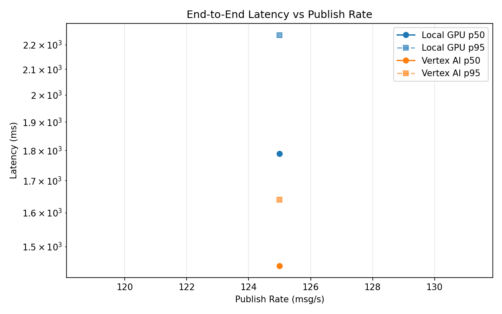
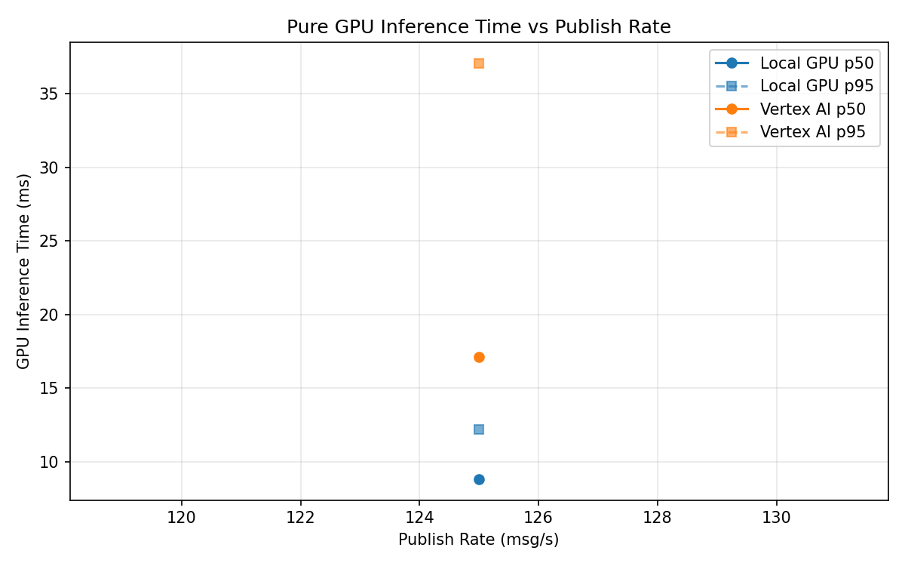
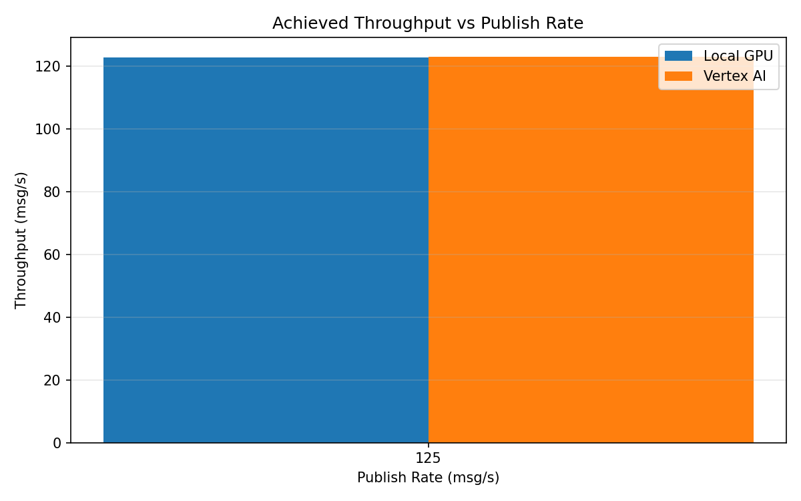

# Benchmark Report

Generated: 2026-03-08 17:17:13

## Configuration

| Parameter | Value |
|---|---|
| Messages per phase | 100s per phase |
| Rates (msg/s) | 125 |
| Experiments | Local GPU, Vertex AI |

## Throughput

| Rate (msg/s) | Local GPU | Vertex AI |
|---|---|---|
| 125 | 122.9 | 123.1 |

## End-to-End Latency (ms)

| Rate | Percentile | Local GPU | Vertex AI |
|---|---|---|---|
| 125 | p50 | 1789.0 | 1446.0 |
| 125 | p95 | 2241.0 | 1639.0 |
| 125 | p99 | 2339.0 | 1682.0 |

## GPU Inference Time (ms)

| Rate | Percentile | Local GPU | Vertex AI |
|---|---|---|---|
| 125 | p50 | 8.8 | 17.1 |
| 125 | p95 | 12.2 | 37.1 |
| 125 | p99 | 13.8 | 46.6 |

## Charts

### Latency vs Publish Rate

### GPU Inference Time vs Publish Rate

### Throughput vs Publish Rate

