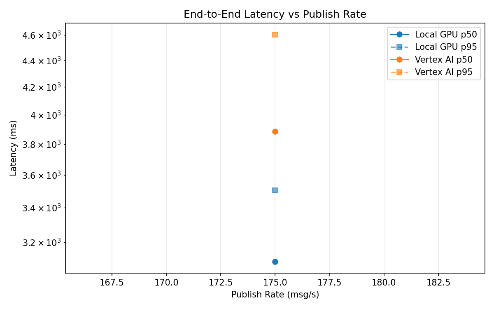
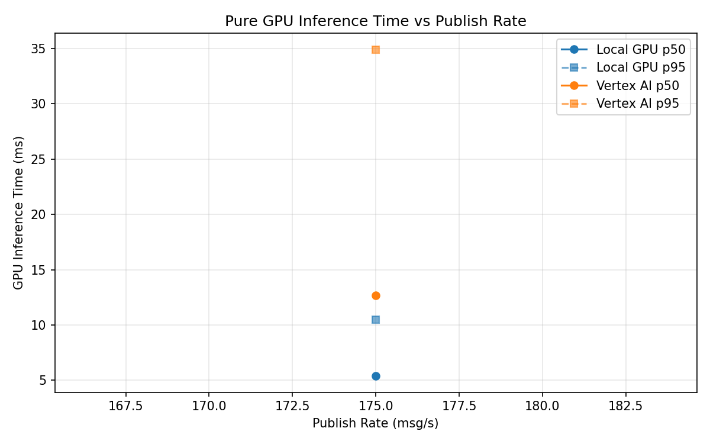
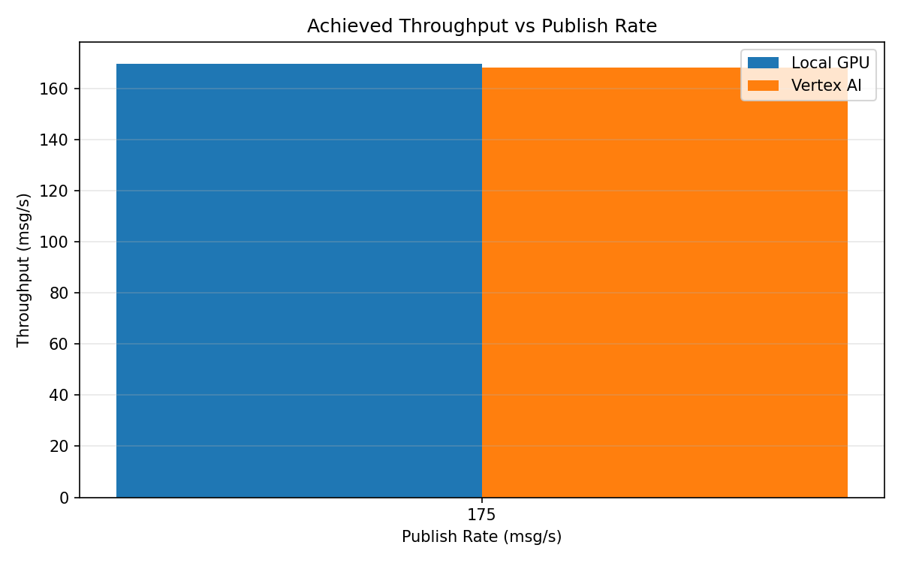

# Benchmark Report

Generated: 2026-03-08 17:36:39

## Configuration

| Parameter | Value |
|---|---|
| Messages per phase | 100s per phase |
| Rates (msg/s) | 175 |
| Experiments | Local GPU, Vertex AI |

## Throughput

| Rate (msg/s) | Local GPU | Vertex AI |
|---|---|---|
| 175 | 169.7 | 168.2 |

## End-to-End Latency (ms)

| Rate | Percentile | Local GPU | Vertex AI |
|---|---|---|---|
| 175 | p50 | 3093.0 | 3884.5 |
| 175 | p95 | 3503.0 | 4604.0 |
| 175 | p99 | 3638.0 | 4833.0 |

## GPU Inference Time (ms)

| Rate | Percentile | Local GPU | Vertex AI |
|---|---|---|---|
| 175 | p50 | 5.4 | 12.7 |
| 175 | p95 | 10.5 | 34.9 |
| 175 | p99 | 11.7 | 41.9 |

## Charts

### Latency vs Publish Rate

### GPU Inference Time vs Publish Rate

### Throughput vs Publish Rate

