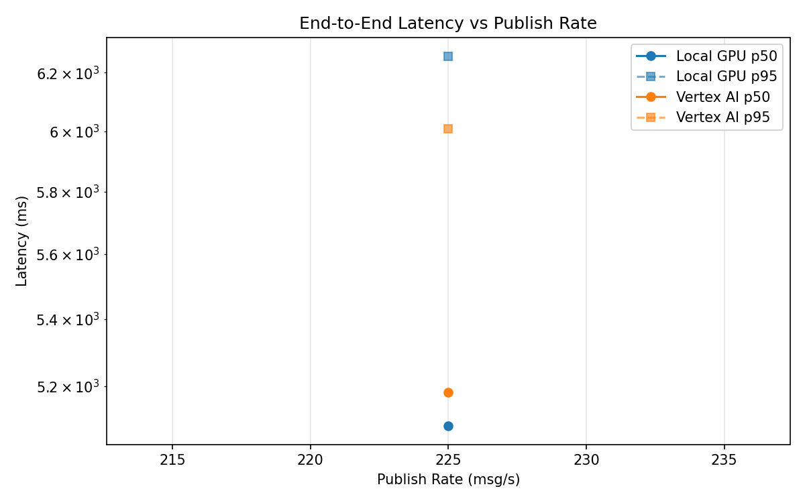
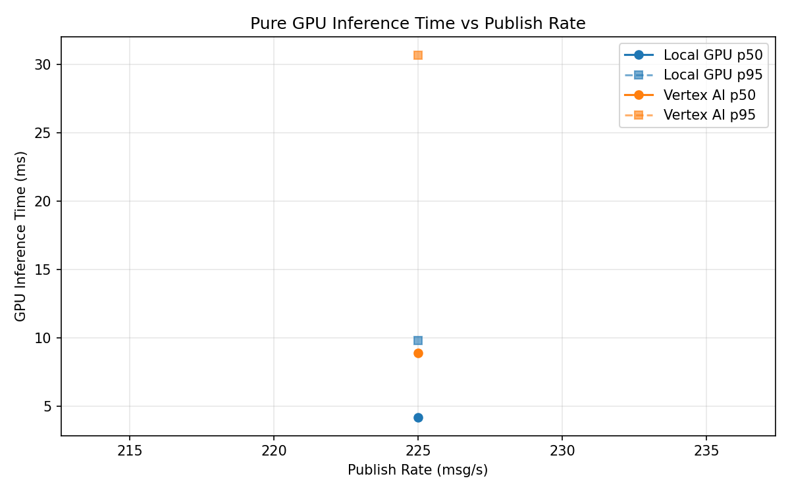
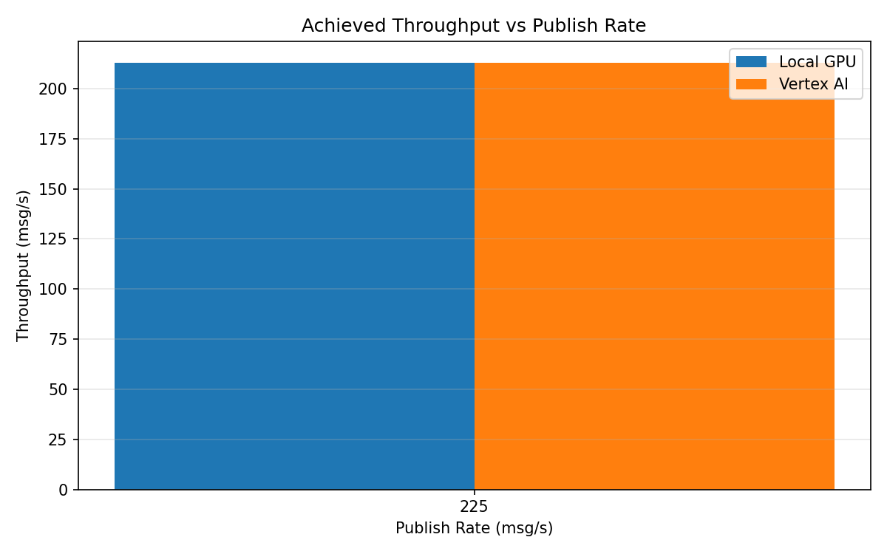

# Benchmark Report

Generated: 2026-03-08 17:55:19

## Configuration

| Parameter | Value |
|---|---|
| Messages per phase | 100s per phase |
| Rates (msg/s) | 225 |
| Experiments | Local GPU, Vertex AI |

## Throughput

| Rate (msg/s) | Local GPU | Vertex AI |
|---|---|---|
| 225 | 212.9 | 212.7 |

## End-to-End Latency (ms)

| Rate | Percentile | Local GPU | Vertex AI |
|---|---|---|---|
| 225 | p50 | 5086.0 | 5183.5 |
| 225 | p95 | 6258.0 | 6007.0 |
| 225 | p99 | 6315.0 | 6109.0 |

## GPU Inference Time (ms)

| Rate | Percentile | Local GPU | Vertex AI |
|---|---|---|---|
| 225 | p50 | 4.2 | 8.9 |
| 225 | p95 | 9.8 | 30.7 |
| 225 | p99 | 11.7 | 37.7 |

## Charts

### Latency vs Publish Rate

### GPU Inference Time vs Publish Rate

### Throughput vs Publish Rate

