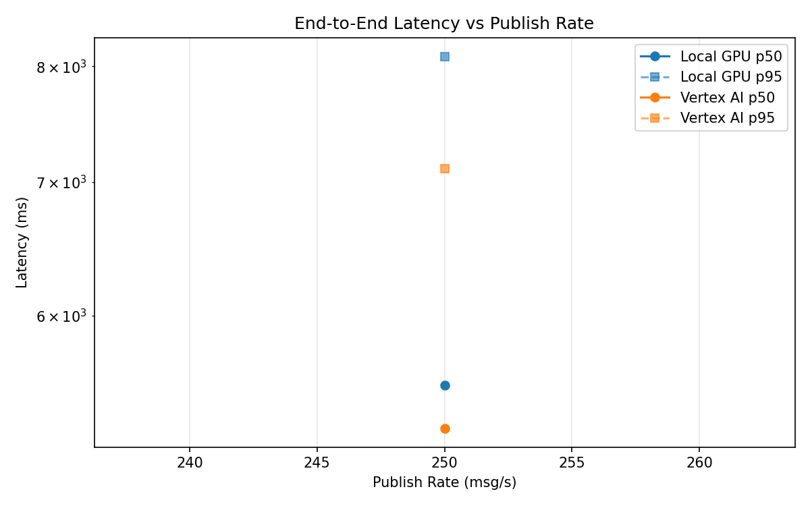
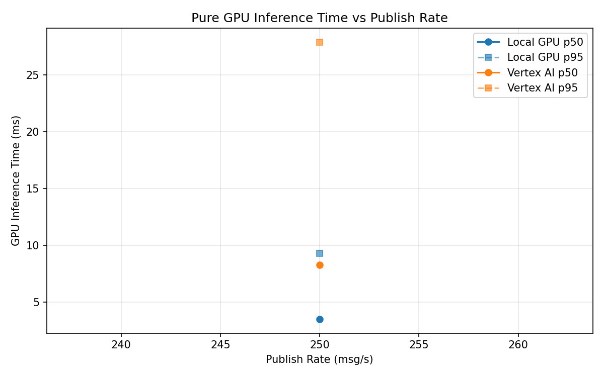
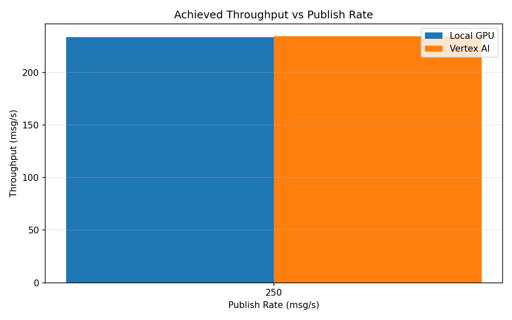

# Benchmark Report

Generated: 2026-03-08 18:04:39

## Configuration

| Parameter | Value |
|---|---|
| Messages per phase | 100s per phase |
| Rates (msg/s) | 250 |
| Experiments | Local GPU, Vertex AI |

## Throughput

| Rate (msg/s) | Local GPU | Vertex AI |
|---|---|---|
| 250 | 233.5 | 234.5 |

## End-to-End Latency (ms)

| Rate | Percentile | Local GPU | Vertex AI |
|---|---|---|---|
| 250 | p50 | 5536.0 | 5267.0 |
| 250 | p95 | 8091.0 | 7109.0 |
| 250 | p99 | 8171.0 | 7222.0 |

## GPU Inference Time (ms)

| Rate | Percentile | Local GPU | Vertex AI |
|---|---|---|---|
| 250 | p50 | 3.5 | 8.3 |
| 250 | p95 | 9.3 | 27.9 |
| 250 | p99 | 11.6 | 35.9 |

## Charts

### Latency vs Publish Rate

### GPU Inference Time vs Publish Rate

### Throughput vs Publish Rate

