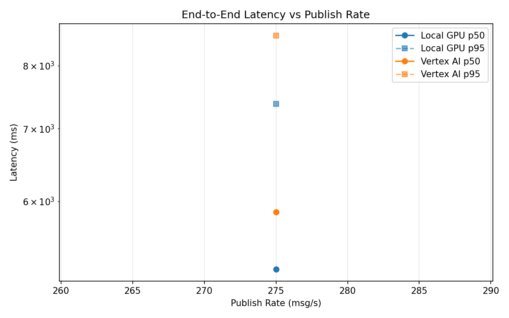
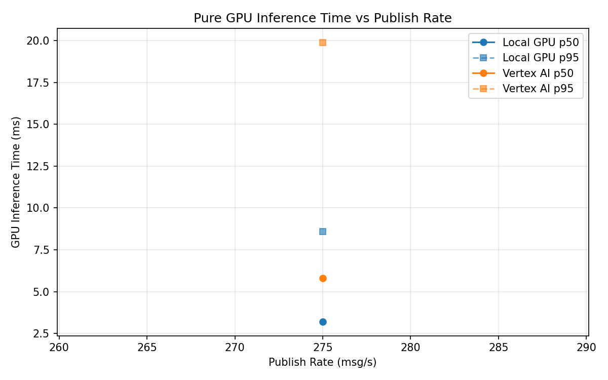
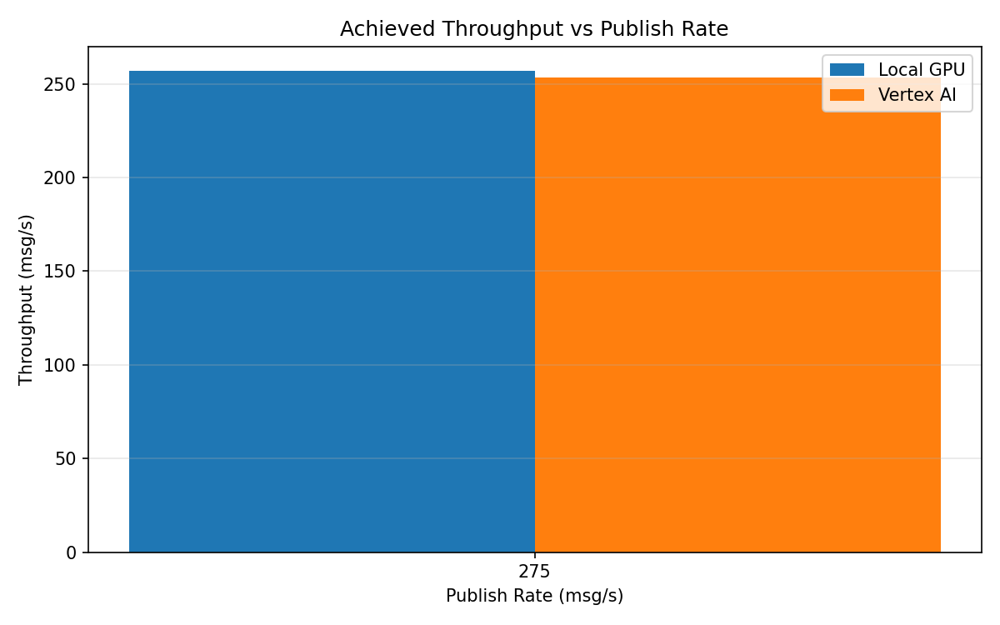

# Benchmark Report

Generated: 2026-03-08 18:13:20

## Configuration

| Parameter | Value |
|---|---|
| Messages per phase | 100s per phase |
| Rates (msg/s) | 275 |
| Experiments | Local GPU, Vertex AI |

## Throughput

| Rate (msg/s) | Local GPU | Vertex AI |
|---|---|---|
| 275 | 257.0 | 253.4 |

## End-to-End Latency (ms)

| Rate | Percentile | Local GPU | Vertex AI |
|---|---|---|---|
| 275 | p50 | 5195.0 | 5863.5 |
| 275 | p95 | 7378.0 | 8527.0 |
| 275 | p99 | 7526.0 | 8642.0 |

## GPU Inference Time (ms)

| Rate | Percentile | Local GPU | Vertex AI |
|---|---|---|---|
| 275 | p50 | 3.2 | 5.8 |
| 275 | p95 | 8.6 | 19.9 |
| 275 | p99 | 10.8 | 34.0 |

## Charts

### Latency vs Publish Rate

### GPU Inference Time vs Publish Rate

### Throughput vs Publish Rate

