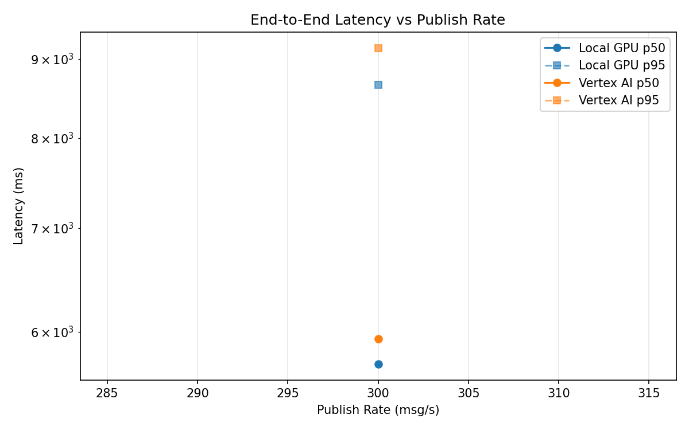
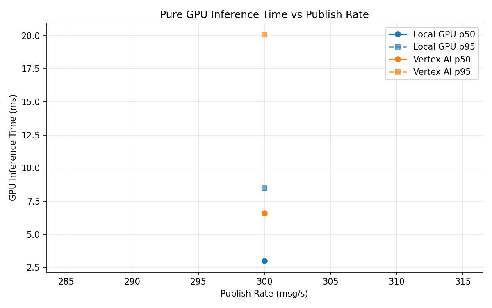
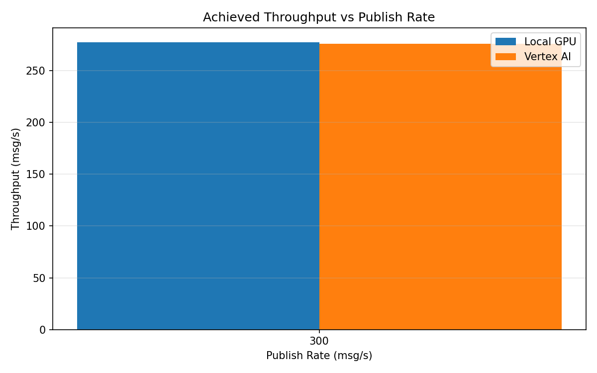

# Benchmark Report

Generated: 2026-03-08 18:22:43

## Configuration

| Parameter | Value |
|---|---|
| Messages per phase | 100s per phase |
| Rates (msg/s) | 300 |
| Experiments | Local GPU, Vertex AI |

## Throughput

| Rate (msg/s) | Local GPU | Vertex AI |
|---|---|---|
| 300 | 277.6 | 276.0 |

## End-to-End Latency (ms)

| Rate | Percentile | Local GPU | Vertex AI |
|---|---|---|---|
| 300 | p50 | 5720.0 | 5940.0 |
| 300 | p95 | 8657.0 | 9148.0 |
| 300 | p99 | 9000.0 | 9457.0 |

## GPU Inference Time (ms)

| Rate | Percentile | Local GPU | Vertex AI |
|---|---|---|---|
| 300 | p50 | 3.0 | 6.6 |
| 300 | p95 | 8.5 | 20.1 |
| 300 | p99 | 10.8 | 35.1 |

## Charts

### Latency vs Publish Rate

### GPU Inference Time vs Publish Rate

### Throughput vs Publish Rate

