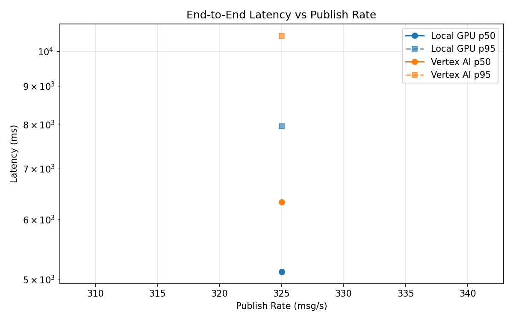
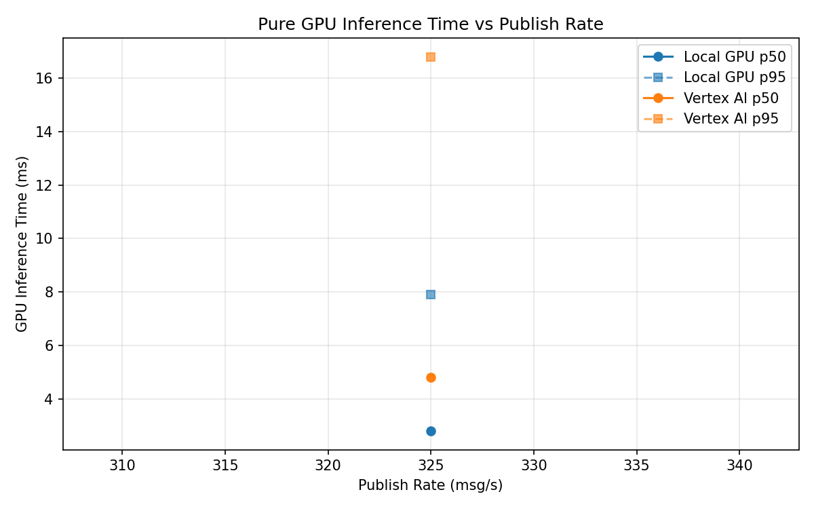
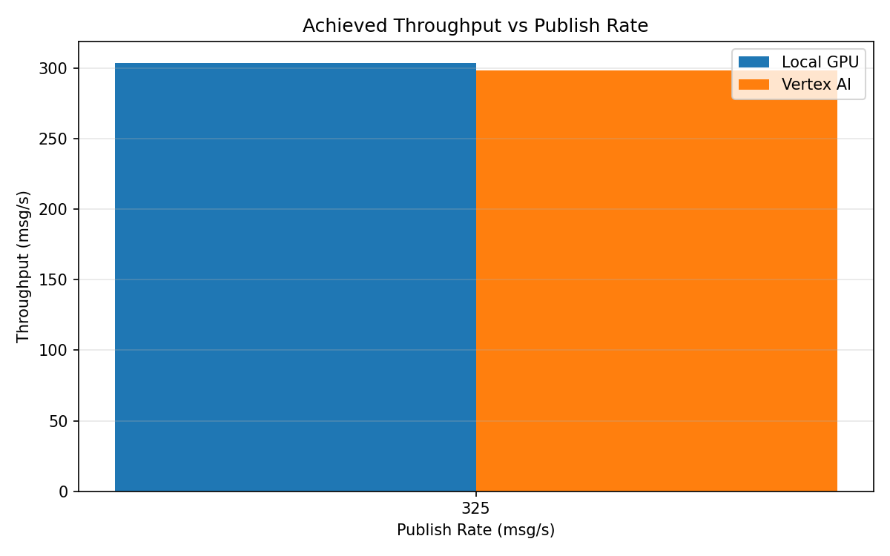

# Benchmark Report

Generated: 2026-03-08 18:31:56

## Configuration

| Parameter | Value |
|---|---|
| Messages per phase | 100s per phase |
| Rates (msg/s) | 325 |
| Experiments | Local GPU, Vertex AI |

## Throughput

| Rate (msg/s) | Local GPU | Vertex AI |
|---|---|---|
| 325 | 303.8 | 298.6 |

## End-to-End Latency (ms)

| Rate | Percentile | Local GPU | Vertex AI |
|---|---|---|---|
| 325 | p50 | 5113.0 | 6321.5 |
| 325 | p95 | 7958.0 | 10481.0 |
| 325 | p99 | 8095.0 | 10633.0 |

## GPU Inference Time (ms)

| Rate | Percentile | Local GPU | Vertex AI |
|---|---|---|---|
| 325 | p50 | 2.8 | 4.8 |
| 325 | p95 | 7.9 | 16.8 |
| 325 | p99 | 10.1 | 31.4 |

## Charts

### Latency vs Publish Rate

### GPU Inference Time vs Publish Rate

### Throughput vs Publish Rate

