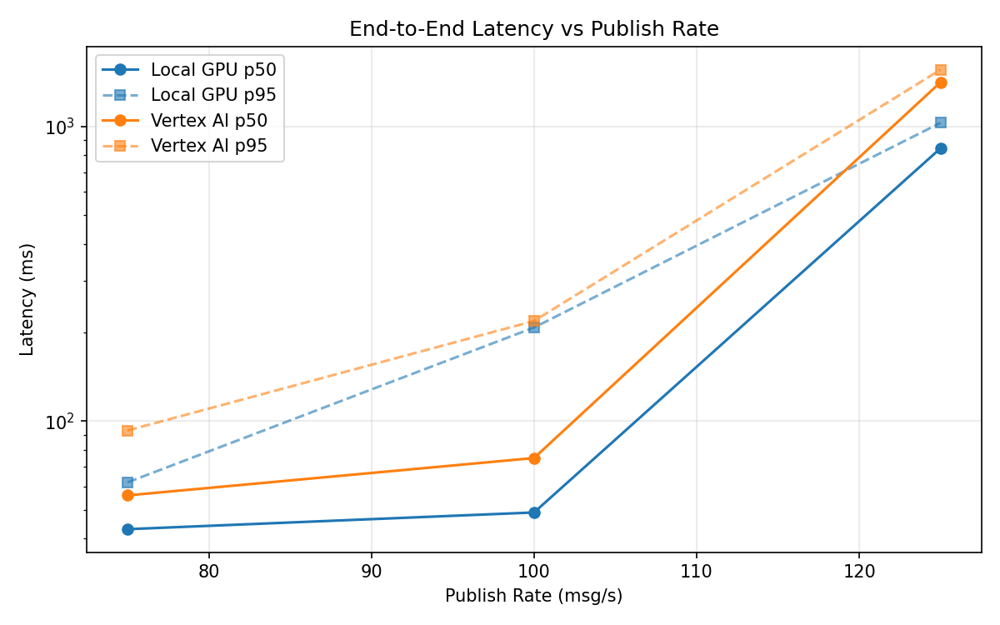
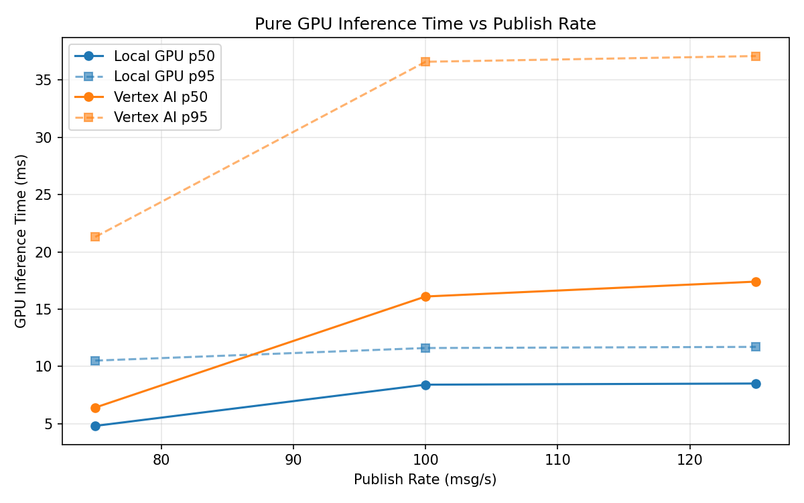
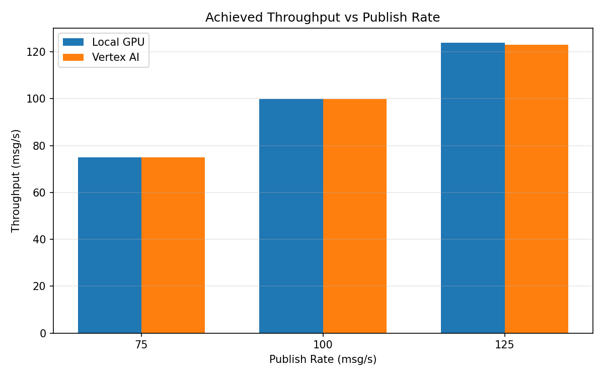

# Benchmark Report

Generated: 2026-03-08 13:42:24

## Configuration

| Parameter | Value |
|---|---|
| Messages per phase | 100s per phase |
| Rates (msg/s) | 75, 100, 125 |
| Experiments | Local GPU, Vertex AI |

## Throughput

| Rate (msg/s) | Local GPU | Vertex AI |
|---|---|---|
| 75 | 75.0 | 74.9 |
| 100 | 99.9 | 99.9 |
| 125 | 123.9 | 123.1 |

## End-to-End Latency (ms)

| Rate | Percentile | Local GPU | Vertex AI |
|---|---|---|---|
| 75 | p50 | 43.0 | 56.0 |
| 75 | p95 | 62.0 | 93.0 |
| 75 | p99 | 186.0 | 667.1 |
| 100 | p50 | 49.0 | 75.0 |
| 100 | p95 | 208.0 | 219.0 |
| 100 | p99 | 613.0 | 562.0 |
| 125 | p50 | 845.0 | 1416.0 |
| 125 | p95 | 1031.0 | 1562.0 |
| 125 | p99 | 1077.0 | 1615.0 |

## GPU Inference Time (ms)

| Rate | Percentile | Local GPU | Vertex AI |
|---|---|---|---|
| 75 | p50 | 4.8 | 6.4 |
| 75 | p95 | 10.5 | 21.3 |
| 75 | p99 | 11.8 | 35.1 |
| 100 | p50 | 8.4 | 16.1 |
| 100 | p95 | 11.6 | 36.6 |
| 100 | p99 | 12.5 | 46.3 |
| 125 | p50 | 8.5 | 17.4 |
| 125 | p95 | 11.7 | 37.1 |
| 125 | p99 | 12.8 | 46.1 |

## Charts

### Latency vs Publish Rate

### GPU Inference Time vs Publish Rate

### Throughput vs Publish Rate

