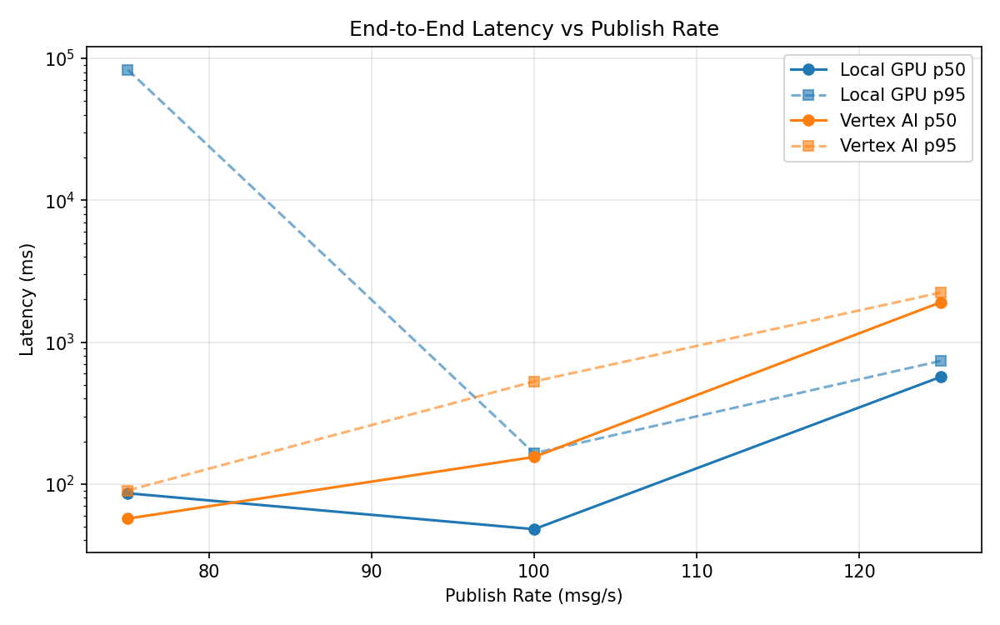
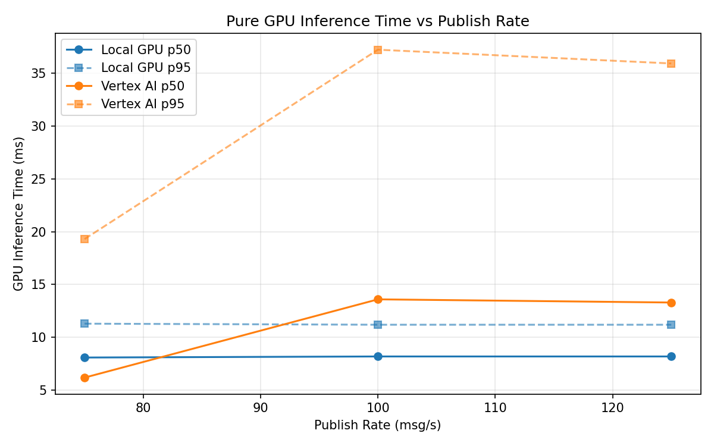
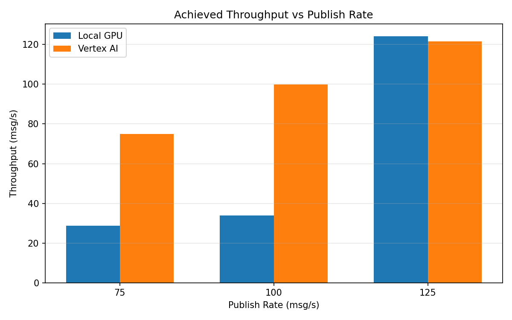

# Benchmark Report

Generated: 2026-03-08 13:56:18

## Configuration

| Parameter | Value |
|---|---|
| Messages per phase | 100s per phase |
| Rates (msg/s) | 75, 100, 125 |
| Experiments | Local GPU, Vertex AI |

## Throughput

| Rate (msg/s) | Local GPU | Vertex AI |
|---|---|---|
| 75 | 28.7 | 75.0 |
| 100 | 33.8 | 99.9 |
| 125 | 124.2 | 121.7 |

## End-to-End Latency (ms)

| Rate | Percentile | Local GPU | Vertex AI |
|---|---|---|---|
| 75 | p50 | 86.0 | 57.0 |
| 75 | p95 | 83338.0 | 90.0 |
| 75 | p99 | 118496.0 | 215.0 |
| 100 | p50 | 48.0 | 155.0 |
| 100 | p95 | 164.6 | 528.0 |
| 100 | p99 | 642.0 | 1085.0 |
| 125 | p50 | 568.0 | 1907.0 |
| 125 | p95 | 737.0 | 2233.0 |
| 125 | p99 | 771.0 | 2644.0 |

## GPU Inference Time (ms)

| Rate | Percentile | Local GPU | Vertex AI |
|---|---|---|---|
| 75 | p50 | 8.1 | 6.2 |
| 75 | p95 | 11.3 | 19.3 |
| 75 | p99 | 12.3 | 33.4 |
| 100 | p50 | 8.2 | 13.6 |
| 100 | p95 | 11.2 | 37.2 |
| 100 | p99 | 12.0 | 48.3 |
| 125 | p50 | 8.2 | 13.3 |
| 125 | p95 | 11.2 | 35.9 |
| 125 | p99 | 12.2 | 44.7 |

## Charts

### Latency vs Publish Rate

### GPU Inference Time vs Publish Rate

### Throughput vs Publish Rate

