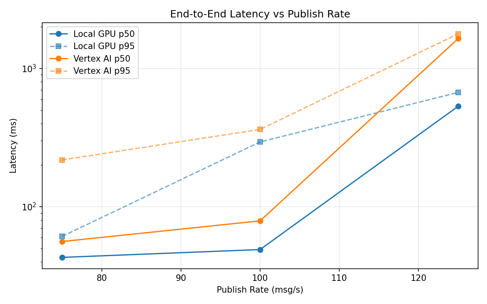
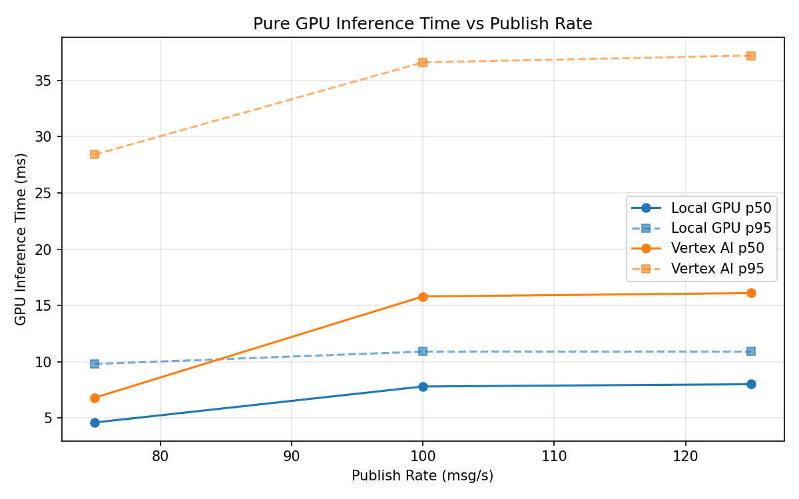
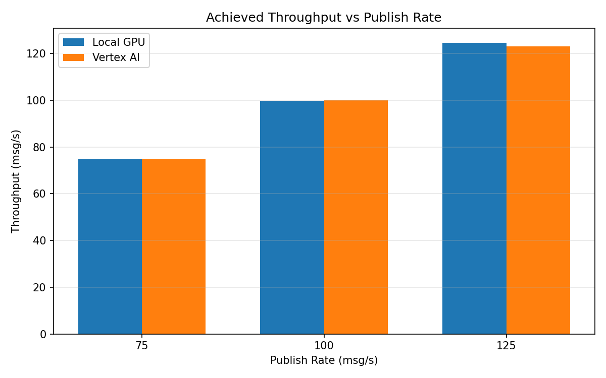

# Benchmark Report

Generated: 2026-03-08 14:09:25

## Configuration

| Parameter | Value |
|---|---|
| Messages per phase | 100s per phase |
| Rates (msg/s) | 75, 100, 125 |
| Experiments | Local GPU, Vertex AI |

## Throughput

| Rate (msg/s) | Local GPU | Vertex AI |
|---|---|---|
| 75 | 75.0 | 75.0 |
| 100 | 99.8 | 100.0 |
| 125 | 124.6 | 123.0 |

## End-to-End Latency (ms)

| Rate | Percentile | Local GPU | Vertex AI |
|---|---|---|---|
| 75 | p50 | 43.0 | 56.0 |
| 75 | p95 | 61.0 | 218.0 |
| 75 | p99 | 193.0 | 739.1 |
| 100 | p50 | 49.0 | 79.0 |
| 100 | p95 | 294.1 | 362.0 |
| 100 | p99 | 953.0 | 635.0 |
| 125 | p50 | 532.0 | 1640.5 |
| 125 | p95 | 670.0 | 1778.0 |
| 125 | p99 | 714.0 | 1816.0 |

## GPU Inference Time (ms)

| Rate | Percentile | Local GPU | Vertex AI |
|---|---|---|---|
| 75 | p50 | 4.6 | 6.8 |
| 75 | p95 | 9.8 | 28.4 |
| 75 | p99 | 11.1 | 36.4 |
| 100 | p50 | 7.8 | 15.8 |
| 100 | p95 | 10.9 | 36.6 |
| 100 | p99 | 11.8 | 47.5 |
| 125 | p50 | 8.0 | 16.1 |
| 125 | p95 | 10.9 | 37.2 |
| 125 | p99 | 11.7 | 45.4 |

## Charts

### Latency vs Publish Rate

### GPU Inference Time vs Publish Rate

### Throughput vs Publish Rate

