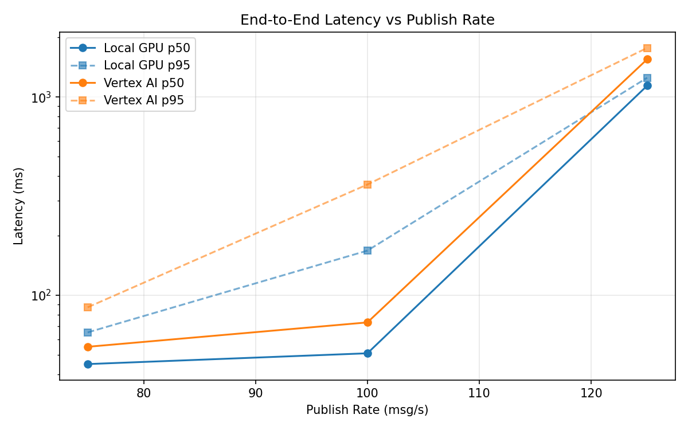
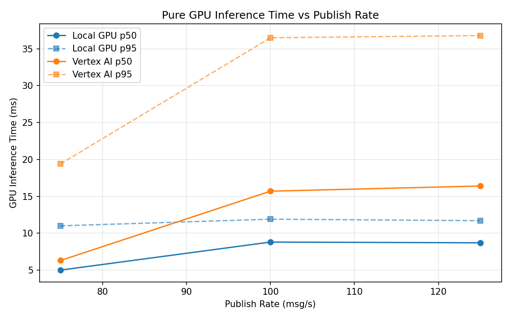
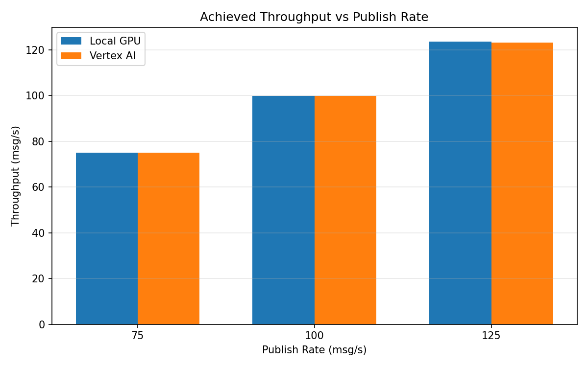

# Benchmark Report

Generated: 2026-03-08 14:22:01

## Configuration

| Parameter | Value |
|---|---|
| Messages per phase | 100s per phase |
| Rates (msg/s) | 75, 100, 125 |
| Experiments | Local GPU, Vertex AI |

## Throughput

| Rate (msg/s) | Local GPU | Vertex AI |
|---|---|---|
| 75 | 75.0 | 75.0 |
| 100 | 99.9 | 99.9 |
| 125 | 123.6 | 123.1 |

## End-to-End Latency (ms)

| Rate | Percentile | Local GPU | Vertex AI |
|---|---|---|---|
| 75 | p50 | 45.0 | 55.0 |
| 75 | p95 | 65.0 | 87.0 |
| 75 | p99 | 267.0 | 248.0 |
| 100 | p50 | 51.0 | 73.0 |
| 100 | p95 | 168.0 | 362.0 |
| 100 | p99 | 414.0 | 782.0 |
| 125 | p50 | 1140.0 | 1549.0 |
| 125 | p95 | 1250.0 | 1768.0 |
| 125 | p99 | 1303.0 | 1811.0 |

## GPU Inference Time (ms)

| Rate | Percentile | Local GPU | Vertex AI |
|---|---|---|---|
| 75 | p50 | 5.0 | 6.3 |
| 75 | p95 | 11.0 | 19.4 |
| 75 | p99 | 12.0 | 33.6 |
| 100 | p50 | 8.8 | 15.7 |
| 100 | p95 | 11.9 | 36.5 |
| 100 | p99 | 12.8 | 45.7 |
| 125 | p50 | 8.7 | 16.4 |
| 125 | p95 | 11.7 | 36.8 |
| 125 | p99 | 12.9 | 45.8 |

## Charts

### Latency vs Publish Rate

### GPU Inference Time vs Publish Rate

### Throughput vs Publish Rate

