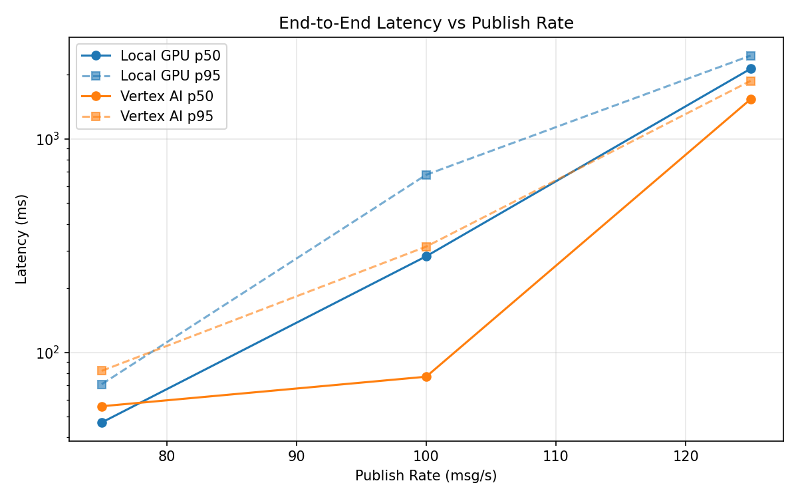
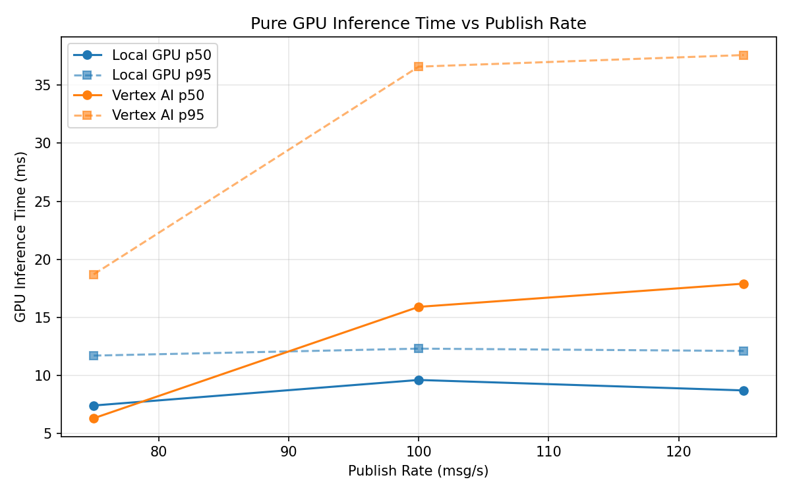
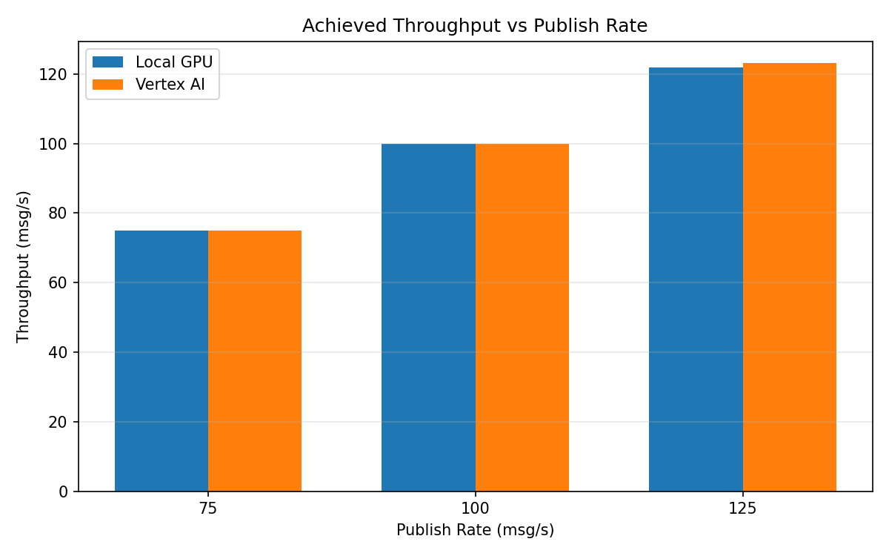

# Benchmark Report

Generated: 2026-03-08 14:35:36

## Configuration

| Parameter | Value |
|---|---|
| Messages per phase | 100s per phase |
| Rates (msg/s) | 75, 100, 125 |
| Experiments | Local GPU, Vertex AI |

## Throughput

| Rate (msg/s) | Local GPU | Vertex AI |
|---|---|---|
| 75 | 75.0 | 75.0 |
| 100 | 99.9 | 100.0 |
| 125 | 122.0 | 123.2 |

## End-to-End Latency (ms)

| Rate | Percentile | Local GPU | Vertex AI |
|---|---|---|---|
| 75 | p50 | 47.0 | 56.0 |
| 75 | p95 | 71.0 | 82.0 |
| 75 | p99 | 185.0 | 221.1 |
| 100 | p50 | 282.0 | 77.0 |
| 100 | p95 | 679.0 | 313.0 |
| 100 | p99 | 959.0 | 650.0 |
| 125 | p50 | 2130.0 | 1534.0 |
| 125 | p95 | 2455.0 | 1870.0 |
| 125 | p99 | 2494.0 | 1935.0 |

## GPU Inference Time (ms)

| Rate | Percentile | Local GPU | Vertex AI |
|---|---|---|---|
| 75 | p50 | 7.4 | 6.3 |
| 75 | p95 | 11.7 | 18.7 |
| 75 | p99 | 13.3 | 30.7 |
| 100 | p50 | 9.6 | 15.9 |
| 100 | p95 | 12.3 | 36.6 |
| 100 | p99 | 14.2 | 46.1 |
| 125 | p50 | 8.7 | 17.9 |
| 125 | p95 | 12.1 | 37.6 |
| 125 | p99 | 13.7 | 45.6 |

## Charts

### Latency vs Publish Rate

### GPU Inference Time vs Publish Rate

### Throughput vs Publish Rate

