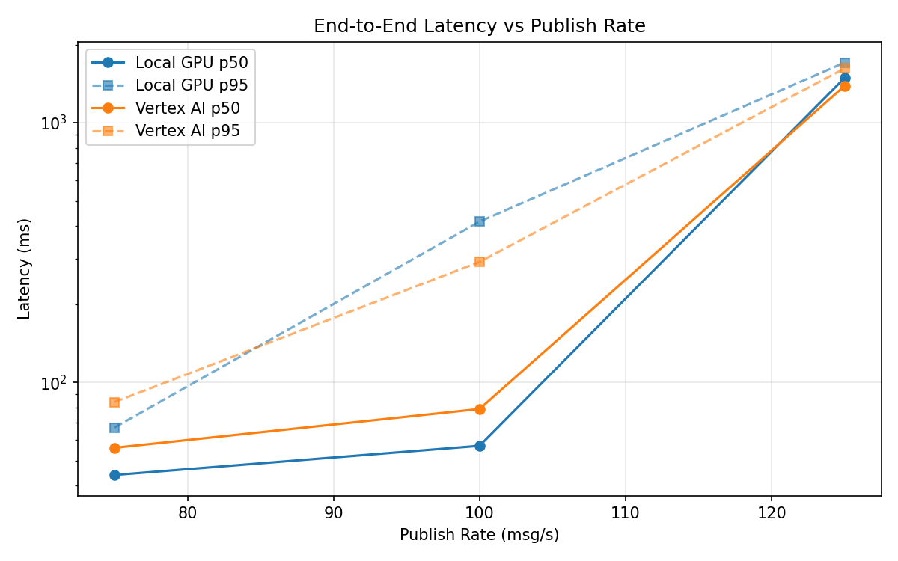
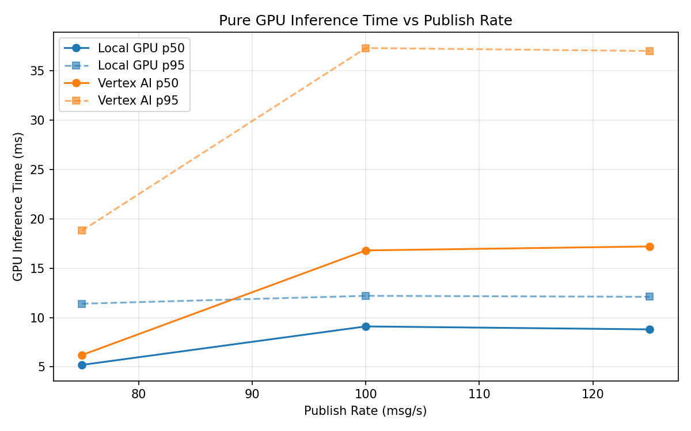
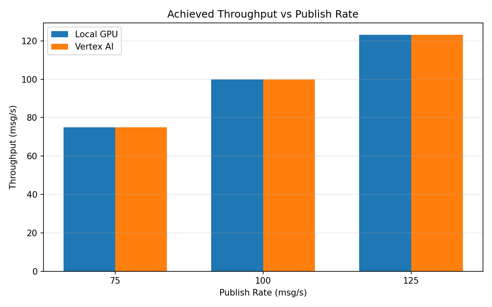

# Benchmark Report

Generated: 2026-03-08 13:16:31

## Configuration

| Parameter | Value |
|---|---|
| Messages per phase | 100s per phase |
| Rates (msg/s) | 75, 100, 125 |
| Experiments | Local GPU, Vertex AI |

## Throughput

| Rate (msg/s) | Local GPU | Vertex AI |
|---|---|---|
| 75 | 75.0 | 75.0 |
| 100 | 99.9 | 100.0 |
| 125 | 123.2 | 123.1 |

## End-to-End Latency (ms)

| Rate | Percentile | Local GPU | Vertex AI |
|---|---|---|---|
| 75 | p50 | 44.0 | 56.0 |
| 75 | p95 | 67.0 | 84.0 |
| 75 | p99 | 511.1 | 152.0 |
| 100 | p50 | 57.0 | 79.0 |
| 100 | p95 | 416.0 | 291.0 |
| 100 | p99 | 695.0 | 426.0 |
| 125 | p50 | 1488.0 | 1387.0 |
| 125 | p95 | 1705.0 | 1619.0 |
| 125 | p99 | 1750.0 | 1704.0 |

## GPU Inference Time (ms)

| Rate | Percentile | Local GPU | Vertex AI |
|---|---|---|---|
| 75 | p50 | 5.2 | 6.2 |
| 75 | p95 | 11.4 | 18.8 |
| 75 | p99 | 12.5 | 31.6 |
| 100 | p50 | 9.1 | 16.8 |
| 100 | p95 | 12.2 | 37.3 |
| 100 | p99 | 13.6 | 47.3 |
| 125 | p50 | 8.8 | 17.2 |
| 125 | p95 | 12.1 | 37.0 |
| 125 | p99 | 13.4 | 46.9 |

## Charts

### Latency vs Publish Rate

### GPU Inference Time vs Publish Rate

### Throughput vs Publish Rate

