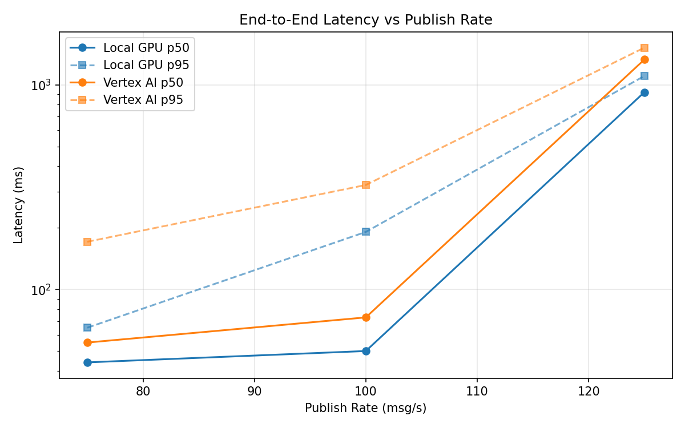
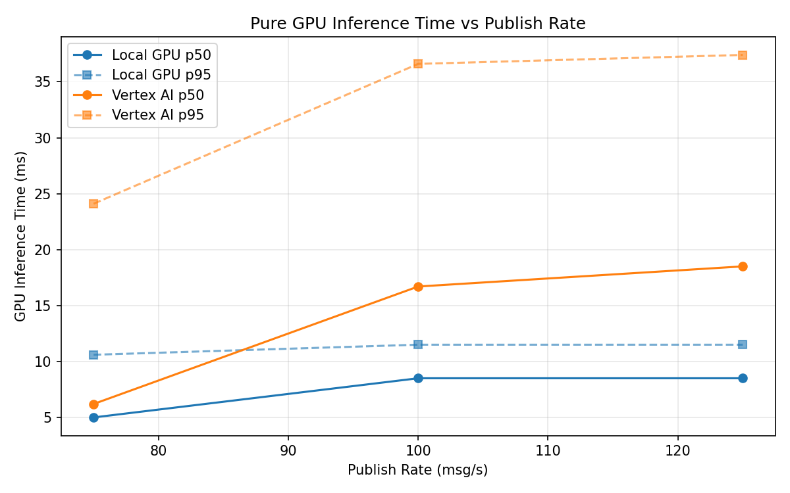
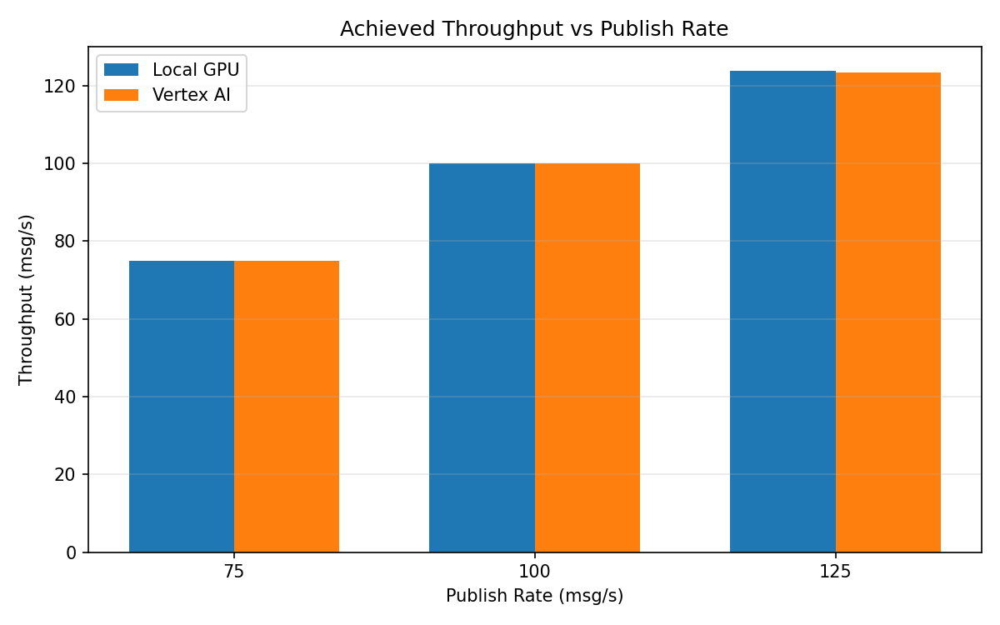

# Benchmark Report

Generated: 2026-03-08 13:29:29

## Configuration

| Parameter | Value |
|---|---|
| Messages per phase | 100s per phase |
| Rates (msg/s) | 75, 100, 125 |
| Experiments | Local GPU, Vertex AI |

## Throughput

| Rate (msg/s) | Local GPU | Vertex AI |
|---|---|---|
| 75 | 75.0 | 75.0 |
| 100 | 99.9 | 99.9 |
| 125 | 123.8 | 123.3 |

## End-to-End Latency (ms)

| Rate | Percentile | Local GPU | Vertex AI |
|---|---|---|---|
| 75 | p50 | 44.0 | 55.0 |
| 75 | p95 | 65.0 | 171.0 |
| 75 | p99 | 445.0 | 658.0 |
| 100 | p50 | 50.0 | 73.0 |
| 100 | p95 | 191.0 | 324.0 |
| 100 | p99 | 435.0 | 712.0 |
| 125 | p50 | 920.0 | 1328.0 |
| 125 | p95 | 1105.0 | 1519.0 |
| 125 | p99 | 1135.0 | 1563.0 |

## GPU Inference Time (ms)

| Rate | Percentile | Local GPU | Vertex AI |
|---|---|---|---|
| 75 | p50 | 5.0 | 6.2 |
| 75 | p95 | 10.6 | 24.1 |
| 75 | p99 | 11.8 | 37.0 |
| 100 | p50 | 8.5 | 16.7 |
| 100 | p95 | 11.5 | 36.6 |
| 100 | p99 | 12.3 | 47.6 |
| 125 | p50 | 8.5 | 18.5 |
| 125 | p95 | 11.5 | 37.4 |
| 125 | p99 | 12.5 | 46.6 |

## Charts

### Latency vs Publish Rate

### GPU Inference Time vs Publish Rate

### Throughput vs Publish Rate

