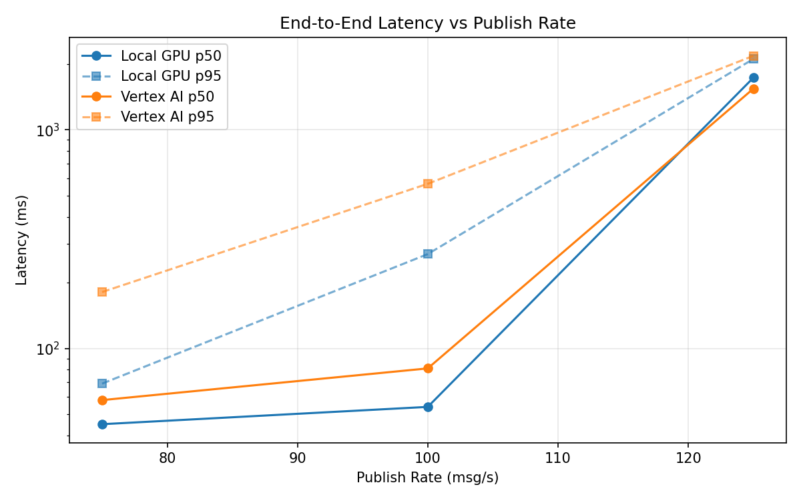
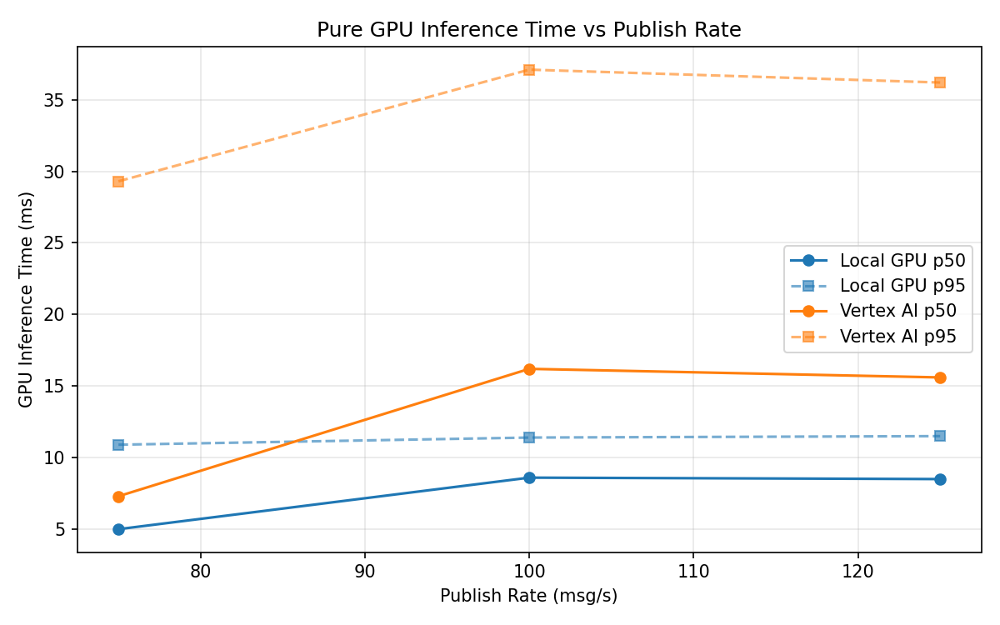
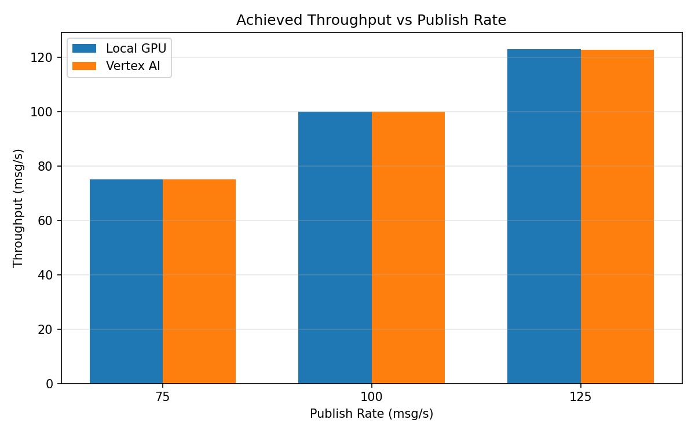

# Benchmark Report

Generated: 2026-03-08 14:49:00

## Configuration

| Parameter | Value |
|---|---|
| Messages per phase | 100s per phase |
| Rates (msg/s) | 75, 100, 125 |
| Experiments | Local GPU, Vertex AI |

## Throughput

| Rate (msg/s) | Local GPU | Vertex AI |
|---|---|---|
| 75 | 75.0 | 75.0 |
| 100 | 100.0 | 99.9 |
| 125 | 122.9 | 122.6 |

## End-to-End Latency (ms)

| Rate | Percentile | Local GPU | Vertex AI |
|---|---|---|---|
| 75 | p50 | 45.0 | 58.0 |
| 75 | p95 | 69.0 | 181.0 |
| 75 | p99 | 704.0 | 585.0 |
| 100 | p50 | 54.0 | 81.0 |
| 100 | p95 | 270.0 | 566.1 |
| 100 | p99 | 741.0 | 1125.0 |
| 125 | p50 | 1731.5 | 1543.0 |
| 125 | p95 | 2110.0 | 2180.0 |
| 125 | p99 | 2153.0 | 2262.0 |

## GPU Inference Time (ms)

| Rate | Percentile | Local GPU | Vertex AI |
|---|---|---|---|
| 75 | p50 | 5.0 | 7.3 |
| 75 | p95 | 10.9 | 29.3 |
| 75 | p99 | 11.9 | 36.6 |
| 100 | p50 | 8.6 | 16.2 |
| 100 | p95 | 11.4 | 37.1 |
| 100 | p99 | 12.2 | 46.8 |
| 125 | p50 | 8.5 | 15.6 |
| 125 | p95 | 11.5 | 36.2 |
| 125 | p99 | 12.8 | 45.1 |

## Charts

### Latency vs Publish Rate

### GPU Inference Time vs Publish Rate

### Throughput vs Publish Rate

