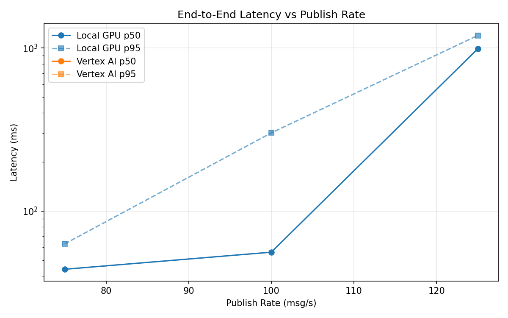
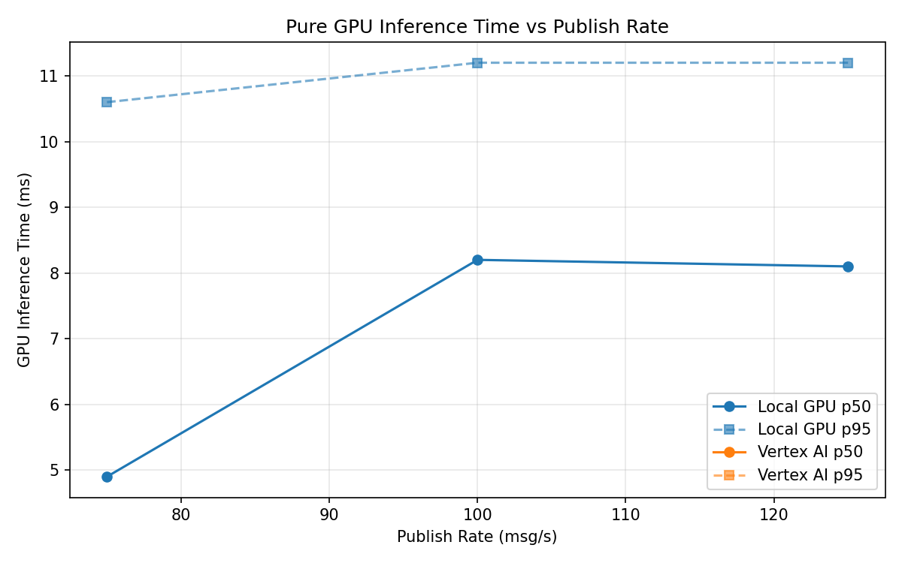
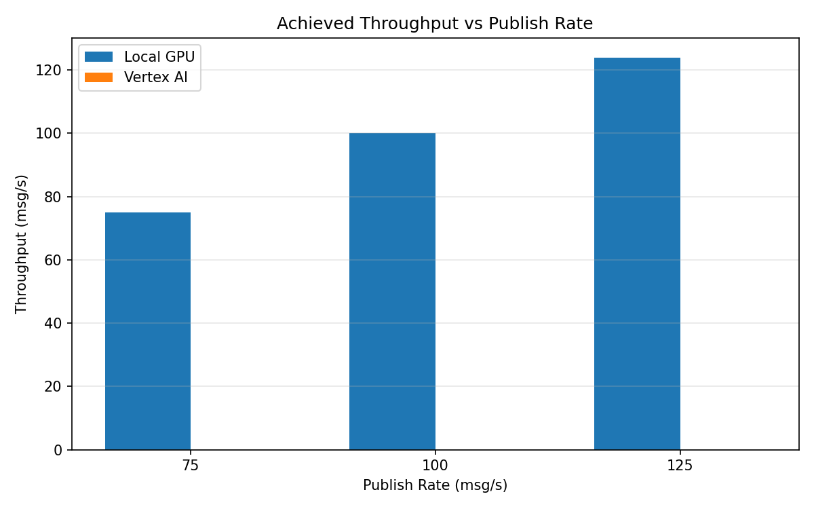

# Benchmark Report

Generated: 2026-03-08 16:23:45

## Configuration

| Parameter | Value |
|---|---|
| Messages per phase | 100s per phase |
| Rates (msg/s) | 75, 100, 125 |
| Experiments | Local GPU, Vertex AI |

## Throughput

| Rate (msg/s) | Local GPU | Vertex AI |
|---|---|---|
| 75 | 75.0 | — |
| 100 | 100.0 | — |
| 125 | 123.9 | — |

## End-to-End Latency (ms)

| Rate | Percentile | Local GPU | Vertex AI |
|---|---|---|---|
| 75 | p50 | 44.0 | — |
| 75 | p95 | 63.0 | — |
| 75 | p99 | 544.2 | — |
| 100 | p50 | 56.0 | — |
| 100 | p95 | 302.0 | — |
| 100 | p99 | 952.0 | — |
| 125 | p50 | 991.0 | — |
| 125 | p95 | 1196.0 | — |
| 125 | p99 | 1253.0 | — |

## GPU Inference Time (ms)

| Rate | Percentile | Local GPU | Vertex AI |
|---|---|---|---|
| 75 | p50 | 4.9 | — |
| 75 | p95 | 10.6 | — |
| 75 | p99 | 11.6 | — |
| 100 | p50 | 8.2 | — |
| 100 | p95 | 11.2 | — |
| 100 | p99 | 12.2 | — |
| 125 | p50 | 8.1 | — |
| 125 | p95 | 11.2 | — |
| 125 | p99 | 12.2 | — |

## Charts

### Latency vs Publish Rate

### GPU Inference Time vs Publish Rate

### Throughput vs Publish Rate

