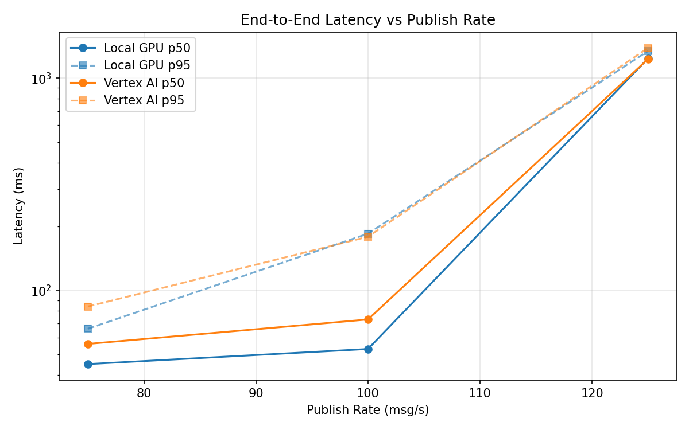
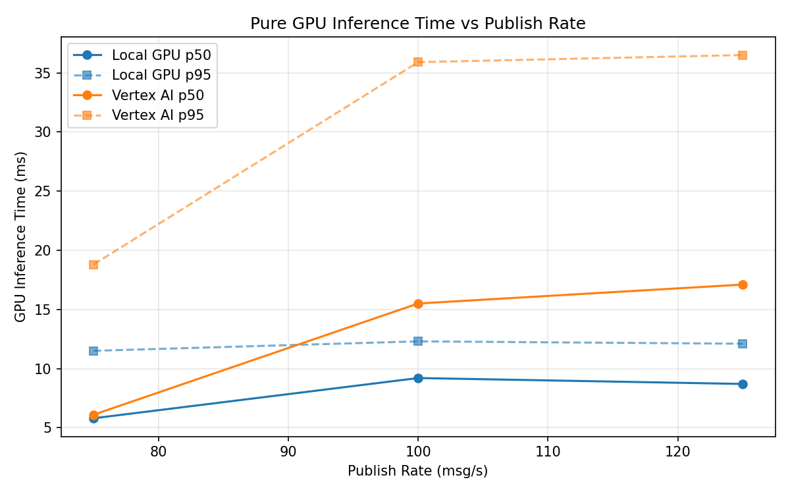
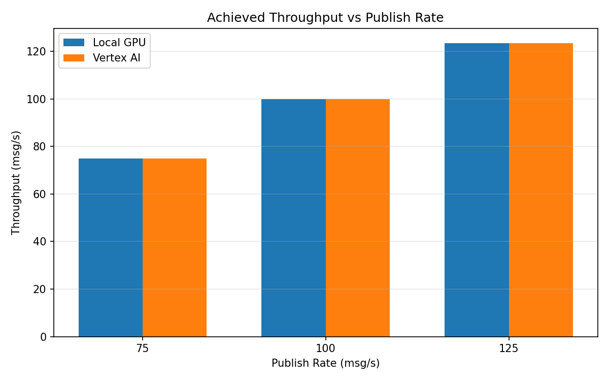

# Benchmark Report

Generated: 2026-03-08 15:26:54

## Configuration

| Parameter | Value |
|---|---|
| Messages per phase | 100s per phase |
| Rates (msg/s) | 75, 100, 125 |
| Experiments | Local GPU, Vertex AI |

## Throughput

| Rate (msg/s) | Local GPU | Vertex AI |
|---|---|---|
| 75 | 75.0 | 75.0 |
| 100 | 100.0 | 99.9 |
| 125 | 123.4 | 123.5 |

## End-to-End Latency (ms)

| Rate | Percentile | Local GPU | Vertex AI |
|---|---|---|---|
| 75 | p50 | 45.0 | 56.0 |
| 75 | p95 | 66.0 | 84.0 |
| 75 | p99 | 469.1 | 198.0 |
| 100 | p50 | 53.0 | 73.0 |
| 100 | p95 | 185.0 | 179.0 |
| 100 | p99 | 444.0 | 263.0 |
| 125 | p50 | 1238.0 | 1230.0 |
| 125 | p95 | 1341.0 | 1387.0 |
| 125 | p99 | 1370.0 | 1421.0 |

## GPU Inference Time (ms)

| Rate | Percentile | Local GPU | Vertex AI |
|---|---|---|---|
| 75 | p50 | 5.8 | 6.1 |
| 75 | p95 | 11.5 | 18.8 |
| 75 | p99 | 12.6 | 31.3 |
| 100 | p50 | 9.2 | 15.5 |
| 100 | p95 | 12.3 | 35.9 |
| 100 | p99 | 13.7 | 46.0 |
| 125 | p50 | 8.7 | 17.1 |
| 125 | p95 | 12.1 | 36.5 |
| 125 | p99 | 13.4 | 46.0 |

## Charts

### Latency vs Publish Rate

### GPU Inference Time vs Publish Rate

### Throughput vs Publish Rate

