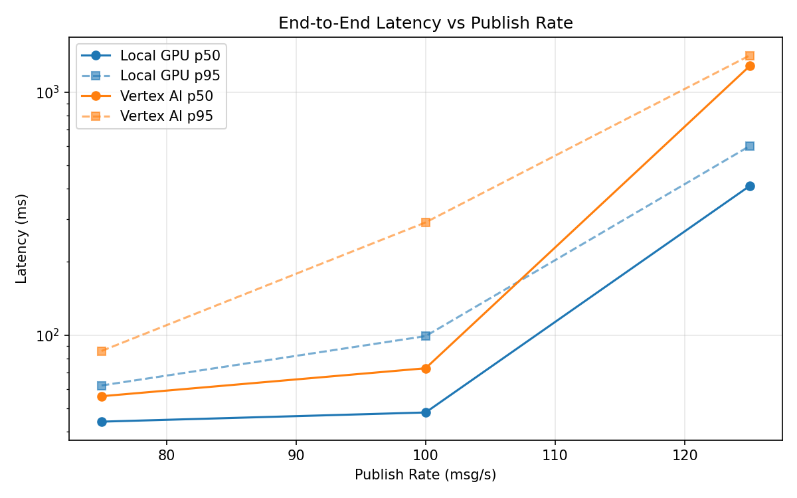
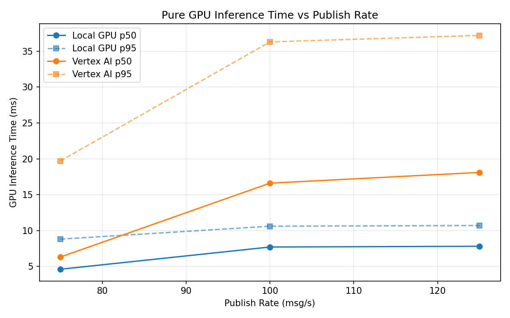
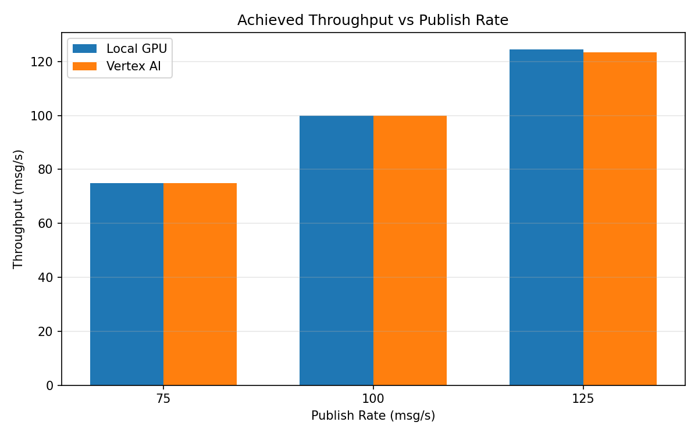

# Benchmark Report

Generated: 2026-03-08 15:39:32

## Configuration

| Parameter | Value |
|---|---|
| Messages per phase | 100s per phase |
| Rates (msg/s) | 75, 100, 125 |
| Experiments | Local GPU, Vertex AI |

## Throughput

| Rate (msg/s) | Local GPU | Vertex AI |
|---|---|---|
| 75 | 75.0 | 75.0 |
| 100 | 99.9 | 99.9 |
| 125 | 124.5 | 123.4 |

## End-to-End Latency (ms)

| Rate | Percentile | Local GPU | Vertex AI |
|---|---|---|---|
| 75 | p50 | 44.0 | 56.0 |
| 75 | p95 | 62.0 | 86.0 |
| 75 | p99 | 145.0 | 244.0 |
| 100 | p50 | 48.0 | 73.0 |
| 100 | p95 | 99.0 | 291.0 |
| 100 | p99 | 234.0 | 729.0 |
| 125 | p50 | 411.0 | 1281.0 |
| 125 | p95 | 600.0 | 1416.0 |
| 125 | p99 | 629.0 | 1459.0 |

## GPU Inference Time (ms)

| Rate | Percentile | Local GPU | Vertex AI |
|---|---|---|---|
| 75 | p50 | 4.6 | 6.3 |
| 75 | p95 | 8.8 | 19.7 |
| 75 | p99 | 10.7 | 33.1 |
| 100 | p50 | 7.7 | 16.6 |
| 100 | p95 | 10.6 | 36.3 |
| 100 | p99 | 11.5 | 46.8 |
| 125 | p50 | 7.8 | 18.1 |
| 125 | p95 | 10.7 | 37.2 |
| 125 | p99 | 11.5 | 47.0 |

## Charts

### Latency vs Publish Rate

### GPU Inference Time vs Publish Rate

### Throughput vs Publish Rate

