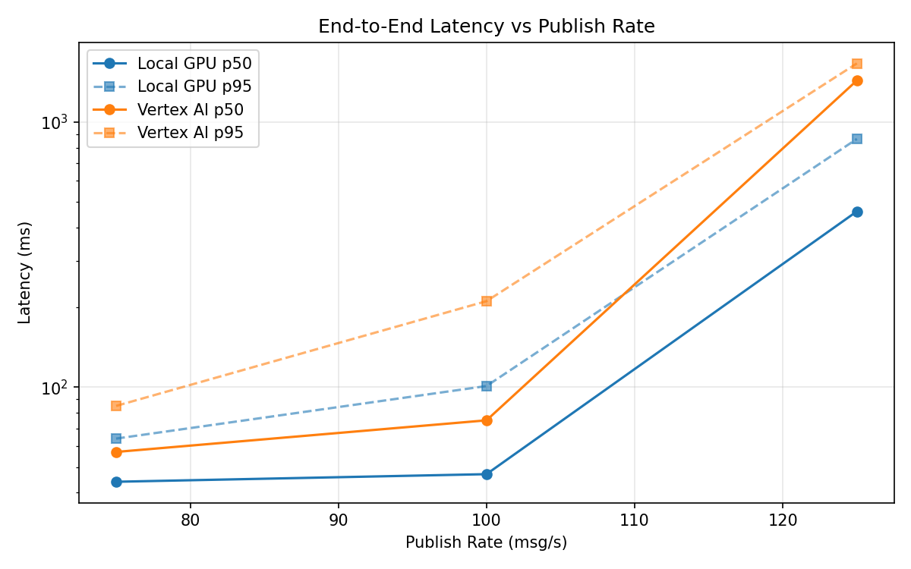
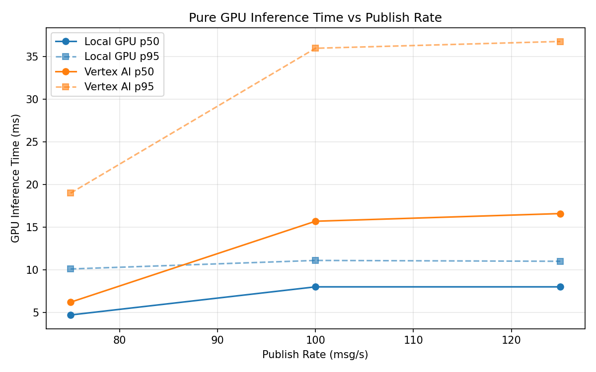
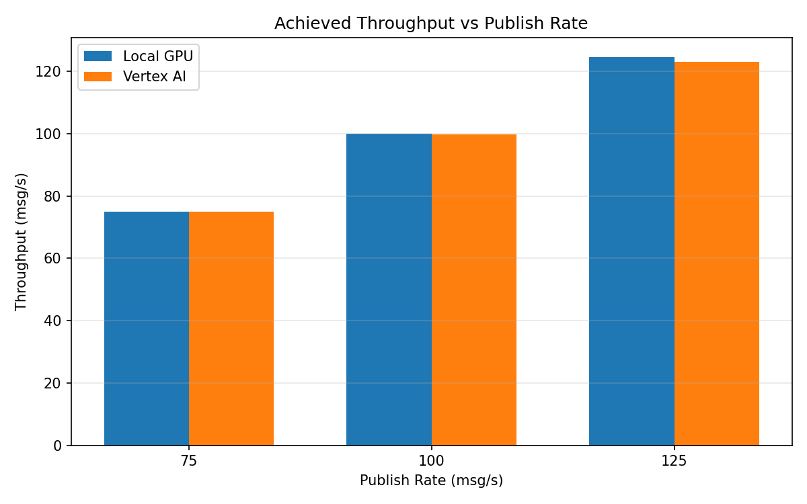

# Benchmark Report

Generated: 2026-03-08 15:02:02

## Configuration

| Parameter | Value |
|---|---|
| Messages per phase | 100s per phase |
| Rates (msg/s) | 75, 100, 125 |
| Experiments | Local GPU, Vertex AI |

## Throughput

| Rate (msg/s) | Local GPU | Vertex AI |
|---|---|---|
| 75 | 75.0 | 75.0 |
| 100 | 99.9 | 99.7 |
| 125 | 124.6 | 123.1 |

## End-to-End Latency (ms)

| Rate | Percentile | Local GPU | Vertex AI |
|---|---|---|---|
| 75 | p50 | 44.0 | 57.0 |
| 75 | p95 | 64.0 | 85.0 |
| 75 | p99 | 763.0 | 347.0 |
| 100 | p50 | 47.0 | 75.0 |
| 100 | p95 | 101.0 | 211.0 |
| 100 | p99 | 208.0 | 439.0 |
| 125 | p50 | 460.0 | 1433.0 |
| 125 | p95 | 863.0 | 1662.0 |
| 125 | p99 | 939.0 | 1732.0 |

## GPU Inference Time (ms)

| Rate | Percentile | Local GPU | Vertex AI |
|---|---|---|---|
| 75 | p50 | 4.7 | 6.2 |
| 75 | p95 | 10.1 | 19.0 |
| 75 | p99 | 11.3 | 32.8 |
| 100 | p50 | 8.0 | 15.7 |
| 100 | p95 | 11.1 | 36.0 |
| 100 | p99 | 11.9 | 45.8 |
| 125 | p50 | 8.0 | 16.6 |
| 125 | p95 | 11.0 | 36.8 |
| 125 | p99 | 11.9 | 46.3 |

## Charts

### Latency vs Publish Rate

### GPU Inference Time vs Publish Rate

### Throughput vs Publish Rate

