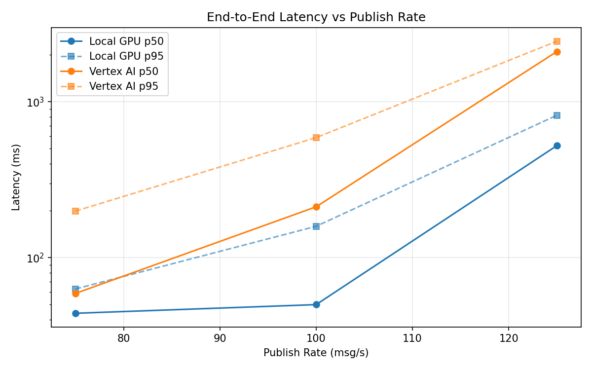
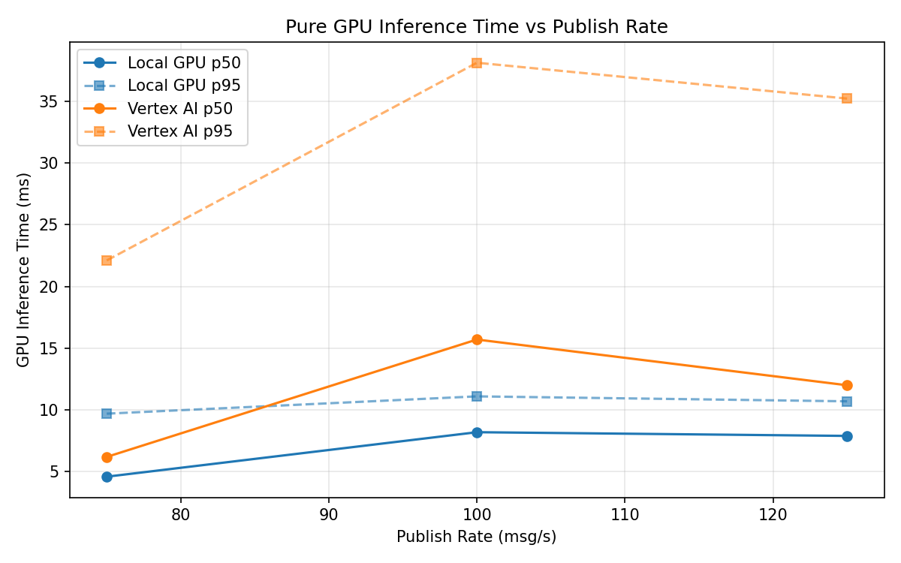
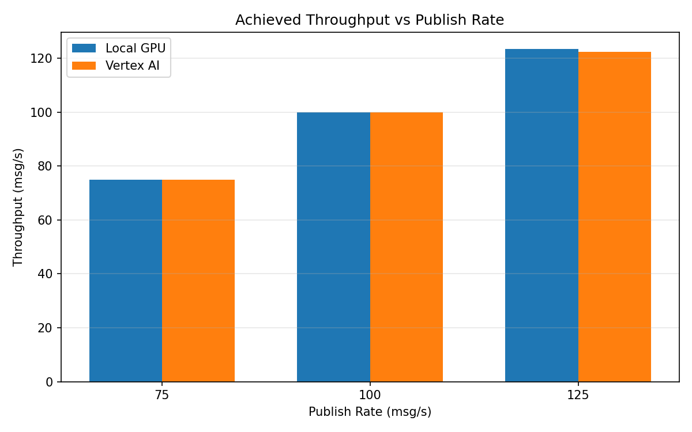

# Benchmark Report

Generated: 2026-03-08 15:52:14

## Configuration

| Parameter | Value |
|---|---|
| Messages per phase | 100s per phase |
| Rates (msg/s) | 75, 100, 125 |
| Experiments | Local GPU, Vertex AI |

## Throughput

| Rate (msg/s) | Local GPU | Vertex AI |
|---|---|---|
| 75 | 75.0 | 75.0 |
| 100 | 100.0 | 99.9 |
| 125 | 123.5 | 122.3 |

## End-to-End Latency (ms)

| Rate | Percentile | Local GPU | Vertex AI |
|---|---|---|---|
| 75 | p50 | 44.0 | 59.0 |
| 75 | p95 | 63.0 | 199.0 |
| 75 | p99 | 308.1 | 1294.0 |
| 100 | p50 | 50.0 | 212.0 |
| 100 | p95 | 159.0 | 589.0 |
| 100 | p99 | 454.0 | 775.0 |
| 125 | p50 | 523.0 | 2098.5 |
| 125 | p95 | 819.2 | 2445.0 |
| 125 | p99 | 1213.0 | 2534.0 |

## GPU Inference Time (ms)

| Rate | Percentile | Local GPU | Vertex AI |
|---|---|---|---|
| 75 | p50 | 4.6 | 6.2 |
| 75 | p95 | 9.7 | 22.1 |
| 75 | p99 | 10.9 | 35.9 |
| 100 | p50 | 8.2 | 15.7 |
| 100 | p95 | 11.1 | 38.1 |
| 100 | p99 | 11.9 | 48.2 |
| 125 | p50 | 7.9 | 12.0 |
| 125 | p95 | 10.7 | 35.2 |
| 125 | p99 | 11.4 | 44.0 |

## Charts

### Latency vs Publish Rate

### GPU Inference Time vs Publish Rate

### Throughput vs Publish Rate

