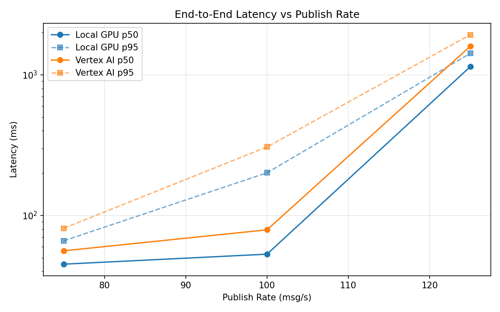
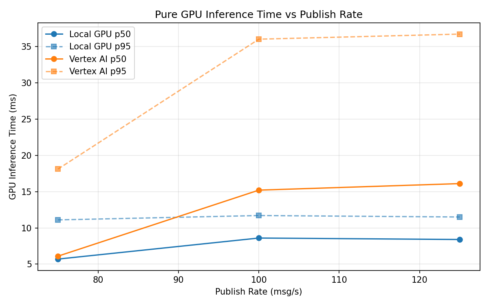
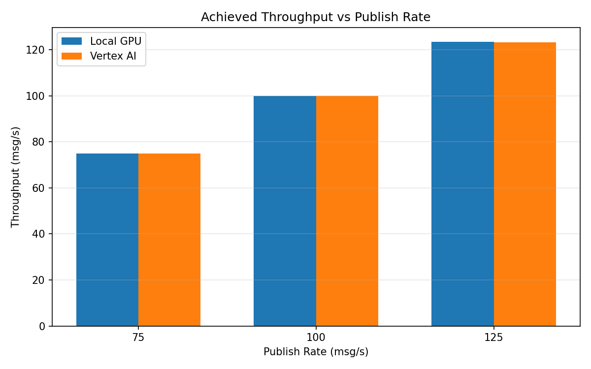

# Benchmark Report

Generated: 2026-03-08 15:14:33

## Configuration

| Parameter | Value |
|---|---|
| Messages per phase | 100s per phase |
| Rates (msg/s) | 75, 100, 125 |
| Experiments | Local GPU, Vertex AI |

## Throughput

| Rate (msg/s) | Local GPU | Vertex AI |
|---|---|---|
| 75 | 75.0 | 75.0 |
| 100 | 100.0 | 99.9 |
| 125 | 123.5 | 123.3 |

## End-to-End Latency (ms)

| Rate | Percentile | Local GPU | Vertex AI |
|---|---|---|---|
| 75 | p50 | 45.0 | 56.0 |
| 75 | p95 | 66.0 | 81.0 |
| 75 | p99 | 292.0 | 245.1 |
| 100 | p50 | 53.0 | 79.0 |
| 100 | p95 | 201.0 | 307.0 |
| 100 | p99 | 350.0 | 606.0 |
| 125 | p50 | 1144.0 | 1599.0 |
| 125 | p95 | 1422.0 | 1929.0 |
| 125 | p99 | 1468.0 | 1990.0 |

## GPU Inference Time (ms)

| Rate | Percentile | Local GPU | Vertex AI |
|---|---|---|---|
| 75 | p50 | 5.7 | 6.1 |
| 75 | p95 | 11.1 | 18.1 |
| 75 | p99 | 12.3 | 31.0 |
| 100 | p50 | 8.6 | 15.2 |
| 100 | p95 | 11.7 | 36.0 |
| 100 | p99 | 12.9 | 46.6 |
| 125 | p50 | 8.4 | 16.1 |
| 125 | p95 | 11.5 | 36.7 |
| 125 | p99 | 12.7 | 45.9 |

## Charts

### Latency vs Publish Rate

### GPU Inference Time vs Publish Rate

### Throughput vs Publish Rate

