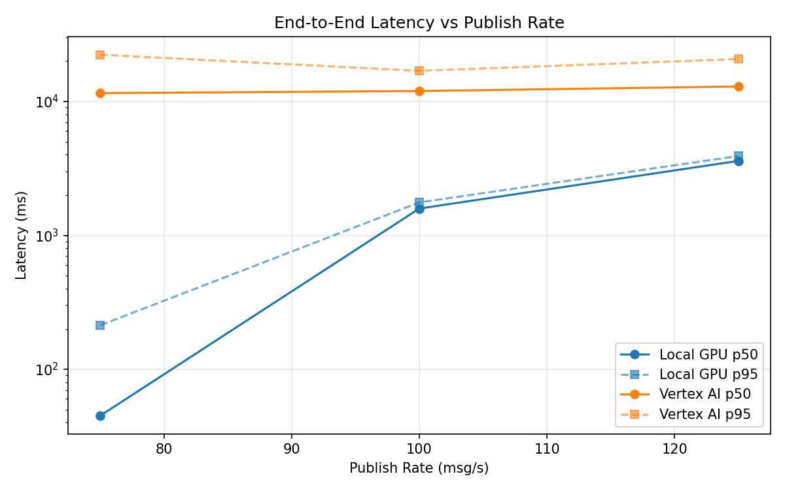
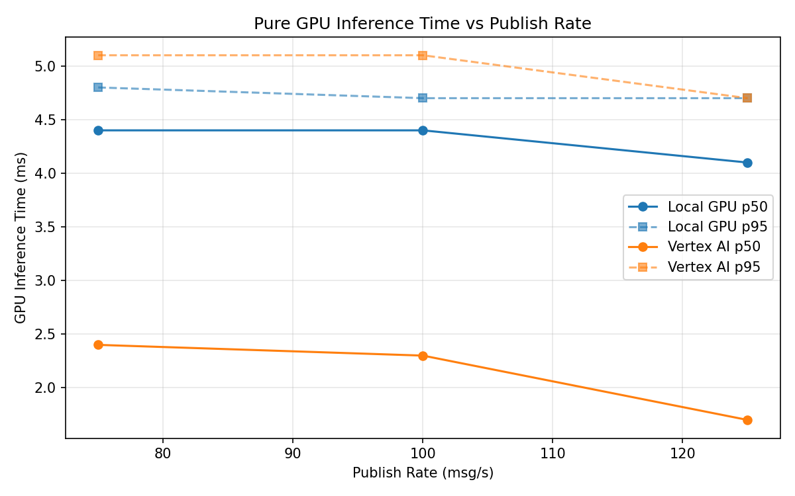
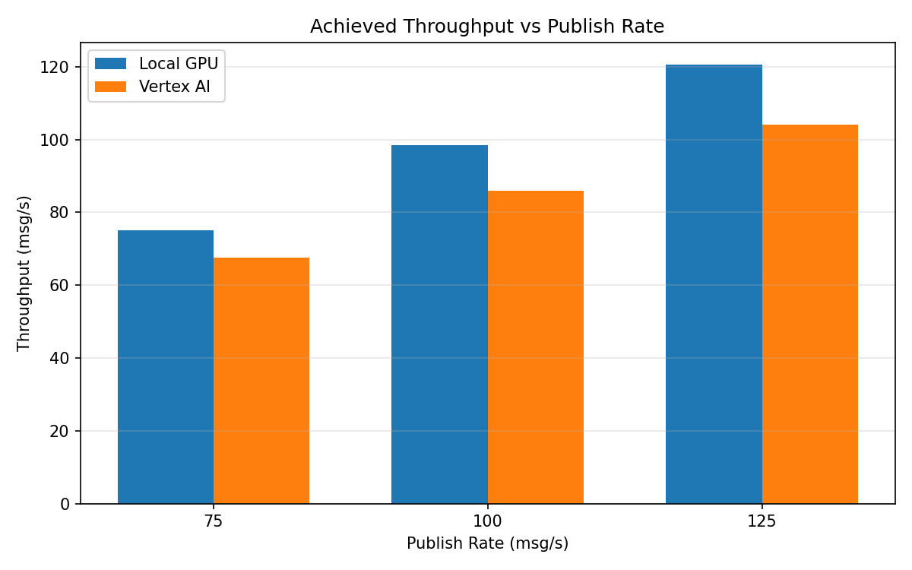

# Benchmark Report

Generated: 2026-03-08 10:38:12

## Configuration

| Parameter | Value |
|---|---|
| Messages per phase | 100s per phase |
| Rates (msg/s) | 75, 100, 125 |
| Experiments | Local GPU, Vertex AI |

## Throughput

| Rate (msg/s) | Local GPU | Vertex AI |
|---|---|---|
| 75 | 75.0 | 67.6 |
| 100 | 98.4 | 86.0 |
| 125 | 120.6 | 104.0 |

## End-to-End Latency (ms)

| Rate | Percentile | Local GPU | Vertex AI |
|---|---|---|---|
| 75 | p50 | 45.0 | 11544.5 |
| 75 | p95 | 213.0 | 22345.0 |
| 75 | p99 | 503.0 | 23010.0 |
| 100 | p50 | 1586.0 | 11969.0 |
| 100 | p95 | 1762.0 | 16929.0 |
| 100 | p99 | 1794.0 | 17047.0 |
| 125 | p50 | 3600.0 | 12938.0 |
| 125 | p95 | 3915.0 | 20735.0 |
| 125 | p99 | 4003.0 | 21079.0 |

## GPU Inference Time (ms)

| Rate | Percentile | Local GPU | Vertex AI |
|---|---|---|---|
| 75 | p50 | 4.4 | 2.4 |
| 75 | p95 | 4.8 | 5.1 |
| 75 | p99 | 5.1 | 7.8 |
| 100 | p50 | 4.4 | 2.3 |
| 100 | p95 | 4.7 | 5.1 |
| 100 | p99 | 5.0 | 7.1 |
| 125 | p50 | 4.1 | 1.7 |
| 125 | p95 | 4.7 | 4.7 |
| 125 | p99 | 4.9 | 6.1 |

## Charts

### Latency vs Publish Rate

### GPU Inference Time vs Publish Rate

### Throughput vs Publish Rate

