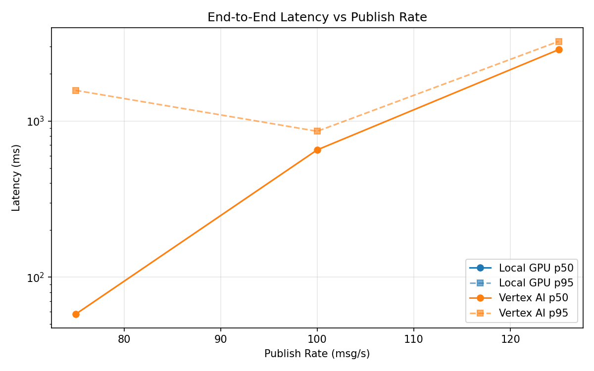
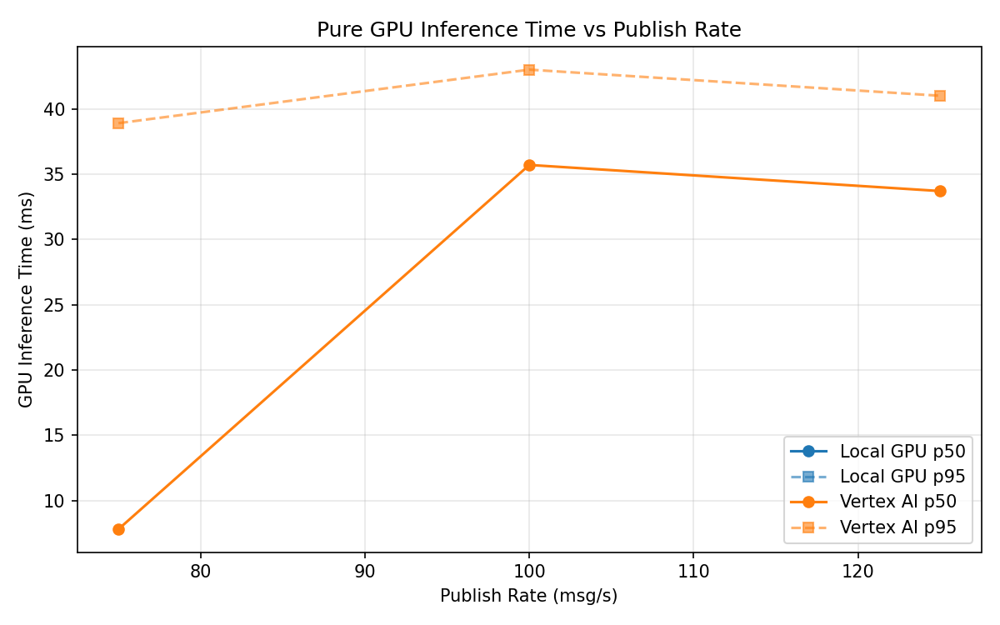
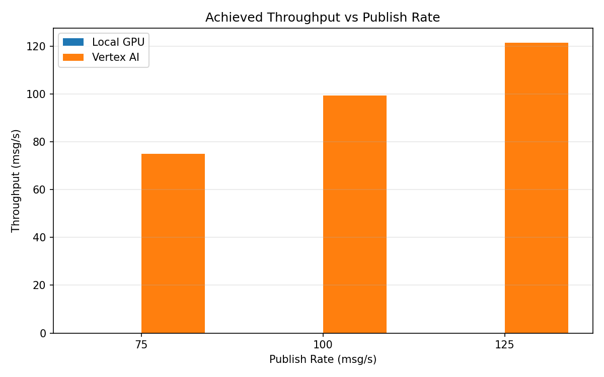

# Benchmark Report

Generated: 2026-03-08 12:38:47

## Configuration

| Parameter | Value |
|---|---|
| Messages per phase | 100s per phase |
| Rates (msg/s) | 75, 100, 125 |
| Experiments | Local GPU, Vertex AI |

## Throughput

| Rate (msg/s) | Local GPU | Vertex AI |
|---|---|---|
| 75 | — | 75.0 |
| 100 | — | 99.4 |
| 125 | — | 121.4 |

## End-to-End Latency (ms)

| Rate | Percentile | Local GPU | Vertex AI |
|---|---|---|---|
| 75 | p50 | — | 58.0 |
| 75 | p95 | — | 1570.0 |
| 75 | p99 | — | 2422.1 |
| 100 | p50 | — | 653.0 |
| 100 | p95 | — | 859.0 |
| 100 | p99 | — | 1128.0 |
| 125 | p50 | — | 2862.0 |
| 125 | p95 | — | 3233.0 |
| 125 | p99 | — | 3302.0 |

## GPU Inference Time (ms)

| Rate | Percentile | Local GPU | Vertex AI |
|---|---|---|---|
| 75 | p50 | — | 7.8 |
| 75 | p95 | — | 38.9 |
| 75 | p99 | — | 44.0 |
| 100 | p50 | — | 35.7 |
| 100 | p95 | — | 43.0 |
| 100 | p99 | — | 52.9 |
| 125 | p50 | — | 33.7 |
| 125 | p95 | — | 41.0 |
| 125 | p99 | — | 50.4 |

## Charts

### Latency vs Publish Rate

### GPU Inference Time vs Publish Rate

### Throughput vs Publish Rate

