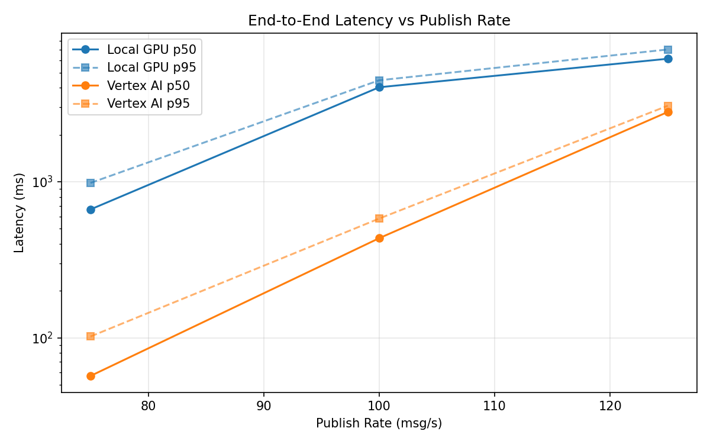
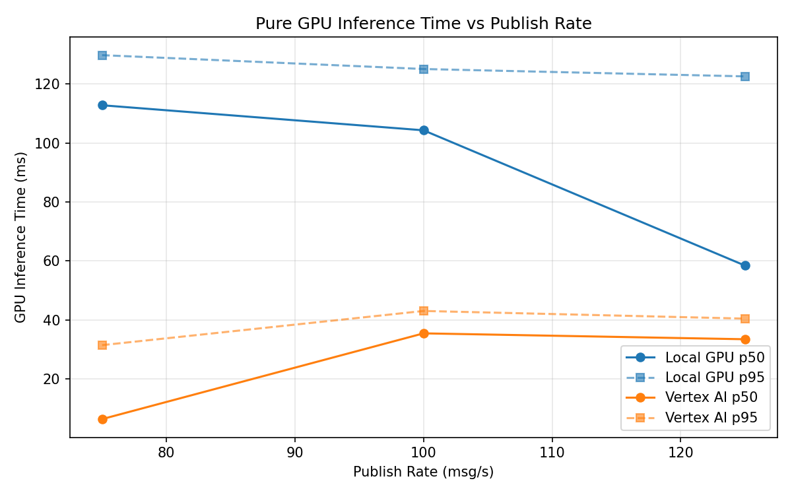
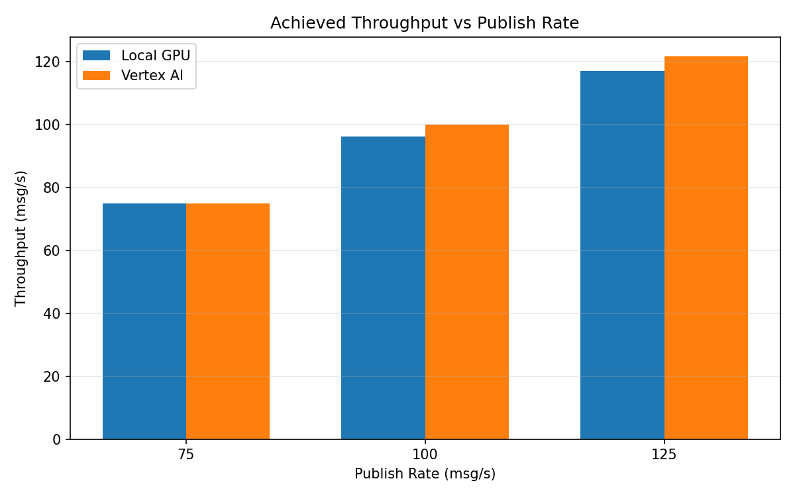

# Benchmark Report

Generated: 2026-03-08 12:50:59

## Configuration

| Parameter | Value |
|---|---|
| Messages per phase | 100s per phase |
| Rates (msg/s) | 75, 100, 125 |
| Experiments | Local GPU, Vertex AI |

## Throughput

| Rate (msg/s) | Local GPU | Vertex AI |
|---|---|---|
| 75 | 74.9 | 75.0 |
| 100 | 96.1 | 99.9 |
| 125 | 117.0 | 121.7 |

## End-to-End Latency (ms)

| Rate | Percentile | Local GPU | Vertex AI |
|---|---|---|---|
| 75 | p50 | 665.0 | 57.0 |
| 75 | p95 | 983.0 | 102.0 |
| 75 | p99 | 1272.1 | 301.0 |
| 100 | p50 | 4033.0 | 435.0 |
| 100 | p95 | 4471.0 | 581.0 |
| 100 | p99 | 4590.0 | 773.0 |
| 125 | p50 | 6142.5 | 2801.0 |
| 125 | p95 | 7043.0 | 3071.0 |
| 125 | p99 | 7176.0 | 3142.0 |

## GPU Inference Time (ms)

| Rate | Percentile | Local GPU | Vertex AI |
|---|---|---|---|
| 75 | p50 | 112.8 | 6.3 |
| 75 | p95 | 129.8 | 31.4 |
| 75 | p99 | 136.5 | 40.3 |
| 100 | p50 | 104.3 | 35.4 |
| 100 | p95 | 125.1 | 43.0 |
| 100 | p99 | 132.6 | 53.0 |
| 125 | p50 | 58.4 | 33.4 |
| 125 | p95 | 122.6 | 40.4 |
| 125 | p99 | 130.9 | 49.9 |

## Charts

### Latency vs Publish Rate

### GPU Inference Time vs Publish Rate

### Throughput vs Publish Rate

