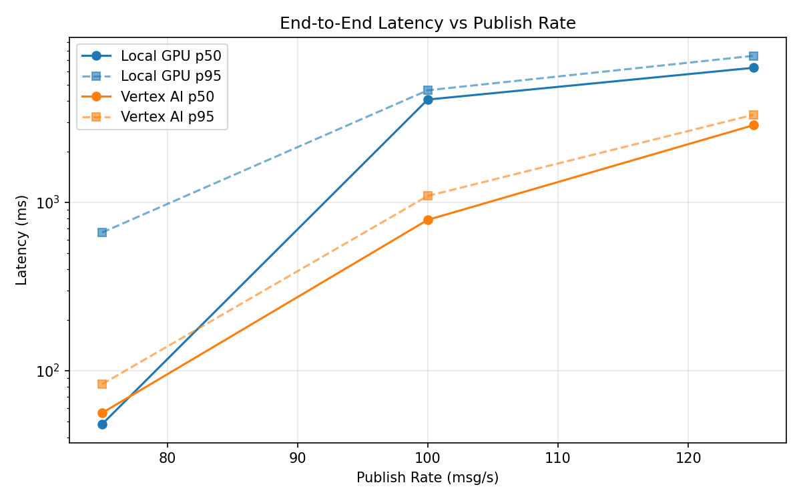
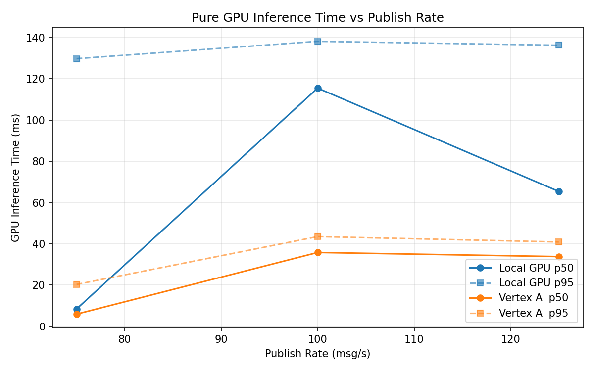
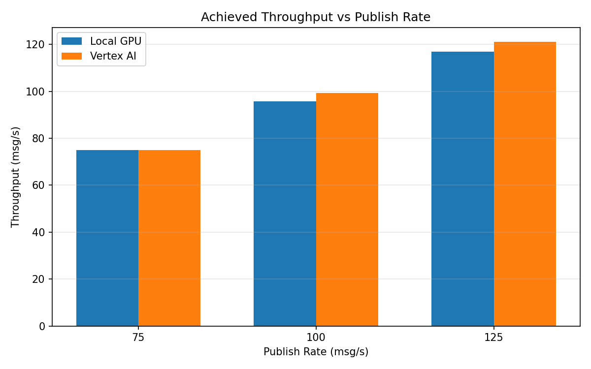

# Benchmark Report

Generated: 2026-03-08 13:03:59

## Configuration

| Parameter | Value |
|---|---|
| Messages per phase | 100s per phase |
| Rates (msg/s) | 75, 100, 125 |
| Experiments | Local GPU, Vertex AI |

## Throughput

| Rate (msg/s) | Local GPU | Vertex AI |
|---|---|---|
| 75 | 75.0 | 75.0 |
| 100 | 95.8 | 99.2 |
| 125 | 116.9 | 121.1 |

## End-to-End Latency (ms)

| Rate | Percentile | Local GPU | Vertex AI |
|---|---|---|---|
| 75 | p50 | 48.0 | 56.0 |
| 75 | p95 | 662.0 | 83.0 |
| 75 | p99 | 809.0 | 219.0 |
| 100 | p50 | 4085.0 | 787.0 |
| 100 | p95 | 4640.0 | 1092.0 |
| 100 | p99 | 4751.0 | 1363.0 |
| 125 | p50 | 6309.5 | 2874.0 |
| 125 | p95 | 7433.0 | 3316.0 |
| 125 | p99 | 7594.0 | 3448.0 |

## GPU Inference Time (ms)

| Rate | Percentile | Local GPU | Vertex AI |
|---|---|---|---|
| 75 | p50 | 8.4 | 5.9 |
| 75 | p95 | 129.8 | 20.3 |
| 75 | p99 | 139.0 | 36.6 |
| 100 | p50 | 115.5 | 35.8 |
| 100 | p95 | 138.2 | 43.5 |
| 100 | p99 | 145.8 | 52.7 |
| 125 | p50 | 65.4 | 33.8 |
| 125 | p95 | 136.3 | 40.9 |
| 125 | p99 | 144.1 | 50.9 |

## Charts

### Latency vs Publish Rate

### GPU Inference Time vs Publish Rate

### Throughput vs Publish Rate

