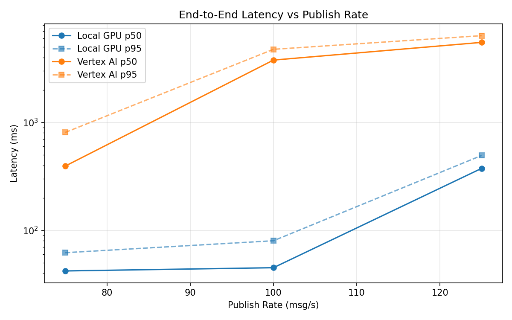
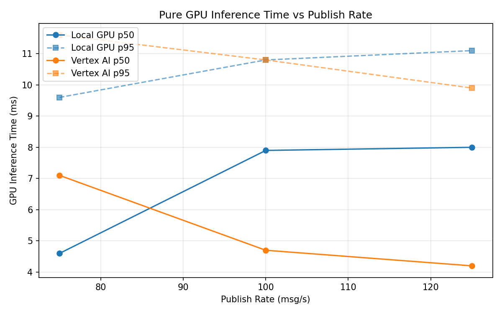
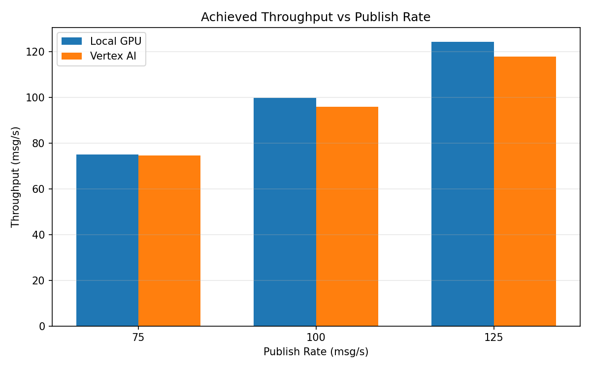

# Benchmark Report

Generated: 2026-03-08 10:52:23

## Configuration

| Parameter | Value |
|---|---|
| Messages per phase | 100s per phase |
| Rates (msg/s) | 75, 100, 125 |
| Experiments | Local GPU, Vertex AI |

## Throughput

| Rate (msg/s) | Local GPU | Vertex AI |
|---|---|---|
| 75 | 75.0 | 74.7 |
| 100 | 99.9 | 96.0 |
| 125 | 124.4 | 118.0 |

## End-to-End Latency (ms)

| Rate | Percentile | Local GPU | Vertex AI |
|---|---|---|---|
| 75 | p50 | 42.0 | 394.0 |
| 75 | p95 | 62.0 | 808.0 |
| 75 | p99 | 601.0 | 1091.0 |
| 100 | p50 | 45.0 | 3784.0 |
| 100 | p95 | 80.0 | 4762.0 |
| 100 | p99 | 197.0 | 5024.0 |
| 125 | p50 | 375.0 | 5522.0 |
| 125 | p95 | 494.0 | 6374.0 |
| 125 | p99 | 524.0 | 6558.0 |

## GPU Inference Time (ms)

| Rate | Percentile | Local GPU | Vertex AI |
|---|---|---|---|
| 75 | p50 | 4.6 | 7.1 |
| 75 | p95 | 9.6 | 11.6 |
| 75 | p99 | 11.0 | 15.6 |
| 100 | p50 | 7.9 | 4.7 |
| 100 | p95 | 10.8 | 10.8 |
| 100 | p99 | 11.5 | 12.8 |
| 125 | p50 | 8.0 | 4.2 |
| 125 | p95 | 11.1 | 9.9 |
| 125 | p99 | 11.9 | 11.9 |

## Charts

### Latency vs Publish Rate

### GPU Inference Time vs Publish Rate

### Throughput vs Publish Rate

