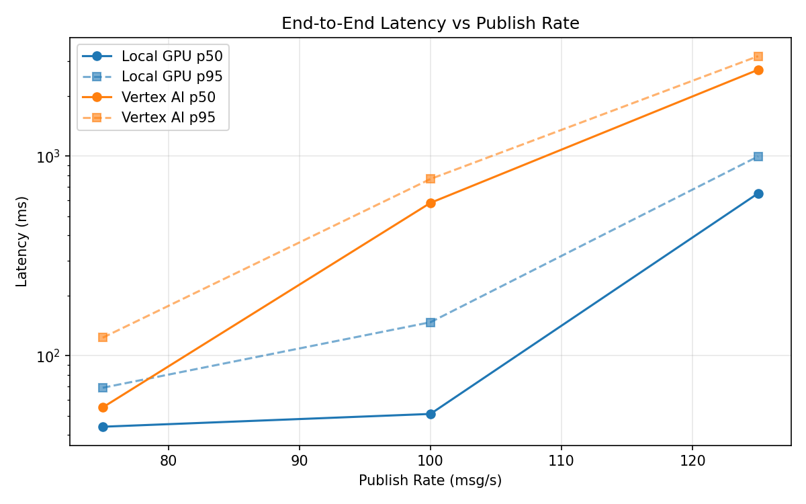
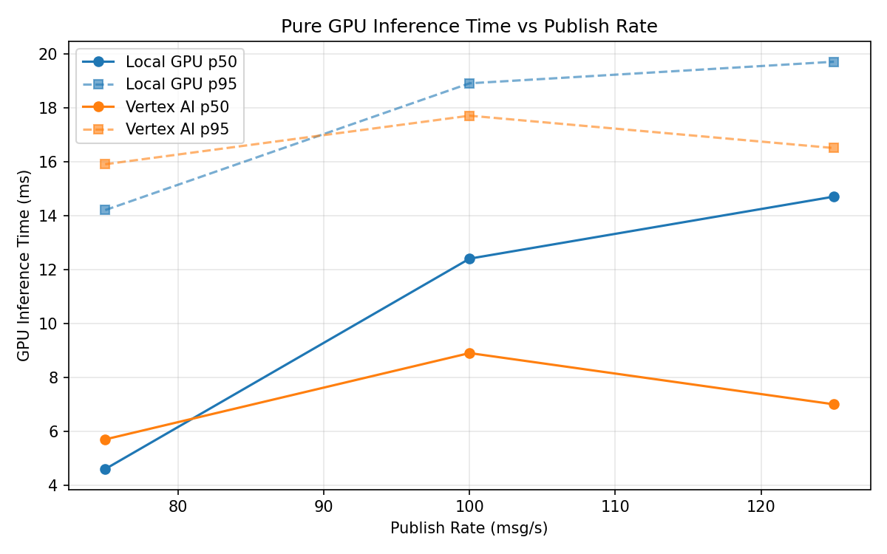
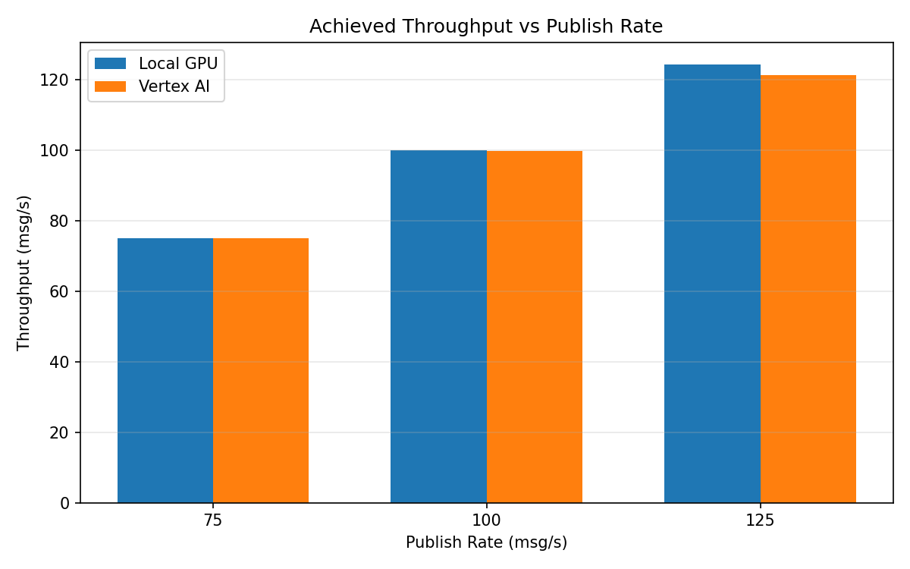

# Benchmark Report

Generated: 2026-03-08 11:04:46

## Configuration

| Parameter | Value |
|---|---|
| Messages per phase | 100s per phase |
| Rates (msg/s) | 75, 100, 125 |
| Experiments | Local GPU, Vertex AI |

## Throughput

| Rate (msg/s) | Local GPU | Vertex AI |
|---|---|---|
| 75 | 75.0 | 75.0 |
| 100 | 99.9 | 99.7 |
| 125 | 124.3 | 121.2 |

## End-to-End Latency (ms)

| Rate | Percentile | Local GPU | Vertex AI |
|---|---|---|---|
| 75 | p50 | 44.0 | 55.0 |
| 75 | p95 | 69.0 | 123.0 |
| 75 | p99 | 272.0 | 754.0 |
| 100 | p50 | 51.0 | 583.0 |
| 100 | p95 | 147.0 | 768.0 |
| 100 | p99 | 244.0 | 823.0 |
| 125 | p50 | 651.0 | 2710.0 |
| 125 | p95 | 997.0 | 3171.0 |
| 125 | p99 | 1098.0 | 3249.0 |

## GPU Inference Time (ms)

| Rate | Percentile | Local GPU | Vertex AI |
|---|---|---|---|
| 75 | p50 | 4.6 | 5.7 |
| 75 | p95 | 14.2 | 15.9 |
| 75 | p99 | 18.0 | 20.4 |
| 100 | p50 | 12.4 | 8.9 |
| 100 | p95 | 18.9 | 17.7 |
| 100 | p99 | 21.1 | 22.2 |
| 125 | p50 | 14.7 | 7.0 |
| 125 | p95 | 19.7 | 16.5 |
| 125 | p99 | 21.6 | 21.0 |

## Charts

### Latency vs Publish Rate

### GPU Inference Time vs Publish Rate

### Throughput vs Publish Rate

