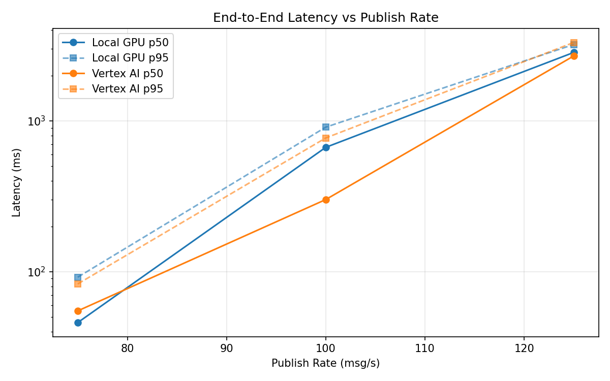
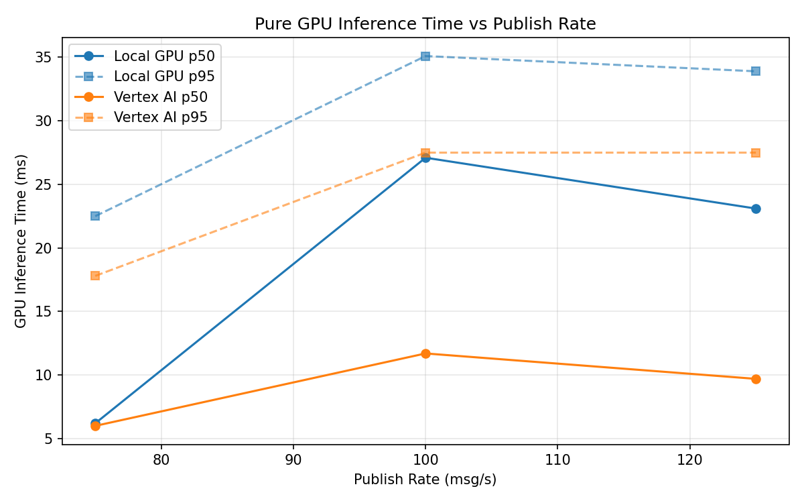
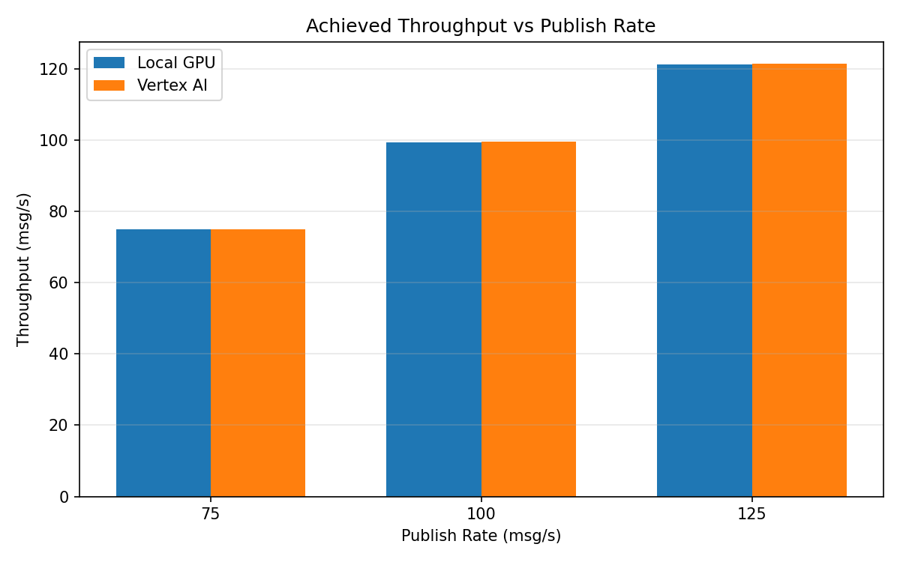

# Benchmark Report

Generated: 2026-03-08 11:17:59

## Configuration

| Parameter | Value |
|---|---|
| Messages per phase | 100s per phase |
| Rates (msg/s) | 75, 100, 125 |
| Experiments | Local GPU, Vertex AI |

## Throughput

| Rate (msg/s) | Local GPU | Vertex AI |
|---|---|---|
| 75 | 75.0 | 75.0 |
| 100 | 99.3 | 99.6 |
| 125 | 121.2 | 121.4 |

## End-to-End Latency (ms)

| Rate | Percentile | Local GPU | Vertex AI |
|---|---|---|---|
| 75 | p50 | 46.0 | 55.0 |
| 75 | p95 | 92.0 | 83.0 |
| 75 | p99 | 310.0 | 325.0 |
| 100 | p50 | 668.0 | 301.0 |
| 100 | p95 | 909.0 | 771.0 |
| 100 | p99 | 948.0 | 1025.0 |
| 125 | p50 | 2845.0 | 2696.0 |
| 125 | p95 | 3212.0 | 3313.0 |
| 125 | p99 | 3277.0 | 3450.0 |

## GPU Inference Time (ms)

| Rate | Percentile | Local GPU | Vertex AI |
|---|---|---|---|
| 75 | p50 | 6.2 | 6.0 |
| 75 | p95 | 22.5 | 17.8 |
| 75 | p99 | 31.4 | 27.0 |
| 100 | p50 | 27.1 | 11.7 |
| 100 | p95 | 35.1 | 27.5 |
| 100 | p99 | 38.5 | 33.9 |
| 125 | p50 | 23.1 | 9.7 |
| 125 | p95 | 33.9 | 27.5 |
| 125 | p99 | 37.4 | 34.4 |

## Charts

### Latency vs Publish Rate

### GPU Inference Time vs Publish Rate

### Throughput vs Publish Rate

