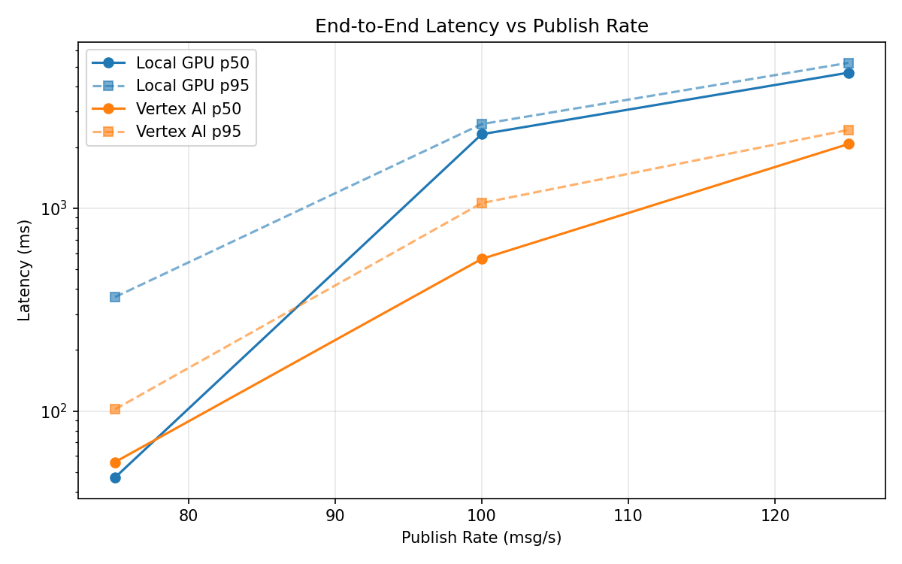
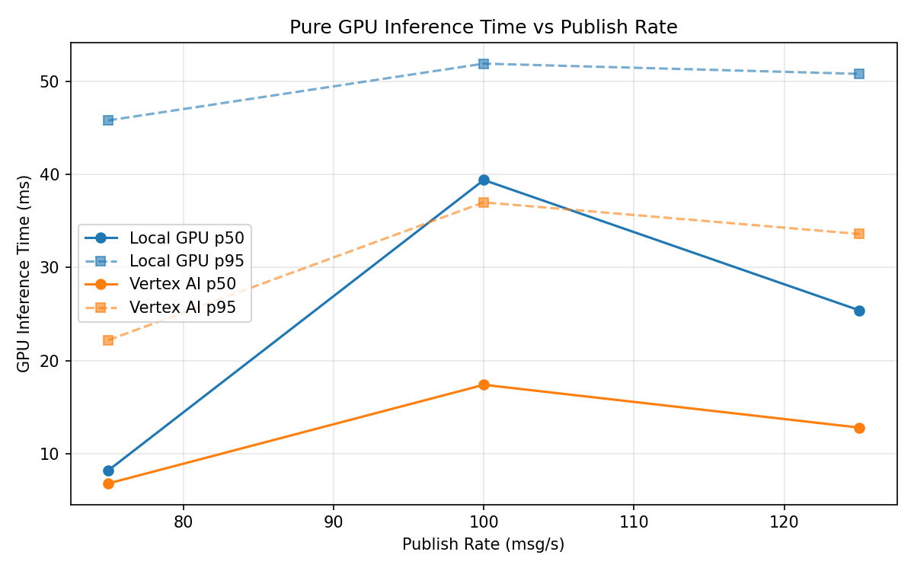
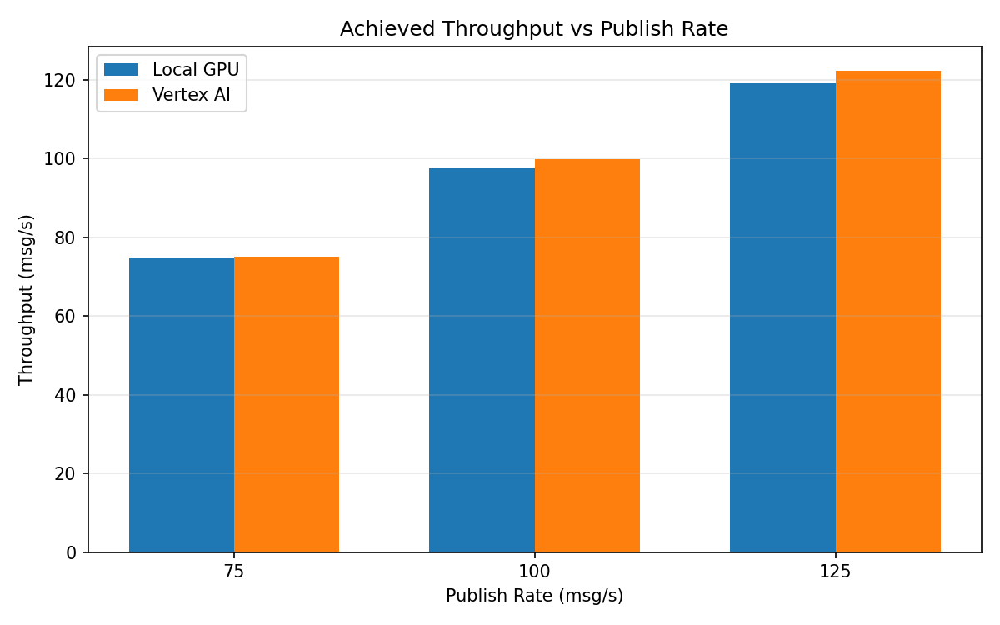

# Benchmark Report

Generated: 2026-03-08 11:33:07

## Configuration

| Parameter | Value |
|---|---|
| Messages per phase | 100s per phase |
| Rates (msg/s) | 75, 100, 125 |
| Experiments | Local GPU, Vertex AI |

## Throughput

| Rate (msg/s) | Local GPU | Vertex AI |
|---|---|---|
| 75 | 74.9 | 75.0 |
| 100 | 97.6 | 99.8 |
| 125 | 119.1 | 122.3 |

## End-to-End Latency (ms)

| Rate | Percentile | Local GPU | Vertex AI |
|---|---|---|---|
| 75 | p50 | 47.0 | 56.0 |
| 75 | p95 | 365.0 | 102.0 |
| 75 | p99 | 791.0 | 650.0 |
| 100 | p50 | 2322.0 | 563.0 |
| 100 | p95 | 2604.0 | 1062.0 |
| 100 | p99 | 2678.0 | 1269.0 |
| 125 | p50 | 4670.5 | 2077.5 |
| 125 | p95 | 5223.0 | 2438.0 |
| 125 | p99 | 5293.0 | 2576.0 |

## GPU Inference Time (ms)

| Rate | Percentile | Local GPU | Vertex AI |
|---|---|---|---|
| 75 | p50 | 8.2 | 6.8 |
| 75 | p95 | 45.8 | 22.2 |
| 75 | p99 | 53.2 | 35.0 |
| 100 | p50 | 39.4 | 17.4 |
| 100 | p95 | 51.9 | 37.0 |
| 100 | p99 | 56.5 | 45.8 |
| 125 | p50 | 25.4 | 12.8 |
| 125 | p95 | 50.8 | 33.6 |
| 125 | p99 | 56.1 | 41.3 |

## Charts

### Latency vs Publish Rate

### GPU Inference Time vs Publish Rate

### Throughput vs Publish Rate

