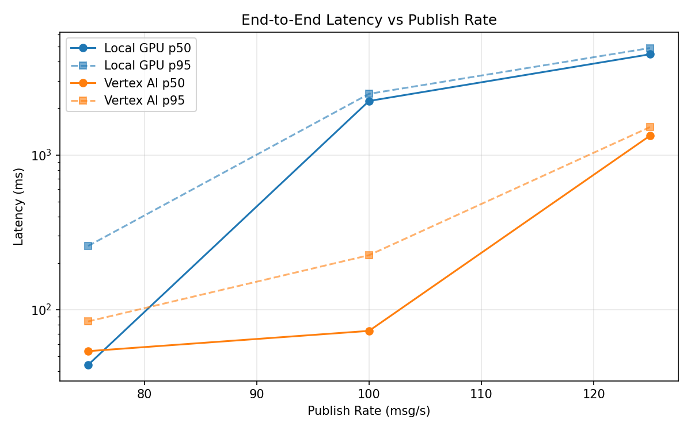
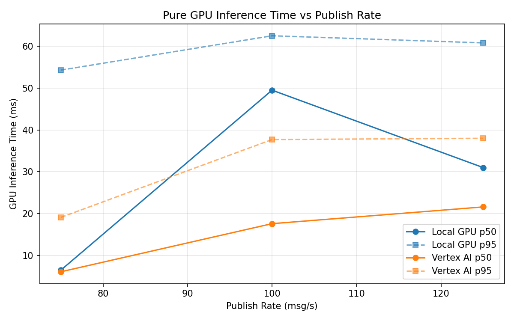
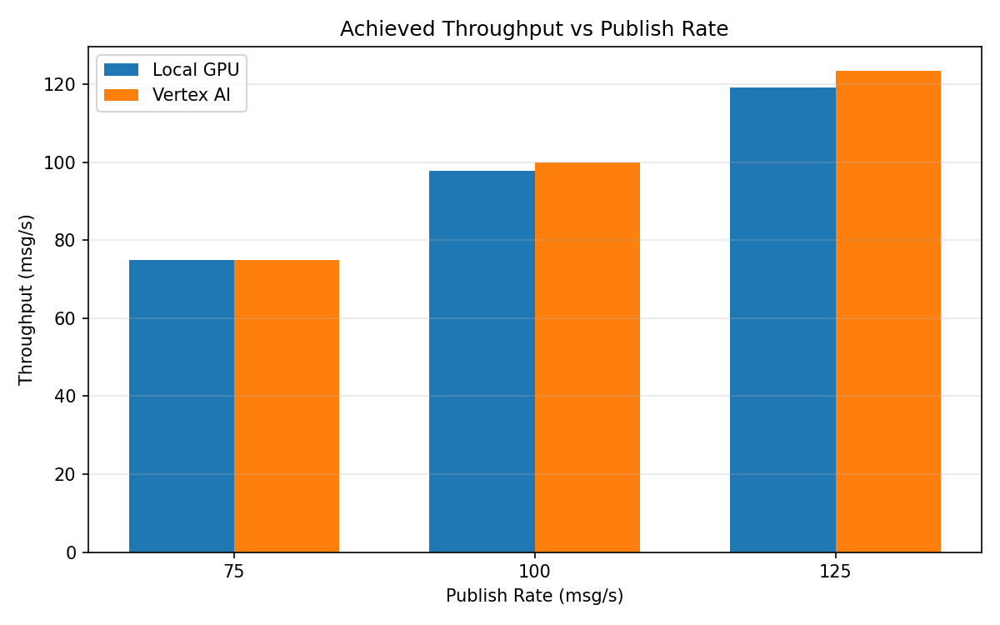

# Benchmark Report

Generated: 2026-03-08 11:46:13

## Configuration

| Parameter | Value |
|---|---|
| Messages per phase | 100s per phase |
| Rates (msg/s) | 75, 100, 125 |
| Experiments | Local GPU, Vertex AI |

## Throughput

| Rate (msg/s) | Local GPU | Vertex AI |
|---|---|---|
| 75 | 75.0 | 75.0 |
| 100 | 97.8 | 99.9 |
| 125 | 119.2 | 123.5 |

## End-to-End Latency (ms)

| Rate | Percentile | Local GPU | Vertex AI |
|---|---|---|---|
| 75 | p50 | 44.0 | 54.0 |
| 75 | p95 | 258.0 | 84.0 |
| 75 | p99 | 610.0 | 490.0 |
| 100 | p50 | 2230.0 | 73.0 |
| 100 | p95 | 2479.0 | 225.0 |
| 100 | p99 | 2550.0 | 384.0 |
| 125 | p50 | 4465.0 | 1330.0 |
| 125 | p95 | 4901.0 | 1512.0 |
| 125 | p99 | 4963.0 | 1562.0 |

## GPU Inference Time (ms)

| Rate | Percentile | Local GPU | Vertex AI |
|---|---|---|---|
| 75 | p50 | 6.5 | 6.1 |
| 75 | p95 | 54.3 | 19.1 |
| 75 | p99 | 62.0 | 33.7 |
| 100 | p50 | 49.5 | 17.6 |
| 100 | p95 | 62.5 | 37.7 |
| 100 | p99 | 67.1 | 48.0 |
| 125 | p50 | 31.0 | 21.6 |
| 125 | p95 | 60.8 | 38.0 |
| 125 | p99 | 65.9 | 48.0 |

## Charts

### Latency vs Publish Rate

### GPU Inference Time vs Publish Rate

### Throughput vs Publish Rate

