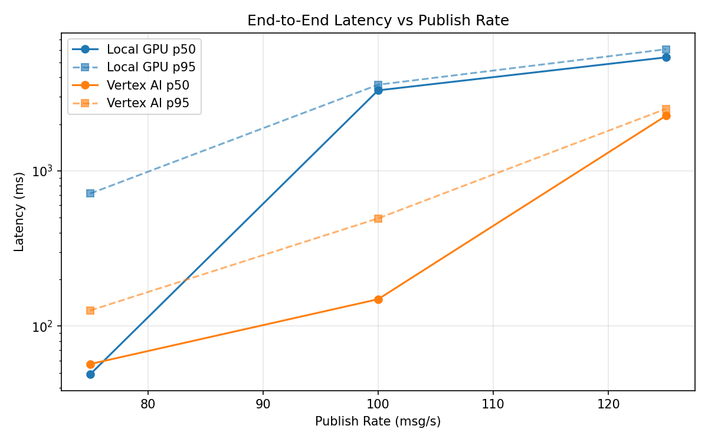
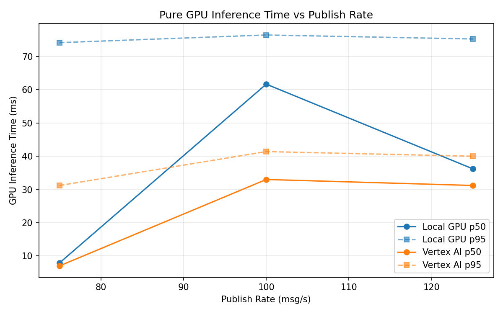
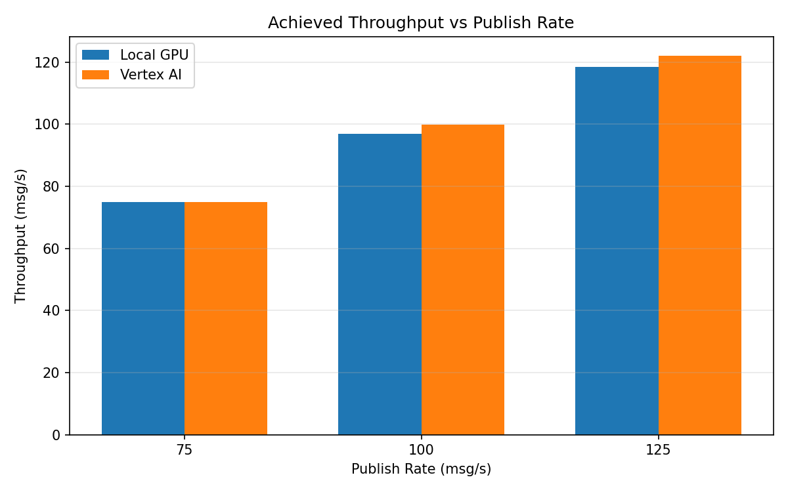

# Benchmark Report

Generated: 2026-03-08 11:59:19

## Configuration

| Parameter | Value |
|---|---|
| Messages per phase | 100s per phase |
| Rates (msg/s) | 75, 100, 125 |
| Experiments | Local GPU, Vertex AI |

## Throughput

| Rate (msg/s) | Local GPU | Vertex AI |
|---|---|---|
| 75 | 74.9 | 75.0 |
| 100 | 96.9 | 99.9 |
| 125 | 118.5 | 122.1 |

## End-to-End Latency (ms)

| Rate | Percentile | Local GPU | Vertex AI |
|---|---|---|---|
| 75 | p50 | 49.0 | 57.0 |
| 75 | p95 | 714.0 | 126.1 |
| 75 | p99 | 1018.0 | 926.1 |
| 100 | p50 | 3297.0 | 149.0 |
| 100 | p95 | 3583.0 | 494.0 |
| 100 | p99 | 3644.0 | 606.0 |
| 125 | p50 | 5377.0 | 2261.0 |
| 125 | p95 | 6064.0 | 2507.0 |
| 125 | p99 | 6165.0 | 2564.0 |

## GPU Inference Time (ms)

| Rate | Percentile | Local GPU | Vertex AI |
|---|---|---|---|
| 75 | p50 | 7.9 | 7.0 |
| 75 | p95 | 74.2 | 31.2 |
| 75 | p99 | 80.4 | 39.6 |
| 100 | p50 | 61.7 | 33.0 |
| 100 | p95 | 76.5 | 41.4 |
| 100 | p99 | 81.6 | 51.9 |
| 125 | p50 | 36.2 | 31.2 |
| 125 | p95 | 75.3 | 40.0 |
| 125 | p99 | 81.7 | 49.8 |

## Charts

### Latency vs Publish Rate

### GPU Inference Time vs Publish Rate

### Throughput vs Publish Rate

