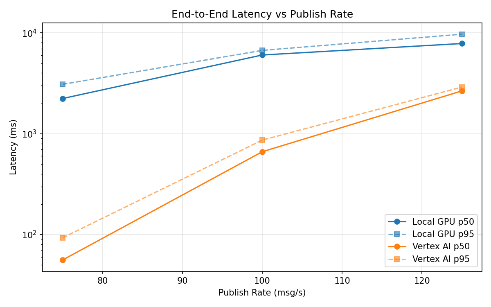
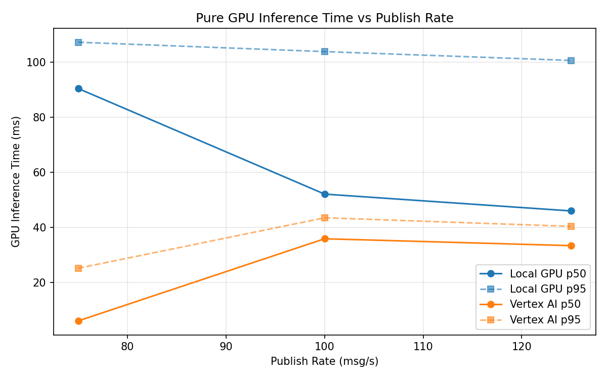
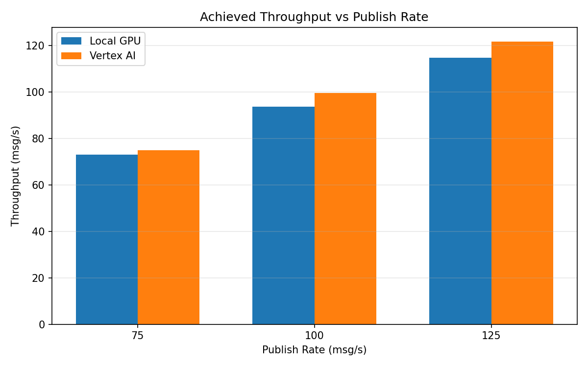

# Benchmark Report

Generated: 2026-03-08 12:13:01

## Configuration

| Parameter | Value |
|---|---|
| Messages per phase | 100s per phase |
| Rates (msg/s) | 75, 100, 125 |
| Experiments | Local GPU, Vertex AI |

## Throughput

| Rate (msg/s) | Local GPU | Vertex AI |
|---|---|---|
| 75 | 73.0 | 75.0 |
| 100 | 93.7 | 99.6 |
| 125 | 114.7 | 121.7 |

## End-to-End Latency (ms)

| Rate | Percentile | Local GPU | Vertex AI |
|---|---|---|---|
| 75 | p50 | 2236.0 | 56.0 |
| 75 | p95 | 3093.0 | 93.0 |
| 75 | p99 | 3208.0 | 851.0 |
| 100 | p50 | 6042.5 | 663.0 |
| 100 | p95 | 6713.0 | 865.0 |
| 100 | p99 | 6814.0 | 962.0 |
| 125 | p50 | 7852.0 | 2658.0 |
| 125 | p95 | 9714.0 | 2903.0 |
| 125 | p99 | 9822.0 | 2988.0 |

## GPU Inference Time (ms)

| Rate | Percentile | Local GPU | Vertex AI |
|---|---|---|---|
| 75 | p50 | 90.4 | 6.1 |
| 75 | p95 | 107.2 | 25.2 |
| 75 | p99 | 114.0 | 37.6 |
| 100 | p50 | 52.1 | 35.9 |
| 100 | p95 | 103.8 | 43.5 |
| 100 | p99 | 110.8 | 53.6 |
| 125 | p50 | 46.0 | 33.4 |
| 125 | p95 | 100.6 | 40.4 |
| 125 | p99 | 108.8 | 50.4 |

## Charts

### Latency vs Publish Rate

### GPU Inference Time vs Publish Rate

### Throughput vs Publish Rate

