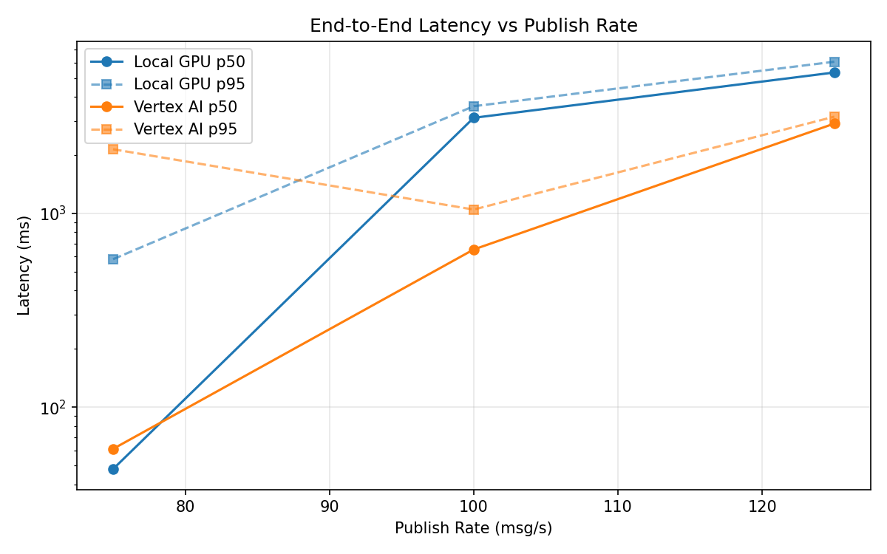
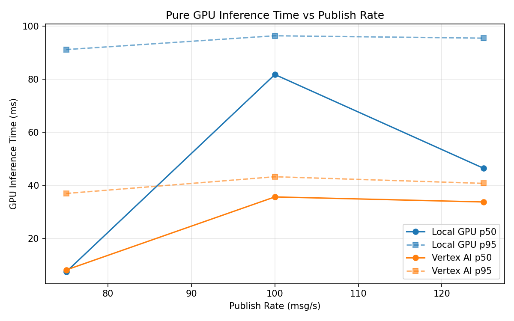
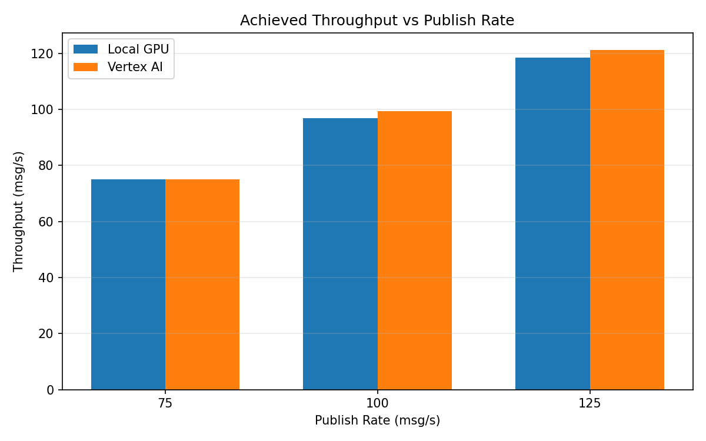

# Benchmark Report

Generated: 2026-03-08 12:25:22

## Configuration

| Parameter | Value |
|---|---|
| Messages per phase | 100s per phase |
| Rates (msg/s) | 75, 100, 125 |
| Experiments | Local GPU, Vertex AI |

## Throughput

| Rate (msg/s) | Local GPU | Vertex AI |
|---|---|---|
| 75 | 75.0 | 75.0 |
| 100 | 96.8 | 99.4 |
| 125 | 118.5 | 121.2 |

## End-to-End Latency (ms)

| Rate | Percentile | Local GPU | Vertex AI |
|---|---|---|---|
| 75 | p50 | 48.0 | 61.0 |
| 75 | p95 | 581.0 | 2145.0 |
| 75 | p99 | 918.1 | 3118.1 |
| 100 | p50 | 3117.0 | 652.0 |
| 100 | p95 | 3578.0 | 1048.0 |
| 100 | p99 | 3714.0 | 1183.0 |
| 125 | p50 | 5341.0 | 2910.0 |
| 125 | p95 | 6069.0 | 3159.0 |
| 125 | p99 | 6201.0 | 3237.0 |

## GPU Inference Time (ms)

| Rate | Percentile | Local GPU | Vertex AI |
|---|---|---|---|
| 75 | p50 | 7.5 | 8.2 |
| 75 | p95 | 91.2 | 37.0 |
| 75 | p99 | 99.2 | 41.8 |
| 100 | p50 | 81.8 | 35.7 |
| 100 | p95 | 96.4 | 43.3 |
| 100 | p99 | 101.7 | 52.5 |
| 125 | p50 | 46.5 | 33.8 |
| 125 | p95 | 95.5 | 40.8 |
| 125 | p99 | 101.5 | 50.7 |

## Charts

### Latency vs Publish Rate

### GPU Inference Time vs Publish Rate

### Throughput vs Publish Rate

